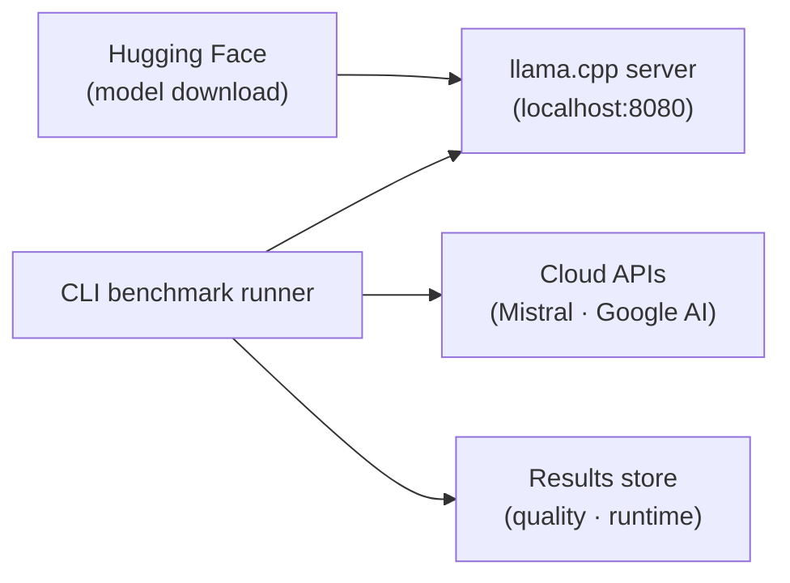

# Architecture

The macro technical shape: the stack, how the pieces fit, and the decisions behind them.

## Stack

- Python, managed by uv (lockfile, fast installs, editable dev install)
- pytest for tests, mypy for type checking, ruff for linting and formatting
- The fast gate (ruff, mypy, detect-secrets) is enforced by a local
  `pre-commit` hook (`.pre-commit-config.yaml`, `repo: local`,
  `language: system`); every entry resolves through `uv run`, so `uv.lock` is
  the single version source. `uv run pre-commit install` wires both the
  `pre-commit` and `pre-push` stages in one command; see `coding-assertions.md`
  for the commands. CI now runs the same gate server-side on every push and
  pull request, on a two-OS matrix, behind one required check — see
  `.github/workflows/ci.yml`.

## How it fits together

## Key decisions

- **llama.cpp over Ollama**: direct control over inference flags (`--n-cpu-moe`, `-fa`, `--jinja`, etc.), quantization choice, and memory layout; Ollama abstracts these away.
- **uv over pip**: reproducible installs via lockfile, faster CI, single tool for venv + deps + scripts.
- **Two cloud providers for LLM-as-a-judge**: Mistral and Google AI are from different model families; inter-judge agreement is reported alongside judged scores, making them defensible to clients.
- **Quality / runtime split**: quality scores are reproducible (model + prompt + seed); runtime metrics are hardware-bound and must be tagged with a signed hardware fiche. The two are never merged into a single table.
- **English in the repo, French for clients**: code, identifiers, docstrings, comments,
  commits, README and technical docs are English. French is reserved for pitch and
  restitution material produced outside the repo.

## Gotchas

- One quality store now holds **two score shapes**. A classification row is
  an exact-match row (`correct`, `suite_accuracy`, `language_breakdown`); a
  translation row is a graded row (`item_score`, `suite_score`,
  `score_breakdown`, `metric_id`/`metric_version`/`metric_params`,
  `reference_output` beside `subject_output`) and nulls all three exact-match
  fields. `row_contract` refuses a row carrying both, so `task_suite` — or
  the presence of the graded block — is the discriminator, and a reader must
  select by suite before comparing any score column. Averaging a chrF mean
  and an exact-match rate into one number is the mistake the two shapes exist
  to make impossible. chrF itself is in-repo (`chrf.py`, sacreBLEU's
  defaults, published on `0..1` where sacreBLEU prints `0..100`), and a
  single-reference chrF compares models against identical references rather
  than measuring translation quality absolutely.
- The published reference bundle is five parts handed to an auditor together,
  not any one file alone: `runtime-reference.jsonl` + `quality-reference.jsonl`
  (curated snapshots, no CLI writes to them) + `fiches/` (cited by
  `fiche_hash`) + `aidd_docs/roster/models.json` (cited by `roster_entry_id`)
  + `suite-definitions/` (cited by `suite_id`/`suite_version` on quality
  rows, `suite_snapshot.py` — see `cli.md`). `tests/test_reference_bundle.py`
  asserts every row's pointers resolve inside that set. A superseded
  reference file (schema or item-set change) is `git mv`-renamed to
  `*-reference.schema-<N>.jsonl` and kept, never deleted — published-evidence
  continuity for the epic's duration — with a `.gitignore` negation
  (`!aidd_docs/results/*-reference.schema-*.jsonl`) so the rename does not
  silently drop it from tracking, and `aidd_docs/results/README.md` names
  each superseded file and why it is kept.
- The model roster (`aidd_docs/roster/models.json`, parsed by `roster.py`) is
  now the source of truth for a model's identity (repo, revision, file,
  checksum, architecture) and its full launch flag set. `server.py`,
  `__init__.py` and `quality_cli.py` no longer hardcode these as source
  constants — they resolve everything through `roster.resolve_entry` plus
  two host-fitted settings (`SERVER_N_CPU_MOE`, `SERVER_THREADS` — see
  `cli.md`) that are not roster data. `llama_cpp_build` is likewise a live
  probe of the running binary (`build_probe.py`), never a constant string.
- A dense roster entry carries **no** `--n-cpu-moe` and **no** `--load-mode
  none` — the two flags that exist only to make an MoE offload work. That is
  enforced, not conventional: the entry's `architecture` block
  (`kind: "dense"`, `expert_count: 0`) is what makes it checkable, and
  `roster.validate_host_fit` *refuses* a dense entry handed any offload
  value rather than dropping the flag quietly. So the seam that lets a dense
  entry launch is a resolution change, not a `kind == "dense"` branch in
  `server.build_flags`: `host_n_cpu_moe` of `None` (the unset state) is
  resolved from the entry's own `validated_host.n_cpu_moe` *before*
  `validate_host_fit` runs, so the check always sees the value that will
  reach the command line. `0` is an explicit instruction to offload no
  experts and still refuses; `None` is the absence of an instruction. The
  committed fiche for each run records the launched flag list, so "this row
  carried no MoE offload" is checkable after the fact and not just at launch.
- `detect-secrets` opens files with the locale default encoding and silently skips any it cannot decode ("we flat out ignore binary files"), so on Windows (cp1252) a doc containing `✏️`, `‌` or `←` is never scanned at all — always invoke it in UTF-8 mode (`python -X utf8 -m detect_secrets...`), on every OS.
- Regenerate `.secrets.baseline` **only** with the same `--exclude-files` pattern the hook in `.pre-commit-config.yaml` uses. A plain `detect-secrets scan` baselines the fiches and suite-definition snapshots that pattern exists to skip, and the hook then trims them back out on its next run (`pre_commit_hook.main` → `SecretsCollection.trim`: an entry whose file is in the passed filelist but yields no scan result is dropped), rewriting the file and exiting 3. It fails on Linux only: `load_from_baseline` runs each key through `convert_local_os_path`, so a baseline written on Windows has its `\` keys normalised to `/` on the runner and they finally match pre-commit's forward-slash filelist — on Windows they never match and the stale entries survive. A green local gate therefore proves nothing about CI here; the baseline's `results` must hold only files the hook actually scans.
- That `--exclude-files` pattern is coupled to the **filenames**, so renaming an excluded artifact silently un-excludes it. Suite snapshots moved to `<suite_id>@<suite_version>.json` and the pattern's `[a-z0-9-]+` stopped matching, so the hook flagged three public `prompt_set_hash` values as secrets. Widen the character class with the filename; never answer this by baselining the hash, which puts back exactly the entries the row above says the baseline must not hold.
- Runtime metrics are NOT reproducible across machines. Every result row must cite its hardware fiche by `fiche_hash` (CPU, RAM, GPU, driver, llama.cpp build, quant, roster entry + its sha256, and the raw flags as evidence); the fiche itself is stored write-once under `aidd_docs/results/fiches/<hash>.json` (`fiche_registry.py`) rather than flattened onto the row, and `wave-local-ai-v2-validate` proves a cited fiche was neither edited nor lost. A number without a fiche is meaningless.
- llama.cpp has architecture-specific flags that are not optional: `--load-mode none` is required when `--n-cpu-moe` is set (otherwise mmap pages from disk), `--jinja` is required for `<think>` tag parsing, `-np 1` avoids the 4-slot default allocation.
- MoE models (e.g. Qwen3) have a fixed number of experts; `--n-cpu-moe` has a hard ceiling and sweep gains are typically within measurement noise.
- Energy and carbon figures are ESTIMATES, not measurements, except GPU energy. Every
  result row carries three independently-labelled channels: `cpu_energy_kwh`/
  `cpu_energy_method` (always `estimated_tdp` — on Windows, CodeCarbon has no RAPL
  access and falls back to TDP-based estimation, which can be off by a factor of 2-3
  on a laptop under thermal throttling), `ram_energy_kwh`/`ram_energy_method` (always
  `estimated_constant` — a fixed W-per-8GB rule, never a measured channel on any
  platform), and `gpu_energy_kwh`/`gpu_energy_method` (`measured_nvml` only when
  CodeCarbon's `gpu_count` confirms NVML found a GPU, else `null`/`unavailable` — an
  *availability* check, never a magnitude check, so a GPU that genuinely drew ~0W in a
  short run stays distinguishable from no GPU present). `measure_energy` uses
  `codecarbon.OfflineEmissionsTracker` (declared `country_iso_code`, no live
  geolocation call). A local run's emissions are Scope 2 (`emissions_scope`
  `"scope_2"`, measured on this machine via `emissions.local_emissions`); a Mistral
  quality batch's emissions are Scope 3 (`"scope_3"`, estimated from a
  Wh-per-token formula since no on-machine energy exists to attribute to a network
  call) — the two are not directly comparable, and every Scope-3 row states that in
  its own `scope_comparability` field. See `docs/setup.md` section 5.