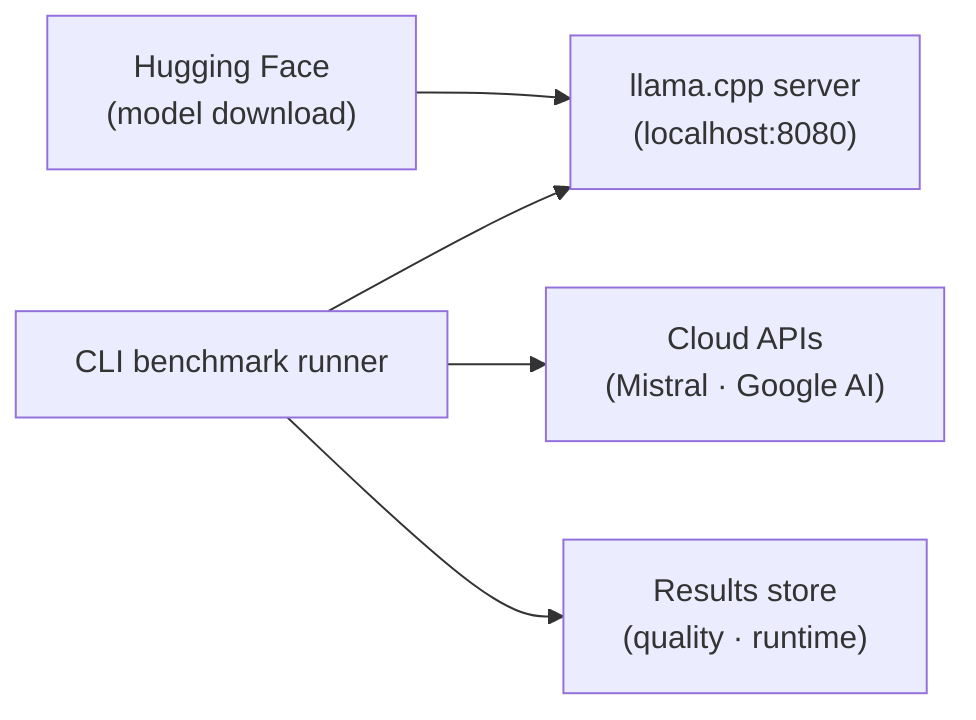

# Architecture

The macro technical shape: the stack, how the pieces fit, and the decisions behind them.

## Stack

- Python, managed by uv (lockfile, fast installs, editable dev install)
- pytest for tests, mypy for type checking, ruff for linting and formatting
- The fast gate (ruff, mypy, detect-secrets) is enforced by a local
  `pre-commit` hook (`.pre-commit-config.yaml`, `repo: local`,
  `language: system`); every entry resolves through `uv run`, so `uv.lock` is
  the single version source. `uv run pre-commit install` wires both the
  `pre-commit` and `pre-push` stages in one command; see `coding-assertions.md`
  for the commands. CI now runs the same gate server-side on every push and
  pull request, on a two-OS matrix, behind one required check — see
  `.github/workflows/ci.yml`.

## How it fits together

## Key decisions

- **llama.cpp over Ollama**: direct control over inference flags (`--n-cpu-moe`, `-fa`, `--jinja`, etc.), quantization choice, and memory layout; Ollama abstracts these away.
- **uv over pip**: reproducible installs via lockfile, faster CI, single tool for venv + deps + scripts.
- **Two cloud providers for LLM-as-a-judge**: Mistral and Google AI are from different model families; inter-judge agreement is reported alongside judged scores, making them defensible to clients.
- **Quality / runtime split**: quality scores are reproducible (model + prompt + seed); runtime metrics are hardware-bound and must be tagged with a signed hardware fiche. The two are never merged into a single table.
- **English in the repo, French for clients**: code, identifiers, docstrings, comments,
  commits, README and technical docs are English. French is reserved for pitch and
  restitution material produced outside the repo.

## Gotchas

- Runtime metrics are NOT reproducible across machines. Every result row must carry its hardware fiche (CPU, RAM, GPU, driver, llama.cpp build, quant, flags). A number without a fiche is meaningless.
- llama.cpp has architecture-specific flags that are not optional: `--load-mode none` is required when `--n-cpu-moe` is set (otherwise mmap pages from disk), `--jinja` is required for `<think>` tag parsing, `-np 1` avoids the 4-slot default allocation.
- MoE models (e.g. Qwen3) have a fixed number of experts; `--n-cpu-moe` has a hard ceiling and sweep gains are typically within measurement noise.
- Energy and carbon figures are ESTIMATES, not measurements. On Windows, CodeCarbon
  has no RAPL access and falls back to TDP-based estimation, which can be off by a
  factor of 2-3 on a laptop under thermal throttling. Every result row must carry an
  `energy_method` field (`estimated_tdp` | `measured_nvml`) and the front end must
  surface it. GPU draw via NVML is a real measurement; CPU is not.