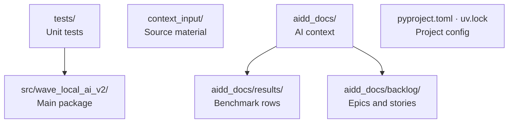

# Codebase Map

The macro layout: the top-level areas and what each holds.

## Areas

- `src/wave_local_ai_v2/`: the main Python package; two entry points, `__init__.py:main` and `quality_cli.py:main`
- `tests/`: pytest unit tests, one `test_<module>.py` per source module
- `context_input/`: French-language research notes (hardware fiches, benchmark baselines) — source material to inform implementation, not a language precedent for the repo
- `aidd_docs/`: AIDD memory bank and team docs, not application code
- `aidd_docs/results/`: benchmark output — the untracked live stores the CLIs append to, plus the committed `*-reference.jsonl` acceptance evidence (see its README)
- `aidd_docs/backlog/`: product backlog, epics and stories

## Entry points

- `wave-local-ai-v2` CLI command → `src/wave_local_ai_v2/__init__.py:main` (runtime benchmark)
- `wave-local-ai-v2-quality` CLI command → `src/wave_local_ai_v2/quality_cli.py:main` (quality benchmark)
