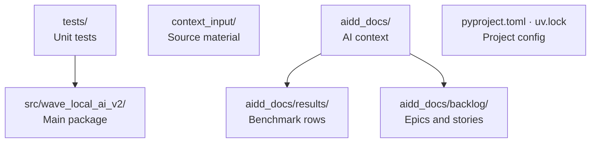

# Codebase Map

The macro layout: the top-level areas and what each holds.

## Areas

- `src/wave_local_ai_v2/`: the main Python package; `read_model.py` is the typed read layer over the two stores (the four views, the three finite absence reasons, the schema-floor selection, and the resolution of `fiche_hash`/`roster_entry_id`/`suite_id`+`suite_version`), and `service.py` is the FastAPI app that answers those views over HTTP behind the API-key gate — both are read-only and import no writer; `row_contract.py` (the row schema contract and writer gate), `suite_gate.py` (the suite size/language-mix/provenance gate), `provenance.py` (code/tree identity: release version, commit sha, tree dirtiness) and `prompt_provenance.py` (call-path identity: endpoint, prompt-template id/hash, consistency rule) are shared by both benchmark CLIs; `fiche_registry.py` (write-once fiche storage, lookup, edited/missing verification), `fiche_validator.py` (the `wave-local-ai-v2-validate` command) and `verdict.py` (the three-state reproduction verdict, runtime and quality) are shared by all three; `mistral_client.py` and `google_client.py` are the quality CLI's two cloud-provider clients, one `requests`-only module per provider, dispatched by `quality_cli.py`'s `_CLOUD_PROVIDERS` table; the judge path follows the same one-module-per-provider discipline — `judge_protocol.py` (the per-language prompt shells, their content hashes and the versioned rubrics) and `agreement.py` (the two kappas, the raw agreement rates, the contested rule and the headline) are pure and provider-free, `judge.py` calls through an injected backend and enforces family independence, and `judge_backends.py` is the single seam that binds the two cloud clients to that backend protocol; `roster.py` resolves a model's family through `family_of`, preferring a roster entry's own optional `family` and falling back to an in-code declaration until Methodology 13's roster carries one; the two deterministic task suites are `classification_suite.py` (exact label match) and `translation_suite.py` (chrF against a hand-written reference), selected by `quality_cli.py`'s `--suite` through its two-entry `_SUITES` table, and `chrf.py` is the character n-gram F-score itself — pure, no I/O, reproducing sacreBLEU's defaults in-repo rather than depending on the package
- `tests/`: pytest unit tests, one `test_<module>.py` per source module
- `context_input/`: French-language research notes (hardware fiches, benchmark baselines) — source material to inform implementation, not a language precedent for the repo
- `aidd_docs/`: AIDD memory bank and team docs, not application code
- `aidd_docs/results/`: benchmark output — the untracked live stores the CLIs append to, plus the committed `*-reference.jsonl` acceptance evidence (see its README)
- `aidd_docs/backlog/`: product backlog, epics and stories

## Entry points

- `wave-local-ai-v2` CLI command → `src/wave_local_ai_v2/__init__.py:main` (runtime benchmark)
- `wave-local-ai-v2-quality` CLI command → `src/wave_local_ai_v2/quality_cli.py:main` (quality benchmark)
- `wave-local-ai-v2-validate` CLI command → `src/wave_local_ai_v2/fiche_validator.py:main` (fiche invalidation validator)
- `wave-local-ai-v2-serve` CLI command → `src/wave_local_ai_v2/service.py:main` (read-only results service — see `cli.md`)
- Gap, not fixed here: `pyproject.toml` also declares `wave-local-ai-v2-judge-probe` → `judge_probe.py:main`, which this list has never named.
