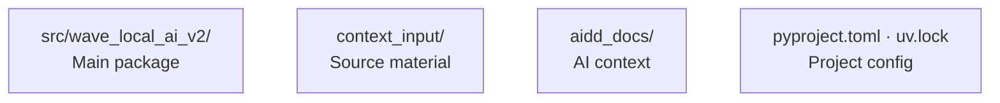

# Codebase Map

The macro layout: the top-level areas and what each holds.

## Areas

- `src/wave_local_ai_v2/`: the main Python package; entry point is `__init__.py:main`
- `context_input/`: French-language research notes (hardware fiches, benchmark baselines) — source material to inform implementation, not a language precedent for the repo
- `aidd_docs/`: AIDD memory bank and team docs, not application code

## Entry points

- `wave-local-ai-v2` CLI command → `src/wave_local_ai_v2/__init__.py:main`
