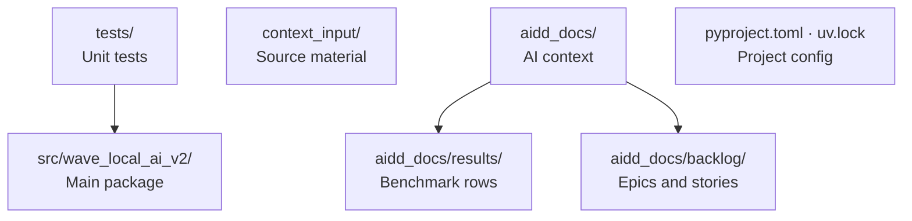

# Codebase Map

The macro layout: the top-level areas and what each holds.

```mermaid
flowchart TD
    src["src/wave_local_ai_v2/\nMain package"]
    tests["tests/\nUnit tests"]
    ctx["context_input/\nSource material"]
    docs["aidd_docs/\nAI context"]
    results["aidd_docs/results/\nBenchmark rows"]
    backlog["aidd_docs/backlog/\nEpics and stories"]
    cfg["pyproject.toml · uv.lock\nProject config"]

    tests --> src
    docs --> results
    docs --> backlog
```

## Areas

- `src/wave_local_ai_v2/`: the main Python package; `read_model.py` is the typed read layer over the two stores (the four views, the four finite absence reasons, the schema-floor selection, and the resolution of `fiche_hash`/`roster_entry_id`/`suite_id`+`suite_version`/`machine_id`), and `service.py` is the FastAPI app that answers those views over HTTP behind the API-key gate — both are read-only and import no writer; `demo_console.py` is the service's demo run console (declared sets, request validation, the one-run lock, the CLI launcher and its streamed output), which launches the unchanged CLIs and writes nothing itself; `playground.py` is the service's demo playground (one roster model launched with the benchmark flags under the console's shared lock, a typed prompt proxied to its chat endpoint as message content and streamed back), which records nothing; `row_contract.py` (the row schema contract and writer gate), `harness.py` (Methodology 23's agentic harness candidate set, closed at five, the harness version read from its installed package, and the per-call prompt-overhead rule; only `direct` is implemented), `suite_gate.py` (the suite size/language-mix/provenance gate), `provenance.py` (code/tree identity: release version, commit sha, tree dirtiness) and `prompt_provenance.py` (call-path identity: endpoint, prompt-template id/hash, consistency rule) and `prompt_variants.py` (the versioned, hash-checked prompt variant registry, each variant's declared task-family applicability, its per-family output format and decoding constraint (`constraint_for`: the mechanism, the grammar and its hash), and `apply_variant`, the one place a variant transforms an authored prompt before any templating or records a no-op) are shared by both benchmark CLIs; `fiche_registry.py` (write-once fiche storage, lookup, edited/missing verification), `fiche_validator.py` (the `wave-local-ai-v2-validate` command) and `verdict.py` (the three-state reproduction verdict, runtime and quality) are shared by all three; `mistral_client.py` and `google_client.py` are the quality CLI's two cloud-provider clients, one `requests`-only module per provider, dispatched by `quality_cli.py`'s `_CLOUD_PROVIDERS` table; the judge path follows the same one-module-per-provider discipline — `judge_protocol.py` (the per-language prompt shells, their content hashes and the versioned rubrics) and `agreement.py` (the two kappas, the raw agreement rates, the contested rule and the headline) are pure and provider-free, `judge.py` calls through an injected backend and enforces family independence, and `judge_backends.py` is the single seam that binds the two cloud clients to that backend protocol; `roster.py` resolves a model's family through `family_of`, preferring a roster entry's own optional `family` and falling back to an in-code declaration until Methodology 13's roster carries one; a task suite is data: `suite_data/<suite_id>.json` holds each definition (identity, caps, scoring-rule name, tagged items), `suite_registry.py` resolves `--suite`'s id to it and gates it at load, `scoring_rules.py` is the name-to-rule table (`exact_label_match`, `chrf_against_reference`), and `classification_suite.py`/`translation_suite.py` keep only what those rules need (label set, item shapes) and each suite's rationale; `subset_sampler.py` is the publication subset's selection rule (canonical ordering, a draw stratified by language and, for classification, label, recorded seed retries, a per-item content hash) checked by the registry at load and replayed by `subset_replay.py`; `use_case_coverage.py` gates and publishes the declared coverage record (`use_case_coverage.json`, one state per PRD use case, every named suite resolved through the registry); `chrf.py` is the character n-gram F-score itself — pure, no I/O, reproducing sacreBLEU's defaults in-repo rather than depending on the package; `score_interval.py` is the interval every quality batch publishes (the versioned stdlib draw procedure, the percentile bootstrap, the minimum detectable effect, the `zero_width`/`no_items` reasons, replay and the three batch invariants), computed inside both scoring rules' batch aggregates; `comparison.py` is the paired test between two published configurations (side selection, refusal list, computed differing fields, McNemar/Wilcoxon on the standard library with scipy as a dev-only test oracle, Holm over a closed family, the family record and its supersede-by-id lookup, and the definition of every field its records carry); `leader_set.py` derives the leader set per suite and machine class from the rows, their fiches and the suite's family, and publishes and reads its superseded-not-edited records (`read_model` imports only its readers), and defines its records' fields; `campaigns.py` loads a campaign declaration (`aidd_docs/campaigns/`) against the caps and every registry, checks a run against it before launch, and lists its cells for completeness; `preflight.py` checks a roster entry's declared minimums (RAM, VRAM, disk per compute mode) against what the machine reports before any writer looks for the weights, and appends the refusal record to the machine's tracked file; `machine_results.py` defines each declared machine's tracked results location (`machines/<machine_id>/`: runtime, quality, refusals) and promotes named runs and their fiches into it, and `bundle_merge.py` derives the published bundle from every location, refusing a cross-machine fiche-hash collision and an undeclared machine; `field_doc.py` is the shared field-description type (meaning, unit, empty cell) those definitions and `bundle_export.py`'s column dictionary use
- `tests/`: pytest unit tests, one `test_<module>.py` per source module
- `context_input/`: French-language research notes (hardware fiches, benchmark baselines) — source material to inform implementation, not a language precedent for the repo
- `aidd_docs/`: AIDD memory bank and team docs, not application code
- `aidd_docs/results/`: benchmark output — the untracked live stores the CLIs append to, plus the committed `*-reference.jsonl` acceptance evidence (see its README)
- `aidd_docs/backlog/`: product backlog, epics and stories

## Entry points

- `wave-local-ai-v2` CLI command → `src/wave_local_ai_v2/__init__.py:main` (runtime benchmark)
- `wave-local-ai-v2-quality` CLI command → `src/wave_local_ai_v2/quality_cli.py:main` (quality benchmark)
- `wave-local-ai-v2-validate` CLI command → `src/wave_local_ai_v2/fiche_validator.py:main` (fiche invalidation validator)
- `wave-local-ai-v2-serve` CLI command → `src/wave_local_ai_v2/service.py:main` (read-only results service — see `cli.md`)
- `wave-local-ai-v2-export` CLI command → `src/wave_local_ai_v2/bundle_export.py:main` (the bundle and its comparison, family and leader-set records as flat CSV tables — see `cli.md`)
- `wave-local-ai-v2-compare` CLI command → `src/wave_local_ai_v2/comparison.py:main` (paired comparison record — see `cli.md`)
- `wave-local-ai-v2-candidate-gate` CLI command → `src/wave_local_ai_v2/candidate_gate.py:main` (the roster's candidate verification gate — see `cli.md`)
- `wave-local-ai-v2-composition-check` CLI command → `src/wave_local_ai_v2/composition_check.py:main` (the roster's size-class composition rule — see `cli.md`)
- `wave-local-ai-v2-campaign-completeness` CLI command → `src/wave_local_ai_v2/campaigns.py:main` (a campaign declaration's every cell filled, refused or dropped — see `cli.md`)
- `wave-local-ai-v2-promote` CLI command → `src/wave_local_ai_v2/machine_results.py:main` (named runs into the machine's tracked location — see `cli.md`)
- `wave-local-ai-v2-merge-bundle` CLI command → `src/wave_local_ai_v2/bundle_merge.py:main` (the bundle derived from every location; `--check` in CI — see `cli.md`)
- Gap, not fixed here: `pyproject.toml` also declares `wave-local-ai-v2-judge-probe` → `judge_probe.py:main`, which this list has never named.
