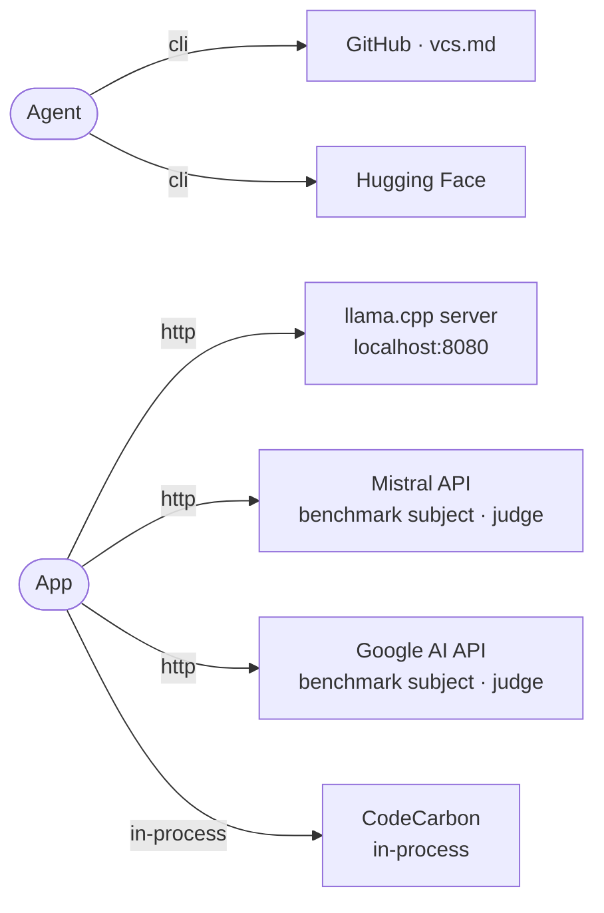

# Ecosystem

```mermaid
flowchart LR
  Agent([Agent])
  App([App])

  GitHub["GitHub · vcs.md"]
  HF["Hugging Face"]
  Llama["llama.cpp server\nlocalhost:8080"]
  Mistral["Mistral API\nbenchmark subject · judge"]
  Google["Google AI API\nbenchmark subject · judge"]
  CC["CodeCarbon\nin-process"]

  Agent -- cli --> GitHub
  Agent -- cli --> HF
  App -- http --> Llama
  App -- http --> Mistral
  App -- http --> Google
  App -- in-process --> CC
```
