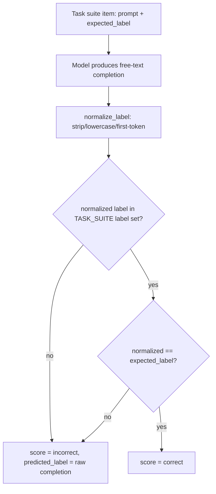
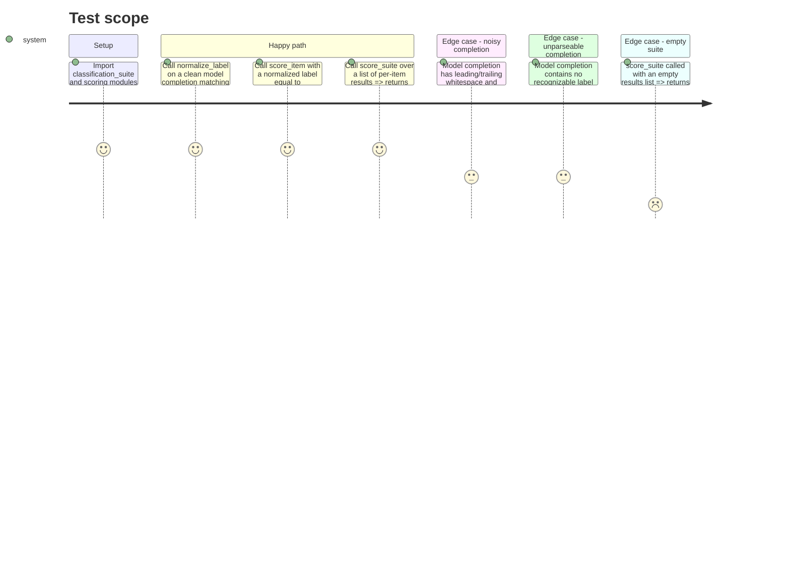

<!-- Fill or omit these sections; never add, rename, or reorder one. -->

# Instruction: Classification task suite and deterministic scorer

## Architecture projection

> Tree of the final files. ✅ create · ✏️ modify · ❌ delete

```txt
.
└── src/wave_local_ai_v2/
    ├── classification_suite.py  ✅ fixed task suite: prompts, expected labels, label set
    └── scoring.py                ✅ deterministic label normalization + exact-match scoring
└── tests/
    ├── test_classification_suite.py  ✅ suite shape/content sanity checks
    └── test_scoring.py               ✅ normalization + scoring unit tests
```

## User Journey



## Test Scope



## Tasks to do

### `1)` Define the fixed classification task suite

> A small, fixed, in-repo set of classification prompts with known-correct labels, shared verbatim by both models.

1. In `src/wave_local_ai_v2/classification_suite.py`, define a `ClassificationItem` `TypedDict` with `item_id: str`, `prompt: str`, `expected_label: str`.
2. Define the closed label set as a module-level constant (e.g. `LABELS = frozenset({...})`) -- pick one simple, unambiguous domain (e.g. short customer-support-message routing: `billing` / `technical` / `account` / `other`, or single-sentence sentiment: `positive` / `negative` / `neutral`). Document the choice in a module docstring: why this domain, why these labels are unambiguous enough for exact-match scoring.
3. Define `TASK_SUITE: list[ClassificationItem]` with at least 8 items, each prompt instructing the model to answer with exactly one label word from the label set (embed the label set in the prompt text itself so both models see the same closed-set instruction). Every `expected_label` must be a member of `LABELS`.
4. Name the suite constant descriptively (e.g. `CLASSIFICATION_TASK_SUITE`) so a second suite (translation, rewriting) can be added later without renaming this one.

### `2)` Deterministic label normalization and scoring

> Turn a model's free-text completion into a label, and a label into a pass/fail, with no network or randomness involved.

1. In `src/wave_local_ai_v2/scoring.py`, add `normalize_label(raw_completion: str, labels: frozenset[str]) -> str | None`: lowercase, strip whitespace/punctuation, take the first whitespace-delimited token (or the first substring matching a member of `labels`), return the matched label from `labels` or `None` if nothing matches. Never raises on malformed input.
2. Add a `ScoredItem` `TypedDict` (`item_id`, `expected_label`, `predicted_label: str | None`, `correct: bool`).
3. Add `score_item(item: ClassificationItem, raw_completion: str) -> ScoredItem` composing `normalize_label` + exact comparison against `item["expected_label"]`; `correct` is `False` (not an exception) when `normalize_label` returns `None`.
4. Add `score_suite(scored_items: list[ScoredItem]) -> float` returning accuracy (`correct` count / total), returning `0.0` for an empty list rather than raising `ZeroDivisionError`.

## Test acceptance criteria

| Task | Acceptance criteria              |
| ---- | -------------------------------- |
| 1.1-1.4 | `CLASSIFICATION_TASK_SUITE` has >= 8 items; every `expected_label` is a member of `LABELS`; importing the module performs no I/O or network call. |
| 2.1 | `normalize_label` returns the matching label for a clean, noisy-whitespace, and mixed-case completion alike; returns `None` (never raises) for a completion with no matching label. |
| 2.3 | `score_item` returns `correct=True` only when the normalized label equals `expected_label` exactly; returns `correct=False` for any unparseable completion, without raising. |
| 2.4 | `score_suite([])` returns `0.0`; `score_suite` over a mixed correct/incorrect list returns the exact fraction correct. |
