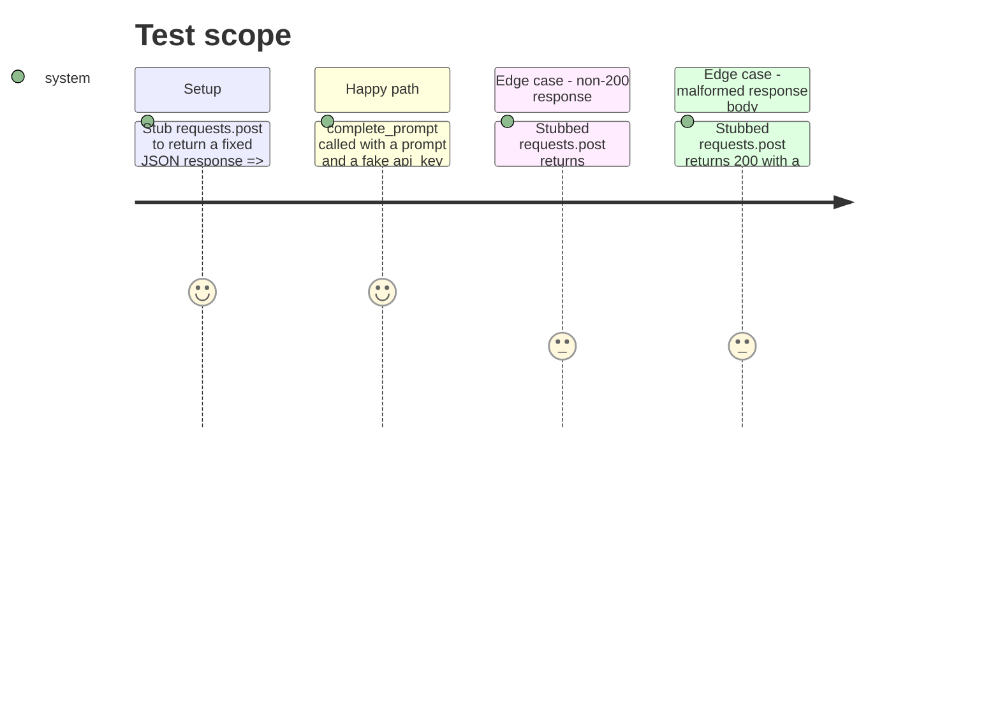

<!-- Fill or omit these sections; never add, rename, or reorder one. -->

# Instruction: Cloud model client (Mistral)

## Architecture projection

> Tree of the final files. ✅ create · ✏️ modify · ❌ delete

```txt
.
└── src/wave_local_ai_v2/
    └── mistral_client.py  ✅ minimal REST client: one prompt in, one completion string out
└── tests/
    └── test_mistral_client.py  ✅ HTTP stubbed, no live call
```

## User Journey

```mermaid
flowchart TD
  A[complete_prompt(prompt, api_key)] --> B[POST to Mistral chat completions endpoint]
  B --> C{HTTP 200?}
  C -->|no| D[raise MistralRequestError with status + body excerpt]
  C -->|yes| E[Parse choices[0].message.content]
  E --> F{content present and non-empty?}
  F -->|no| D
  F -->|yes| G[Return raw completion string to caller]
```

## Test Scope



## Tasks to do

### `1)` Minimal Mistral chat-completions client

> One function: send one prompt, get back one completion string. No streaming, no retries, no SDK dependency -- `requests` only, matching the project's existing HTTP pattern (`server.py`).

1. In `src/wave_local_ai_v2/mistral_client.py`, define `MistralRequestError(RuntimeError)` for any non-200 response or unparseable response body.
2. Define module constants: `API_URL = "https://api.mistral.ai/v1/chat/completions"`, `MODEL = "mistral-small-latest"` (or the current small/cheap tier -- confirm the exact model id string against Mistral's published model list before hardcoding; note the source consulted in a comment), `REQUEST_TIMEOUT_S`.
3. Add `complete_prompt(prompt: str, api_key: str) -> str`: POST `{"model": MODEL, "messages": [{"role": "user", "content": prompt}]}` with `Authorization: Bearer {api_key}` and `Content-Type: application/json` headers; raise `MistralRequestError` on non-200 (include status code and a truncated body in the message); extract and return `response_json["choices"][0]["message"]["content"]`, raising `MistralRequestError` (not a raw `KeyError`/`IndexError`) if the shape doesn't match.
4. Do not add retry/backoff logic in this phase -- out of scope for a proof-of-concept slice; a single failed cloud call surfaces as a clear error, matching the runtime harness's existing no-retry precedent.

## Test acceptance criteria

| Task | Acceptance criteria              |
| ---- | -------------------------------- |
| 1.1-1.3 | With `requests.post` stubbed to return a 200 response with a valid `choices` body, `complete_prompt` returns the exact `content` string and the stubbed call received the correct URL, headers, and JSON body. |
| 1.3 | With `requests.post` stubbed to return a non-200 status, `complete_prompt` raises `MistralRequestError` naming the status code. |
| 1.3 | With `requests.post` stubbed to return 200 but a body missing `choices`, `complete_prompt` raises `MistralRequestError`, not an unhandled `KeyError`/`IndexError`. |
| all | No test in `test_mistral_client.py` makes a live network call (`requests.post` is stubbed/monkeypatched in every test). |
