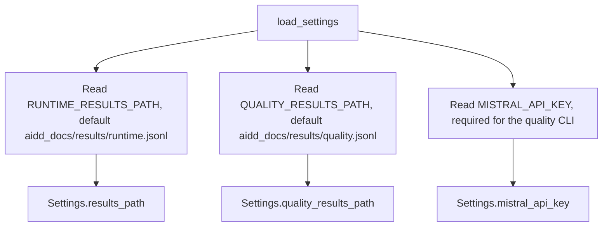
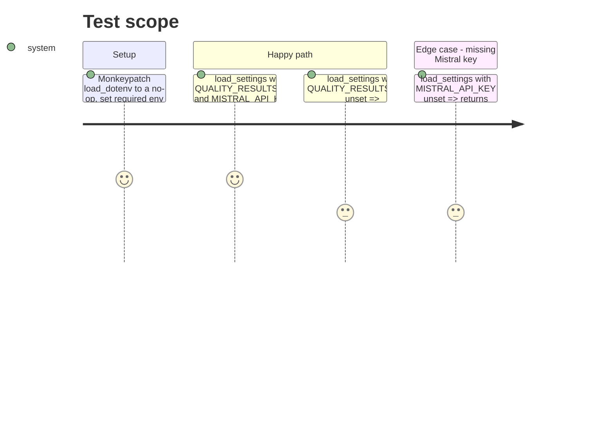

<!-- Fill or omit these sections; never add, rename, or reorder one. -->

# Instruction: Quality results store and settings

## Architecture projection

> Tree of the final files. ✅ create · ✏️ modify · ❌ delete

```txt
.
└── src/wave_local_ai_v2/
    └── settings.py  ✏️ add quality_results_path + mistral_api_key to Settings/load_settings
└── .env.example      ✏️ add QUALITY_RESULTS_PATH; MISTRAL_API_KEY already present
└── tests/
    └── test_settings.py  ✏️ cover the new settings field(s)
```

## User Journey



## Test Scope



## Tasks to do

### `1)` Extend settings for the quality path and cloud credential

> Same env-backed pattern as the existing runtime settings -- no new config mechanism.

1. In `src/wave_local_ai_v2/settings.py`, add `DEFAULT_QUALITY_RESULTS_PATH = "aidd_docs/results/quality.jsonl"`.
2. Add `quality_results_path: Path = Path(DEFAULT_QUALITY_RESULTS_PATH)` and `mistral_api_key: str = ""` fields to the `Settings` dataclass, **with defaults**. `tests/test_cli.py` constructs `Settings(...)` with only the three existing fields (`slm_models_dir`, `llama_server_path`, `results_path`) at three call sites -- new required fields with no default break every one of them. Defaults keep `Settings` a single shared type without forcing the existing runtime-only call sites to change.
3. In `load_settings`, read `QUALITY_RESULTS_PATH` the same way `RUNTIME_RESULTS_PATH` is read (optional, defaults to the new constant). Read `MISTRAL_API_KEY` as an **optional** string (default `""` if unset) -- do not make `load_settings()` raise when it's absent; the runtime CLI (`__init__.py`) must keep working with no Mistral key configured at all.
4. The quality CLI (phase 4), not `load_settings`, is what actually needs a non-empty `mistral_api_key` to run. Add a small check at the point of use in `quality_cli.py` (e.g. raise `SettingsError` there if `settings.mistral_api_key` is empty) rather than baking a hard requirement into the shared loader that the runtime-only CLI would then also have to satisfy.

### `2)` Document the new env var

1. Add `QUALITY_RESULTS_PATH=aidd_docs/results/quality.jsonl` to `.env.example`, next to the existing `RUNTIME_RESULTS_PATH` line. `MISTRAL_API_KEY` is already present there.

## Test acceptance criteria

| Task | Acceptance criteria              |
| ---- | -------------------------------- |
| 1.1-1.3 | `load_settings()` with `QUALITY_RESULTS_PATH` and `MISTRAL_API_KEY` set returns a `Settings` whose `quality_results_path` and `mistral_api_key` match the env values; with either unset, each field falls back to its default (`DEFAULT_QUALITY_RESULTS_PATH`, `""`) without raising. |
| 1.2, 1.4 | `tests/test_cli.py`'s existing `Settings(...)` constructions (three fields only, no `mistral_api_key`/`quality_results_path`) still pass unmodified -- the new fields' defaults absorb them. |
| 2.1 | `.env.example` lists `QUALITY_RESULTS_PATH` with the same default value used in code. |
