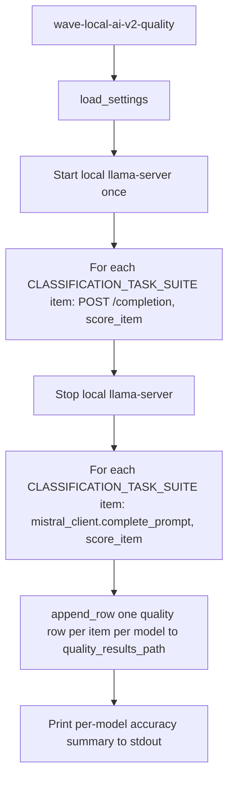
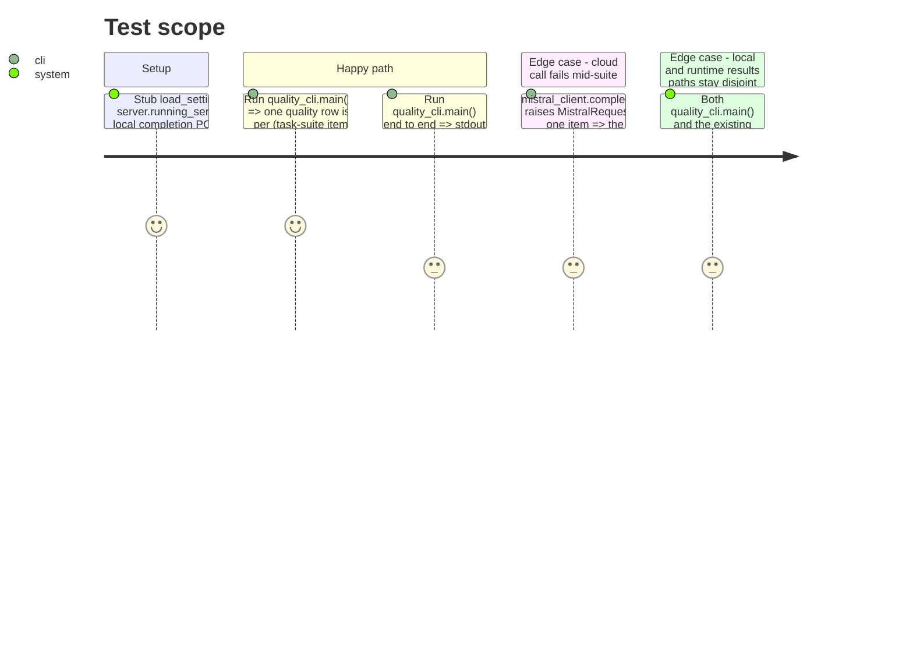

<!-- Fill or omit these sections; never add, rename, or reorder one. -->

# Instruction: CLI wiring (end to end, both models)

## Architecture projection

> Tree of the final files. ✅ create · ✏️ modify · ❌ delete

```txt
.
└── src/wave_local_ai_v2/
    └── quality_cli.py  ✅ new entry point: runs the suite against both models, writes quality.jsonl
└── pyproject.toml       ✏️ new [project.scripts] entry: wave-local-ai-v2-quality
└── .env.example         ✏️ (carried from phase 3 if not already done)
└── tests/
    └── test_quality_cli.py  ✅ stubs llama-server + Mistral HTTP, asserts row shape and separation
```

## User Journey



## Test Scope



## Tasks to do

### `1)` Local-model run over the task suite

> Reuse the existing llama-server lifecycle; unlike the runtime harness, this run collects no timings/fiche/energy at all -- only the raw completion text, since a quality row must be readable without any runtime metric.

1. In `src/wave_local_ai_v2/quality_cli.py`, add a helper that starts the local server once (`server.running_server`, reusing `server.build_flags` and the same model path resolution as `__init__.py`) and, inside that single `with` block, loops over `CLASSIFICATION_TASK_SUITE`, POSTing each item's `prompt` to `/completion` and collecting the raw `content` string per item -- one server start for the whole suite, not one per item.
2. Do not read `timings`, GPU stats, RSS, or wrap calls in `measure_energy` -- none of that belongs in a quality row.

### `2)` Cloud-model run over the same task suite

> Same prompts, same suite, different transport.

1. Loop over `CLASSIFICATION_TASK_SUITE` again, calling `mistral_client.complete_prompt(item["prompt"], settings.mistral_api_key)` for each item, collecting the raw completion string per item.
2. Before this loop, raise `SettingsError` (imported from `settings.py`) if `settings.mistral_api_key` is empty -- this is the point-of-use check deferred from phase 3.

### `3)` Score and write quality rows

> One row per (task-suite item, model); rows carry no fiche/runtime fields, matching the story's "structurally separate" acceptance criterion.

1. For each model's set of raw completions, call `scoring.score_item` per item to get a `ScoredItem`, then `scoring.score_suite` over all of that model's `ScoredItem`s to get the model's accuracy.
2. Build one row per scored item: `{"model_id": ..., "provider": "local"|"mistral", "task_suite": "classification", "item_id": ..., "prompt": ..., "expected_label": ..., "predicted_label": ..., "correct": ..., "suite_accuracy": <that model's score_suite result>}`. Append every row via `results.append_row(settings.quality_results_path, row)` (the same generic helper the runtime CLI uses, pointed at the quality path).
3. Print a one-line summary per model (e.g. `model=<id> provider=<provider> accuracy=<value>`), mirroring the existing runtime CLI's final `print(...)` pattern.

### `4)` Wire the new entry point

1. Add `main()` to `quality_cli.py` following the existing `__init__.py:main` pattern: call an internal `_run()`, catch the same class of expected exceptions (`SettingsError`, `server.ServerStartupError`, `requests.RequestException`, `MistralRequestError`) and exit with `sys.exit(1)` printing to stderr, rather than letting them crash raw.
2. Add `wave-local-ai-v2-quality = "wave_local_ai_v2.quality_cli:main"` under `[project.scripts]` in `pyproject.toml`.

## Test acceptance criteria

| Task | Acceptance criteria              |
| ---- | -------------------------------- |
| 1.1-1.2 | With the local completion POST and `running_server` stubbed, `quality_cli._run()` (or equivalent) starts the server exactly once for the whole suite and every appended local-model row has no `timings`/`gpu`/`energy`/fiche key. |
| 2.1-2.2 | With `mistral_client.complete_prompt` stubbed, one call is made per suite item with that item's exact prompt; with `mistral_api_key=""`, running the cloud loop raises `SettingsError` before any HTTP call is attempted. |
| 3.1-3.2 | `quality_results_path` ends up with exactly `2 * len(CLASSIFICATION_TASK_SUITE)` rows (one per item per model); every row's `prompt` matches the suite item's prompt verbatim for both models; `suite_accuracy` is present and equal across every row belonging to the same model. |
| 3.2 | No quality row contains any of `cpu`, `ram_gb`, `gpu_name`, `ttft_ms`, `prompt_tok_per_s`, `gen_tok_per_s`, `energy_method` (the runtime table's fields) -- and no existing runtime row is required to carry `expected_label`/`predicted_label`/`suite_accuracy`, proving the two tables are readable independently. |
| 4.1-4.2 | `uv run wave-local-ai-v2-quality --help`-equivalent entry point resolves (the script is registered); a raised `SettingsError`/`MistralRequestError` during `_run()` prints to stderr and exits 1 rather than raising an unhandled traceback. |
