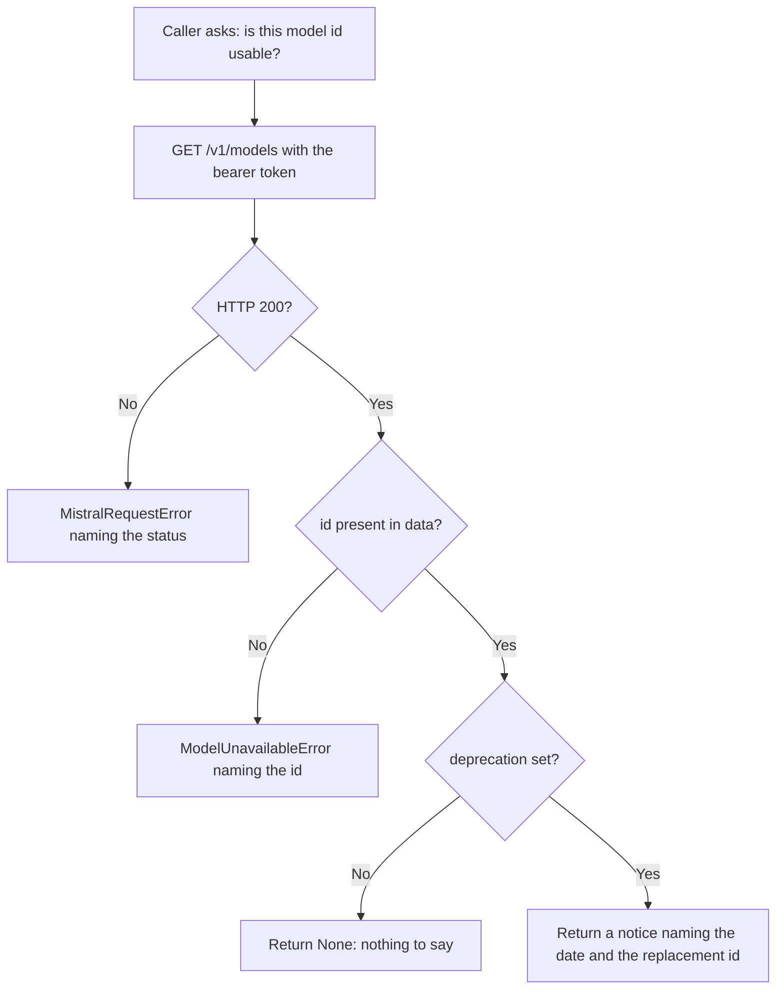
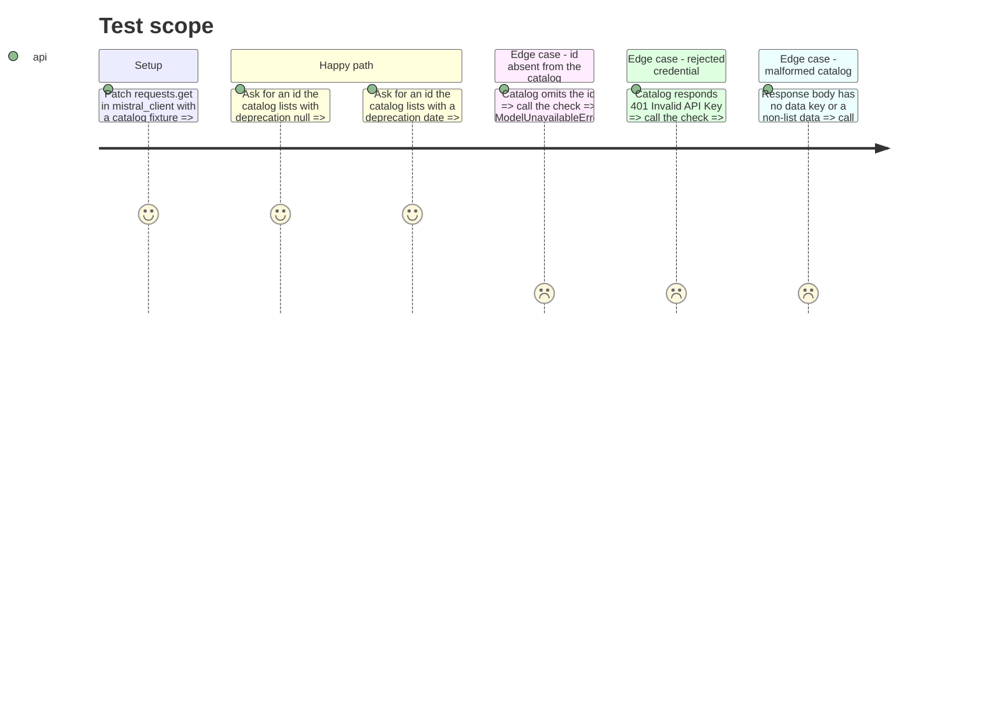

<!-- Fill or omit these sections; never add, rename, or reorder one. -->

# Instruction: Catalog check in the Mistral client

## Architecture projection

> Tree of the final files. ✅ create · ✏️ modify · ❌ delete

```txt
.
├── src/
│   └── wave_local_ai_v2/
│       ├── mistral_client.py      ✏️ MODELS_URL, ModelUnavailableError, check_model_available; API_URL renamed to CHAT_COMPLETIONS_URL
│       ├── quality_cli.py         (untouched this phase — wiring is phase 2)
│       └── settings.py            (untouched — offline by contract, see plan Decisions)
└── tests/
    └── test_mistral_client.py     ✏️ cover live, deprecated, absent, non-200 and malformed catalogs; follow the rename
```

## User Journey



## Test Scope



## Tasks to do

### `1)` Name the two endpoints for what they are

> Two endpoint constants cannot share one generic name.

1. Rename `API_URL` to `CHAT_COMPLETIONS_URL` in `mistral_client.py` and at its use site in `complete_prompt`.
2. Add `MODELS_URL = "https://api.mistral.ai/v1/models"` beside it.
3. Update the `API_URL` import and assertions in `tests/test_mistral_client.py`.
4. Add `CATALOG_TIMEOUT_S`, shorter than `REQUEST_TIMEOUT_S`: a catalog listing that hangs for a completion's full budget defeats the point of checking before the local suite.

### `2)` Add the catalog check

> One function answers "is this id usable, and for how long".

1. Add `ModelUnavailableError`, a subclass of `MistralRequestError`, so an existing `except MistralRequestError` still catches it.
2. Write `check_model_available(api_key: str, model: str = MODEL) -> str | None`: GET `MODELS_URL` with the bearer header, raise `MistralRequestError` on a non-200 naming the status, and guard the body shape the way `complete_prompt` guards `choices`.
3. Raise `ModelUnavailableError` naming the id when no entry's `id` matches.
4. Return `None` when the entry's `deprecation` is null, otherwise a one-line notice carrying the id, the deprecation timestamp and `deprecation_replacement_model`.
5. Docstring: state that the return value is a warning for the caller to surface, not an error, and why absence and deprecation are treated differently.

### `3)` Test the four outcomes against recorded shapes

> The fixture mirrors the live response, not an invented one.

1. Build the catalog fixture from the shape recorded in the plan's Resources table: `{"object": "list", "data": [...]}` with `id`, `deprecation`, `deprecation_replacement_model`.
2. Read the request from the recorded call arguments, never from a constant the test also defines.
3. Cover: listed and current, listed and deprecated, absent, non-200, and a body missing `data`.

### `4)` Confirm the parser against the live catalog once

> A fixture proves the parser matches a shape recorded on one day, not the API.

1. With `MISTRAL_API_KEY` set, call `check_model_available` once against the real endpoint.
2. Confirm it returns `None` for `mistral_client.MODEL` and raises `ModelUnavailableError` for a deliberately wrong id.
3. Record the outcome and the date in this phase file, the way the reproducibility plan records its double-run figures.

## Test acceptance criteria

| Task | Acceptance criteria |
| ---- | ------------------- |
| 1 | No module or test refers to `API_URL`; `CHAT_COMPLETIONS_URL` is used by `complete_prompt` and `MODELS_URL` by the catalog check, and `grep -rn "API_URL" src/ tests/` returns nothing. |
| 1 | The catalog request's timeout is `CATALOG_TIMEOUT_S` and is strictly less than `REQUEST_TIMEOUT_S`, read from the recorded call arguments. |
| 2 | For an id the catalog lists with `deprecation: null`, the check returns `None` and issues exactly one GET, to `MODELS_URL`, carrying `Authorization: Bearer <key>`; changing the URL or dropping the header makes the assertion fail. |
| 2 | For an id the catalog lists with `deprecation: "2026-08-31T12:00:00Z"` and `deprecation_replacement_model: "mistral-medium-3-5"`, the returned string contains all three of the id, the timestamp and the replacement id, and no exception is raised. |
| 2 | For an id absent from `data`, the check raises `ModelUnavailableError` and its message names the missing id. `except MistralRequestError` still catches it, so `quality_cli.main`'s existing handler needs no widening for this type alone. |
| 2 | A 401 response raises `MistralRequestError` whose message carries the status code, and the check never treats the error body as a catalog. |
| 2 | A 200 response whose body has no `data` key, or whose `data` is not a list, raises `MistralRequestError`, never a bare `KeyError` or `TypeError` escaping the client. |
| 3 | Every assertion about the outgoing request reads `requests.get`'s recorded call arguments; no test asserts a value against the module constant that produced it. |
| 4 | One live call against `https://api.mistral.ai/v1/models` returns `None` for `mistral_client.MODEL` and raises `ModelUnavailableError` for a wrong id, proving the parser matches the API rather than only the fixture. The outcome and its date are written into this phase file; a stubbed result does not satisfy this criterion. Evidence (2026-08-21, live): `check_model_available(key)` returned `None` for `mistral-small-2603`; `model="mistral-small-9999"` raised `ModelUnavailableError: Mistral model 'mistral-small-9999' is not on the live catalog (56 models listed)`. The deprecation branch was exercised live too, beyond what this criterion required: `model="mistral-medium-2505"` returned `warning: Mistral model 'mistral-medium-2505' is deprecated as of 2026-08-31T12:00:00Z; replacement: mistral-medium-3-5`, so all three outcomes are confirmed against the API and not only against the fixture. |
