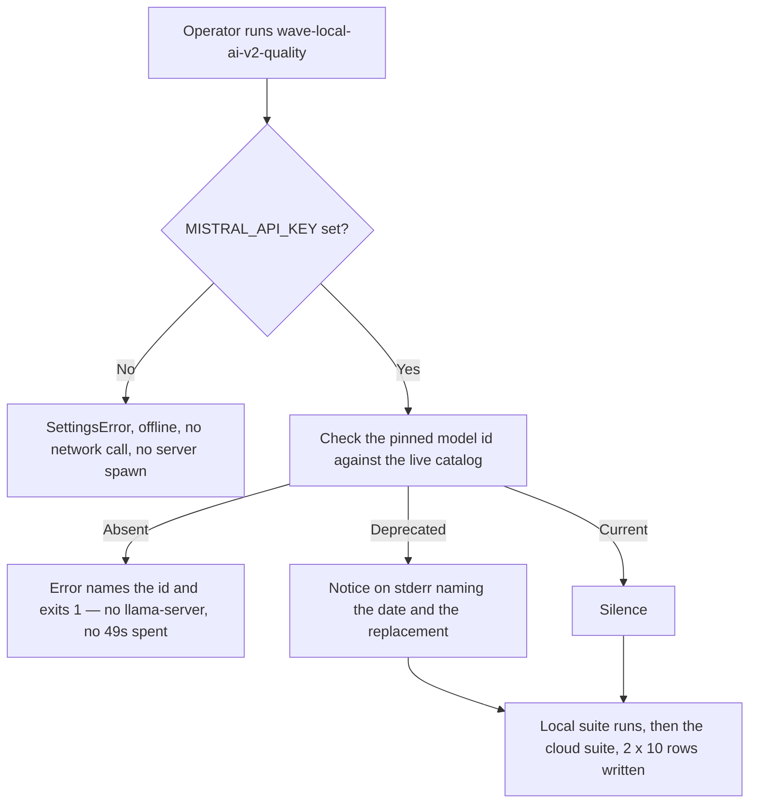
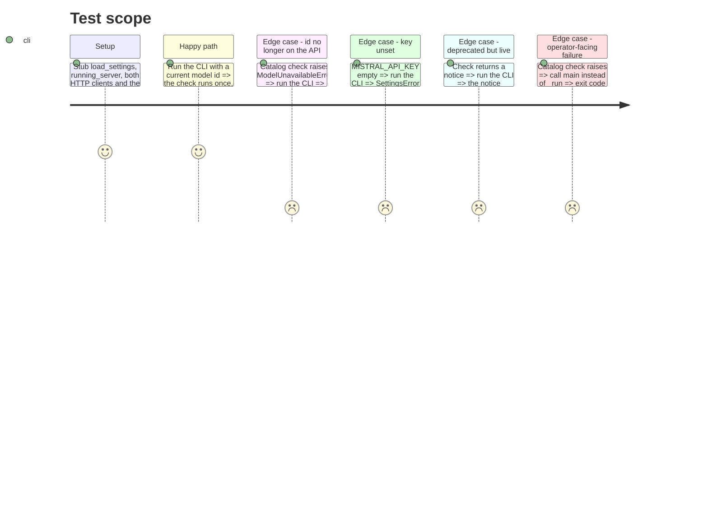

<!-- Fill or omit these sections; never add, rename, or reorder one. -->

# Instruction: Pre-flight before the local suite

## Architecture projection

> Tree of the final files. ✅ create · ✏️ modify · ❌ delete

```txt
.
├── src/
│   └── wave_local_ai_v2/
│       ├── quality_cli.py         ✏️ call the check in _run beside the key check; surface the deprecation notice; handle ModelUnavailableError in main
│       └── mistral_client.py      (untouched this phase — delivered in phase 1)
└── tests/
    └── test_quality_cli.py        ✏️ patch the check in the fixture; assert it gates the local suite and that main exits 1
```

## User Journey



## Test Scope



## Tasks to do

### `1)` Gate the run on the model id

> The expensive half never starts for a run that cannot finish.

1. In `_run`, call `mistral_client.check_model_available(settings.mistral_api_key)` immediately after the empty-key check and before `_run_local_suite`.
2. Keep the ordering: the empty-key check stays first so an unset key fails offline, without a network call.
3. Extend the comment already justifying the key check's position to cover the model check, rather than writing a second, parallel explanation.

### `2)` Surface a deprecation without stopping the run

> A retirement date is news, not a failure.

1. Print the returned notice to stderr when it is not `None`, leaving stdout for the per-model accuracy lines the CLI already prints.
2. Add `ModelUnavailableError` to `main`'s `except` tuple only if phase 1's subclassing does not already cover it; verify rather than assume.

### `3)` Keep the test suite offline

> A test suite that reaches the network is a flaky test suite.

1. Add the catalog check to the `stubbed_run` fixture's patch dict, returning `None` by default.
2. Assert the gating with the mock raising: `running_server` and `requests.post` both uncalled.
3. Assert the deprecation path separately by setting the mock's return value to a notice.

## Test acceptance criteria

| Task | Acceptance criteria |
| ---- | ------------------- |
| 1 | When the catalog check raises `ModelUnavailableError`, `_run` propagates it with `server.running_server` never called and `requests.post` never called: zero local work for a run that cannot finish. Deleting the `check_model_available` call from `_run` makes this fail. Evidence: replacing the call with `deprecation_notice = None` failed 4 tests, this one among them. |
| 1 | With `mistral_api_key` empty, `_run` still raises `SettingsError("MISTRAL_API_KEY is not set")` and the catalog check is never called, so an unset key needs no network. Reordering the two checks makes this fail. Evidence: moving the catalog call above the key check failed this test and `test_run_raises_before_any_local_or_cloud_call_when_mistral_key_missing`. |
| 1 | With a current id, the check is called exactly once per run, before the first `running_server` call, and the run still writes `2 x 10` rows with the same content as before this phase. |
| 2 | When the check returns a deprecation notice, that exact string reaches stderr, the run completes, and all `2 x 10` rows are written; stdout still carries only the two accuracy lines. |
| 2 | `main()` turns a `ModelUnavailableError` into exit code 1 with the message on stderr and no traceback, the same way it already handles `MistralRequestError`. |
| 3 | Every test in `tests/test_quality_cli.py` passes with no network reachable; removing the fixture's catalog patch makes them attempt a live GET to the models URL. Evidence: with the patch removed, 18 of 20 tests failed in 6.67s, the fixture's `fake-key` drawing a real 401 from the API; with it in place the file runs in 1.45s. |
