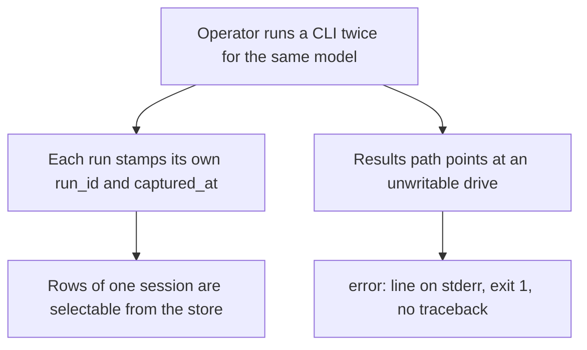
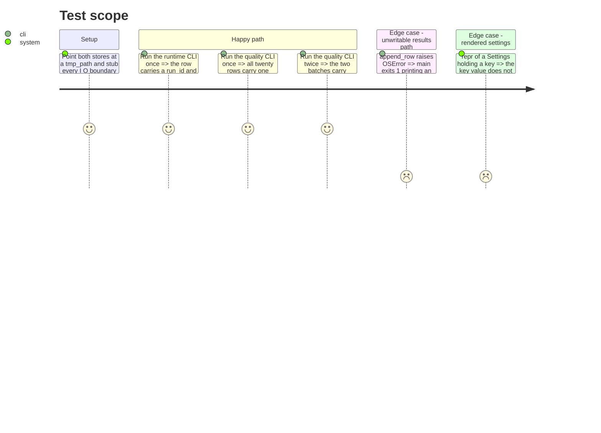

# Instruction: Row provenance and store safety

## Architecture projection

> Tree of the final files. ✅ create · ✏️ modify · ❌ delete

```txt
.
├── src/wave_local_ai_v2/
│   ├── results.py          ✏️ add new_run_id() and captured_at(); the two provenance helpers both stores share
│   ├── settings.py         ✏️ declare mistral_api_key with field(repr=False) so a rendered Settings cannot leak the key
│   ├── __init__.py         ✏️ stamp run_id/captured_at on the runtime row; OSError in main()'s except tuple
│   └── quality_cli.py      ✏️ stamp one run_id per invocation on every quality row; OSError in main()'s except tuple
└── tests/
    ├── test_results.py     ✏️ cover both helpers
    ├── test_settings.py    ✏️ cover the key's absence from repr()
    ├── test_cli.py         ✏️ assert the runtime row carries both keys
    └── test_quality_cli.py ✏️ assert all rows of one run share one run_id
```

## User Journey



## Test Scope



## Tasks to do

### `1)` Provenance helpers in the results store

> One identifier shape and one clock for both stores.

1. In `results.py`, add `new_run_id() -> str` returning `uuid.uuid4().hex` and `captured_at() -> str` returning `datetime.now(UTC).isoformat()`.
2. Docstring each with what it is for: a row must say which run wrote it and when, or two runs of the same model are indistinguishable.
3. Extend `tests/test_results.py`: two `new_run_id()` calls differ; `captured_at()` round-trips through `datetime.fromisoformat` and its `tzinfo` offset is zero.

### `2)` Stamp the runtime row

> The runtime store gains attribution without gaining a metric.

1. In `__init__.py:_run`, call `new_run_id()` once, before `running_server`.
2. Put `"run_id"` and `"captured_at"` first in the row dict, ahead of `**fiche`; call `captured_at()` at row-build time, not at run start.
3. Extend `tests/test_cli.py::test_run_appends_one_row_with_fiche_and_metrics` (or add one test) asserting both keys are present, non-empty, and that `QUALITY_ONLY_FIELDS` stays disjoint.

### `3)` Stamp the quality rows

> One invocation, one run id, across both models.

1. In `quality_cli._run`, call `new_run_id()` once and pass it to both `_score_and_write` calls as a keyword-only argument.
2. In `_score_and_write`, put `"run_id"` and `"captured_at"` first in the row dict, calling `captured_at()` per row.
3. Extend `tests/test_quality_cli.py`: one `_run()` gives one distinct `run_id` across all `2 * len(suite)` rows; two `_run()` calls give two distinct ones; `RUNTIME_ONLY_FIELDS` stays disjoint.

### `4)` A misconfigured results path ends in an error line, not a traceback

> `append_row` can raise `OSError` on a read-only drive, an absent drive, or a full disk.

1. In `__init__.py:main` and `quality_cli.py:main`, replace `requests.RequestException` with `OSError` in the except tuple.
2. Comment the replacement in one line: `requests.RequestException` subclasses `OSError`, so HTTP failures are still caught and disk failures now are too.
3. Add one test per CLI: patch `append_row` to raise `OSError`, assert `SystemExit(1)` and an `error:` line on stderr.

### `5)` The API key is not printable

> A traceback frame or an assertion diff that renders a `Settings` must not carry the credential.

1. In `settings.py`, declare `mistral_api_key: str = field(default="", repr=False)`, importing `field` from `dataclasses`.
2. Add a test: `repr(Settings(..., mistral_api_key="secret-value"))` does not contain `secret-value`, while `settings.mistral_api_key` still returns it.

## Test acceptance criteria

| Task | Acceptance criteria              |
| ---- | -------------------------------- |
| 1 | Two `new_run_id()` calls return different values; `captured_at()` parses back to a timezone-aware UTC datetime. |
| 2 | A stubbed runtime run appends one row carrying a non-empty `run_id` and a UTC-parseable `captured_at`, and no quality-only field. |
| 3 | A stubbed quality run's rows all carry the same `run_id`; a second run's rows carry a different one; no row carries a runtime-only field. |
| 4 | With `append_row` raising `OSError`, each CLI exits 1 with an `error:` line on stderr and no traceback. |
| 5 | `repr()` of a populated `Settings` omits the key value while attribute access still returns it. |
