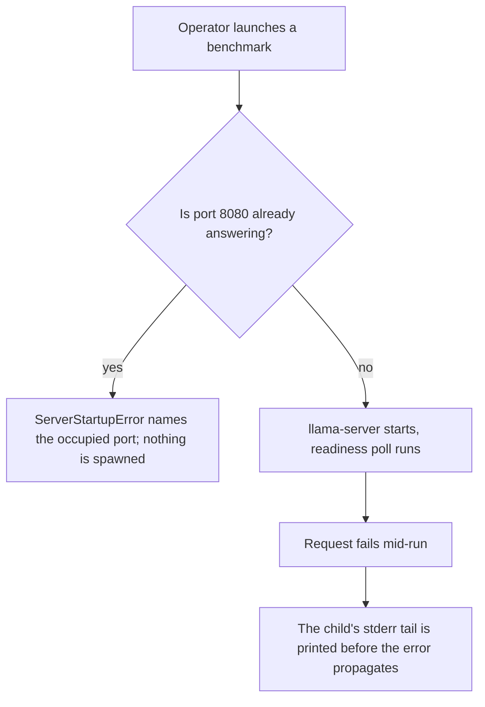
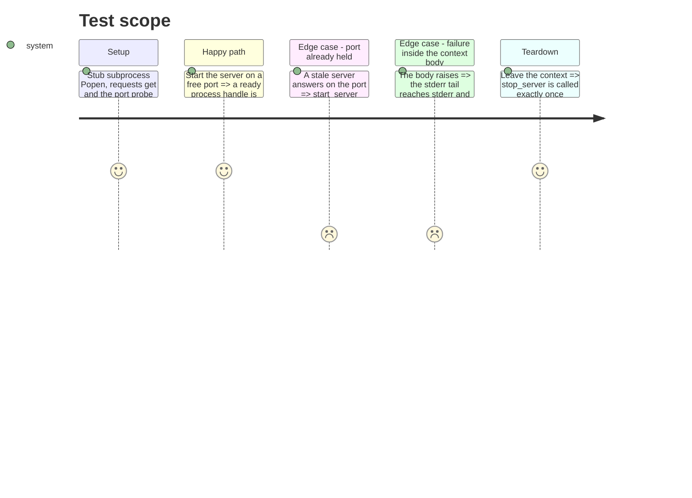

# Instruction: Server lifecycle honesty

## Architecture projection

> Tree of the final files. ✅ create · ✏️ modify · ❌ delete

```txt
.
├── src/wave_local_ai_v2/
│   └── server.py        ✏️ refuse to start on an occupied port; keep the child's stderr readable for its whole lifetime
└── tests/
    └── test_server.py   ✏️ cover the occupied port and the stderr tail on a mid-run failure
```

## User Journey



## Test Scope



## Tasks to do

### `1)` Refuse to attribute metrics to a server we did not start

> A stale llama-server on 8080 makes the new, doomed process look ready: the first `/health` poll returns 200 from the old one, and every metric is then attributed to the wrong process.

1. Add `_port_is_open(host: str, port: int, timeout: float = 0.5) -> bool` to `server.py`, using `socket.create_connection` and returning `False` on `OSError`.
2. At the top of `start_server`, before `Popen`, raise `ServerStartupError` when `_port_is_open(HOST, PORT)` is true. Name the port and say a previous llama-server is likely still running.
3. Comment why the check exists: without it a doomed handle passes readiness and the run reports another process's numbers.
4. Add a test: with `_port_is_open` stubbed true, `start_server` raises and `subprocess.Popen` is never called.

### `2)` Keep the child's stderr readable for as long as the child lives

> `start_server`'s `with tempfile.TemporaryFile()` closes the parent handle at return, so a mid-run crash surfaces as a bare `ConnectionError` with no diagnostics.

1. Give `start_server` a keyword-only `stderr_sink: IO[bytes] | None = None`. When given, use it and neither open nor close one; when `None`, keep today's `with tempfile.TemporaryFile()` behavior so direct callers and existing tests are unaffected.
2. In `running_server`, open one `tempfile.TemporaryFile()` for the whole context, pass it as `stderr_sink`, and keep `stop_server` in the `finally`.
3. In `running_server`, catch any exception raised by the body, print `_read_stderr_tail(...)` to `sys.stderr` prefixed so the operator knows it is the server's output, then re-raise unchanged. Do not swallow, wrap, or replace the exception.
4. Keep `_read_stderr_tail` private; nothing outside the module needs it.
5. Add a test: a body that raises inside `running_server` produces the tail on stderr and propagates the original exception type.

## Test acceptance criteria

| Task | Acceptance criteria              |
| ---- | -------------------------------- |
| 1 | With the port reported occupied, `start_server` raises `ServerStartupError` naming the port and spawns no process. |
| 2 | An exception raised inside a `running_server` body reaches the caller unchanged, and the server's stderr tail was written to stderr before it did; the process is still stopped exactly once. |
