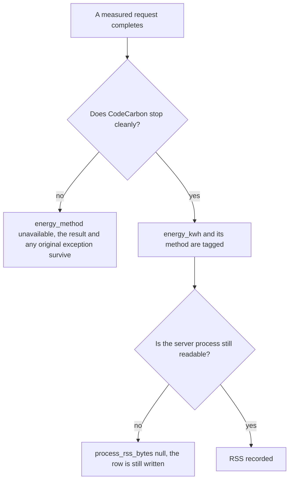
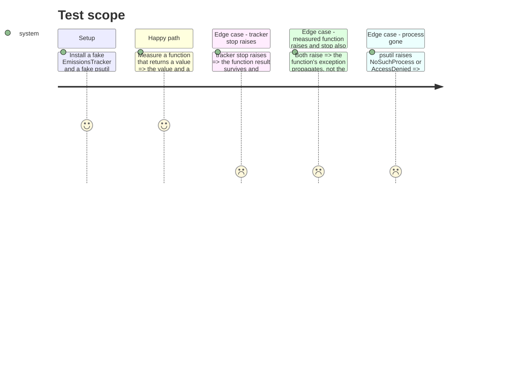

# Instruction: Metrics collection resilience

## Architecture projection

> Tree of the final files. ✅ create · ✏️ modify · ❌ delete

```txt
.
├── src/wave_local_ai_v2/
│   ├── energy.py        ✏️ a CodeCarbon teardown failure must not destroy a completed measurement
│   ├── timings.py       ✏️ read_process_rss degrades to None instead of killing a finished run
│   └── __init__.py      ✏️ the row's process_rss_bytes becomes nullable
└── tests/
    ├── test_energy.py   ✏️ cover the failing stop()
    └── test_timings.py  ✏️ cover both psutil failure modes
```

## User Journey



## Test Scope



## Tasks to do

### `1)` A teardown failure must not destroy a completed measurement

> `tracker.stop()` sits unguarded in the `finally`: it can propagate an unhandled type after `fn()` already succeeded, and it silently replaces any exception `fn()` raised.

1. Add a module-private `_stop_tracker(tracker) -> bool` that calls `tracker.stop()` inside `try/except Exception`, returns `True` on success and `False` otherwise, and never raises.
2. Replace `finally: tracker.stop()` with `finally: stopped = _stop_tracker(tracker)`. Because the helper cannot raise, the `finally` no longer masks the body's exception.
3. When `stopped` is `False`, return `result` with `EnergyResult(energy_kwh=None, energy_method="unavailable")` without reading `final_emissions_data`.
4. Note in the comment why `unavailable` and not a partial number: a tracker that failed to stop has no trustworthy total.
5. Add two tests: `stop()` raising leaves the function result intact and tags `unavailable`; a raising `fn()` plus a raising `stop()` propagates the `fn()` exception.

### `2)` A finished run is not lost to a vanished process

> `read_process_rss` raises `psutil.NoSuchProcess` when the server exits between the completion response and the read, or `AccessDenied`; neither is in `main()`'s except tuple, so the run dies after the measurement already succeeded.

1. Change `read_process_rss` to return `int | None`, catching `psutil.Error` (the base of both `NoSuchProcess` and `AccessDenied`; verified locally, and it does not subclass `OSError`) and returning `None`.
2. Docstring the contract: `None` means the process could not be read, never that RSS was zero.
3. Type the runtime row's `process_rss_bytes` accordingly and leave the CLI except tuples untouched.
4. Update `tests/test_timings.py`: keep the positive-integer test for a live process, add one test per failure mode asserting `None` and no raise.

## Test acceptance criteria

| Task | Acceptance criteria              |
| ---- | -------------------------------- |
| 1 | With `stop()` raising, `measure_energy` returns the measured function's result tagged `energy_method="unavailable"`; when both the function and `stop()` raise, the caller sees the function's exception. |
| 2 | `read_process_rss` returns `None` for both `NoSuchProcess` and `AccessDenied` and still returns a positive integer for a live process; a stubbed run whose RSS read fails still appends its row. |
