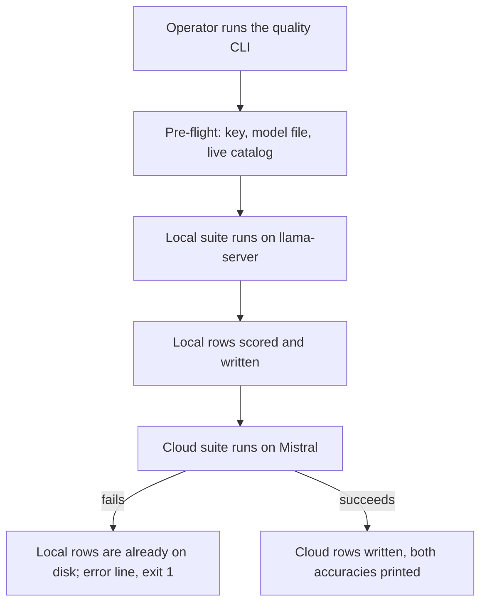
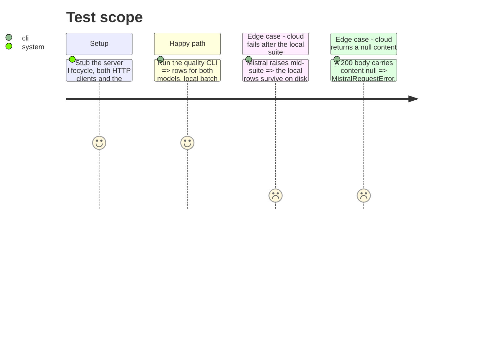

# Instruction: Cloud client and quality run order

## Architecture projection

> Tree of the final files. ✅ create · ✏️ modify · ❌ delete

```txt
.
├── src/wave_local_ai_v2/
│   ├── mistral_client.py     ✏️ reject a non-text content, as the local path already does
│   └── quality_cli.py        ✏️ persist the local rows before the cloud suite starts; correct the stale ordering comment
└── tests/
    ├── test_mistral_client.py ✏️ cover a null content
    └── test_quality_cli.py    ✏️ cover the partial-write path
```

## User Journey



## Test Scope



## Tasks to do

### `1)` The cloud path gets the guard the local path already has

> `content: str = response_json["choices"][0]["message"]["content"]` annotates `str` and never checks it. Mistral returns `content: null` on tool-call and refusal finish reasons; that value reaches `normalize_label`, whose `.lower()` raises `AttributeError` outside `main()`'s except tuple, as a raw traceback.

1. In `complete_prompt`, widen the local annotation to `Any` and, after the shape guard, raise `MistralRequestError` when `isinstance(content, str)` is false, naming the offending value.
2. Mirror the local wording at `quality_cli.py:148-153` so the two guards read as one rule, and reference in the comment that a present-but-non-text content otherwise fails downstream in `normalize_label`.
3. Add a test: a 200 body whose `content` is `None` raises `MistralRequestError`, not `AttributeError`.

### `2)` A cloud failure no longer discards the local run

> Local completions are held in memory until after the cloud suite returns, so a 429, a transient network error or a malformed body after the multi-minute local run writes zero rows. The pre-flight only covers what is knowable at second zero.

1. In `_run`, move the local `_score_and_write` call to immediately after `_run_local_suite`, before `_run_cloud_suite`.
2. Keep one `run_id` (phase 1) across both `_score_and_write` calls so a partial run is still recognizable as one session.
3. Rewrite the `_run` comment block at lines 83-88: it currently states that `_score_and_write` runs only after both suites return and that nothing is lost by failing at pre-flight. After this change the local rows survive a cloud failure, and that is the reason the pre-flight order still matters (it avoids paying for a local run that can never be completed).
4. Add a test: with `complete_prompt` raising `MistralRequestError`, `_run` propagates and the store holds exactly `len(suite)` local rows.
5. Add a test asserting the ordering directly: the local rows exist on disk at the moment the first `complete_prompt` call is made.

## Test acceptance criteria

| Task | Acceptance criteria              |
| ---- | -------------------------------- |
| 1 | A Mistral 200 response carrying `content: null` surfaces as `MistralRequestError` naming the value; a string content still returns unchanged. |
| 2 | A cloud failure leaves exactly one local row per suite item on disk, all sharing the run's `run_id`, and the local rows are already written when the first cloud call happens. |
