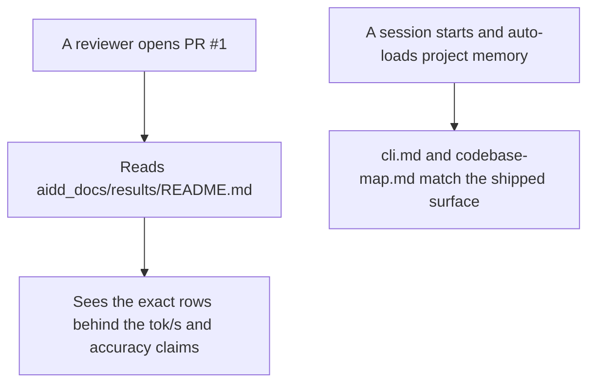
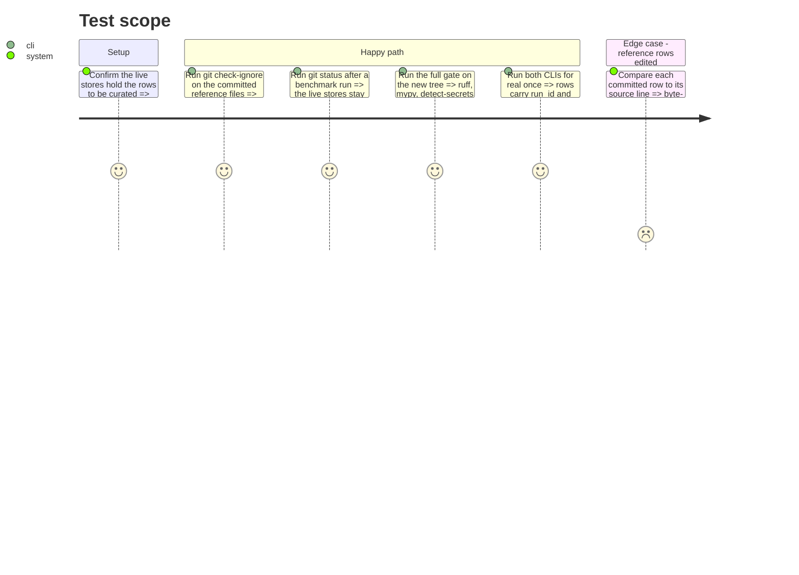

# Instruction: Committed evidence and project memory

## Architecture projection

> Tree of the final files. ✅ create · ✏️ modify · ❌ delete

```txt
.
├── .gitignore                              ✏️ stop hiding the results directory; ignore the two live append targets by name
├── CLAUDE.md                               ✏️ give the two new Action rules the scope carve-out the Communication rules require
├── aidd_docs/
│   ├── results/
│   │   ├── README.md                       ✅ what each committed file proves, how it was produced, what is deliberately absent
│   │   ├── runtime-reference.jsonl         ✅ the two acceptance rows, byte-for-byte as the harness wrote them
│   │   └── quality-reference.jsonl         ✅ the two consecutive quality runs behind the reproducibility claim
│   └── memory/
│       ├── cli.md                          ✏️ both entry points, no "in progress", where the rows land
│       ├── codebase-map.md                 ✏️ tests, results and backlog areas plus both entry points
│       └── architecture.md                 ✏️ drop the false claim that pre-commit wires the fast gate
└── aidd_docs/results/runtime.jsonl         (untracked, unchanged)
    aidd_docs/results/quality.jsonl         (untracked, unchanged)
```

## User Journey



## Test Scope



## Tasks to do

### `1)` The acceptance evidence leaves this machine

> The branch's headline claims rest on `aidd_docs/results/*.jsonl`, which `.gitignore:19` hides, so nobody reading PR #1 can see them. The PRD goal is that a client's engineer reproduces the numbers independently.

1. In `.gitignore`, replace the `aidd_docs/results/` line with `aidd_docs/results/runtime.jsonl` and `aidd_docs/results/quality.jsonl`, and comment in one line why: the live append targets are per-machine output, the curated reference snapshots next to them are evidence.
2. Create `aidd_docs/results/runtime-reference.jsonl` from lines 4 and 5 of the current `runtime.jsonl`, copied verbatim: those are the two rows the runtime acceptance criterion cites (`gen_tok_per_s` 26.046 and 25.484, `prompt_tok_per_s` 255.93 and 259.25).
3. Create `aidd_docs/results/quality-reference.jsonl` from the current `quality.jsonl`, all 40 rows verbatim: two consecutive runs per model, local 0.60 twice, cloud 1.00 twice, zero label mismatches.
4. Write `aidd_docs/results/README.md`: what each file is, which claim it supports, the date and branch tip it was produced at, that the files are curated snapshots no CLI ever writes to, that rows 6 to 9 of the live runtime store are excluded because they come from the reverted streaming experiment under a thermally throttled GPU, and that the reference rows predate `run_id`/`captured_at` and were deliberately not back-filled.
5. Confirm `uv run detect-secrets-hook --baseline .secrets.baseline` still exits 0 with the new files tracked.

### `2)` Project memory stops contradicting the shipped code

> `CLAUDE.md` auto-loads these files every session, so drift here misleads every future run.

1. `cli.md`: list both `wave-local-ai-v2` and `wave-local-ai-v2-quality` with one line each on what they run and where their rows land; delete "(implementation in progress)".
2. `codebase-map.md`: add `tests/`, `aidd_docs/results/` and `aidd_docs/backlog/` to the areas and the diagram, and list both entry points.
3. `architecture.md`: the "pre-commit wires the fast gate" line is false (no `.pre-commit-config.yaml`, no installed hook). State that the gate commands are run manually, and leave wiring pre-commit to the CI/CD step the audit already tracks. This is adjacent to the memory-drift finding, not part of it, and is included because a false claim in auto-loaded memory is the same defect.

### `3)` The two new Action rules stop contradicting the Communication rules

> `CLAUDE.md:33-39` requires a model recommendation at the start of every task and a next-skill pointer with its prompt, while `:14` forbids preamble and suggestion menus. `:31` demands that a new rule which contradicts an existing one be merged or given explicit scope and priority.

1. Amend the "No preamble or recap" bullet to name the two carve-outs explicitly: the model and effort recommendation, and the next AIDD skill pointer, are the exceptions to "skip suggestion menus".
2. Add a scope line to the two Action rules stating they are the named exceptions, and bound them: one line each, at the start and the end of a task, never a menu of alternatives.
3. Keep the edit minimal. The separate finding that these rules belong on their own branch is not addressed here and stays open as tech debt.

### `4)` One real run proves the increment end to end

> Every other criterion in this plan is checked against stubs. The runtime path (port guard, stderr sink, nullable RSS) has never executed against a real llama-server.

1. Run `uv run wave-local-ai-v2` once with the model available, and confirm the appended row carries `run_id`, a UTC `captured_at`, and a `gen_tok_per_s` within the plan's band of 26.
2. Run `uv run wave-local-ai-v2-quality` once and confirm all rows of that invocation share one `run_id` and that the accuracies match the committed reference. This spends a small number of Mistral tokens (10 items, one call each); skip it and say so explicitly if the key is unavailable rather than reporting it as passed.
3. Record both outcomes in the phase notes, quoting the printed summary line, not the whole row.

## Test acceptance criteria

| Task | Acceptance criteria              |
| ---- | -------------------------------- |
| 1 | `git check-ignore` reports the two reference files as not ignored and both live stores as ignored; each reference row is byte-identical to its source line; `detect-secrets-hook` exits 0. |
| 2 | `cli.md` names both commands with no "in progress"; `codebase-map.md` lists the tests, results and backlog areas and both entry points; no memory file claims a gate that is not wired. |
| 3 | `CLAUDE.md` no longer states a rule and its opposite: the Communication bullet names the two exceptions and the Action rules point back to it with their scope stated. |
| 4 | A real runtime run appends a row with both provenance fields and a `gen_tok_per_s` within +/-1.5 of 26; a real quality run's rows share one `run_id` and reproduce the reference accuracies, or the skip is stated. |

## Notes

### Task 4 — one real run, end to end

Both CLIs were run for real on 2026-08-21 with the model, the llama-server
binary and the Mistral key all available. Neither was skipped.

**Runtime** (`uv run wave-local-ai-v2`), printed summary:

```
gen_tok_per_s=26.5 prompt_tok_per_s=259.2 ttft_ms=5748.5 energy_method=measured_nvml -> aidd_docs\results\runtime.jsonl
```

The appended row carries `run_id=4826bf9f4534494c9f7e4c367deacaad` and
`captured_at=2026-08-21T21:08:28.620566+00:00` (UTC offset zero). Its
`gen_tok_per_s` of 26.480 is inside the plan's band of 26 +/- 1.5. This is the
first real execution of the port guard, the long-lived stderr sink and the
nullable RSS read; `process_rss_bytes` came back populated (15,225,921,536).

**Quality** (`uv run wave-local-ai-v2-quality`), printed summary:

```
model=Qwen3.6-35B-A3B provider=local accuracy=0.60
model=mistral-small-2603 provider=mistral accuracy=1.00
```

All 20 rows of the invocation share one `run_id`, every `captured_at` is UTC,
and every `predicted_label` matches the committed reference item for item, for
both providers. The accuracies reproduce the reference exactly.
