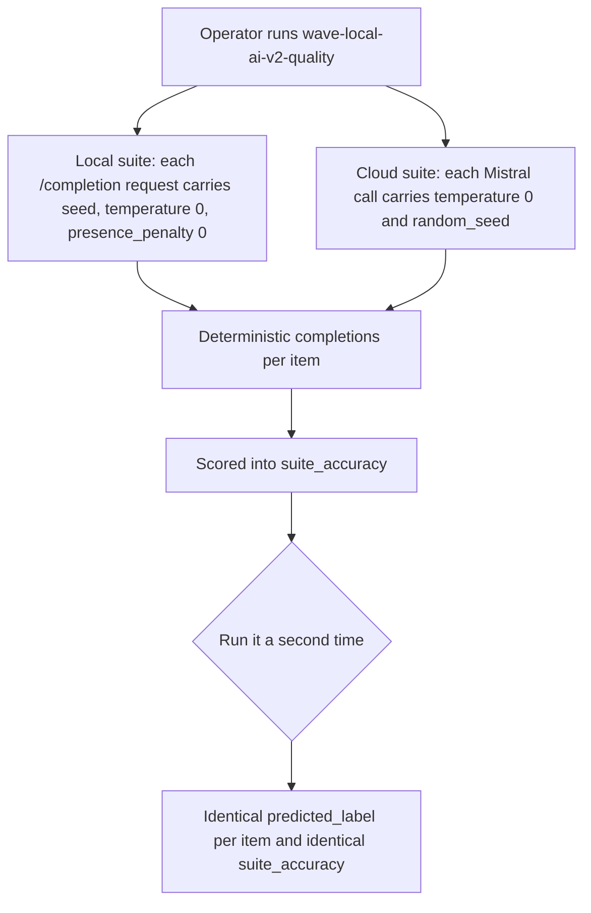
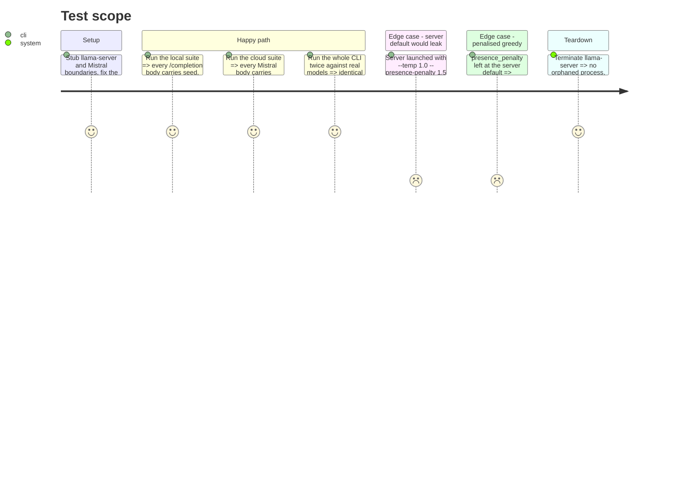

<!-- Fill or omit these sections; never add, rename, or reorder one. -->

# Instruction: Deterministic sampling for both models

## Architecture projection

> Tree of the final files. ✅ create · ✏️ modify · ❌ delete

```txt
.
├── src/
│   └── wave_local_ai_v2/
│       ├── quality_cli.py        ✏️ add QUALITY_SAMPLING block; send it in the /completion body
│       ├── mistral_client.py     ✏️ sampling params in the body; MODEL pinned to a dated id
│       └── server.py             (untouched — build_flags is the runtime baseline contract)
└── tests/
    ├── test_quality_cli.py       ✏️ assert the local request body pins seed/temperature/presence_penalty
    └── test_mistral_client.py    ✏️ assert the cloud request body pins temperature/random_seed
```

## User Journey



## Test Scope



## Tasks to do

### `1)` Pin the local model's sampling per request

> The quality CLI stops inheriting the runtime benchmark's sampler.

1. Add a module-level `QUALITY_SAMPLING` mapping in `quality_cli.py`: `seed` (a fixed non-negative int), `temperature: 0`, `top_k: 0`, `top_p: 1.0`, `presence_penalty: 0`.
2. Merge it into the `/completion` JSON body alongside `prompt` and `n_predict`.
3. Leave `server.build_flags` and `server.py` untouched; do not add a second flag set.
4. Comment why each key is sent, naming the server default it overrides.

### `2)` Pin the cloud model's sampling

> Mistral stops sampling at its model default.

1. Give `complete_prompt` explicit sampling parameters rather than hardcoding them at the call site.
2. Send `temperature: 0` and `random_seed: <the same fixed seed>` in the request body.
3. Keep the existing non-200 and shape-guard behavior unchanged.

### `3)` Pin the cloud model to a dated id

> A rotating alias cannot back a reproducibility claim.

1. Replace `MODEL = "mistral-small-latest"` in `mistral_client.py` with the dated id for the release under test.
2. Confirm the exact id string against `GET /v1/models` with the live key before committing; the docs list `mistral-small-4-0-26-03` as the active v26.03 release as of 2026-08-21, but the live endpoint is authoritative.
3. Update the module docstring: it currently argues *for* the alias, and that rationale no longer holds.
4. No row-builder change is needed — `quality_cli.py:71` already writes `mistral_client.MODEL` into every cloud row.

### `4)` Prove reproducibility with a real double run

> Mocks cannot falsify this claim; only two real runs can.

1. With `MISTRAL_API_KEY` set and the model present, run `wave-local-ai-v2-quality` twice.
2. Compare the two batches of rows: every `predicted_label` and every `suite_accuracy` must match per model and per item.
3. Record the two runs' `suite_accuracy` values in this phase file as manual evidence, the way the runtime plan records its tok/s figures.

## Test acceptance criteria

| Task | Acceptance criteria |
| ---- | ------------------- |
| 1 | Every `/completion` request the quality CLI issues carries `seed`, `temperature: 0`, `top_k: 0`, `top_p: 1.0` and `presence_penalty: 0`; deleting any one of these keys from the request body makes the assertion fail. The request body is read from the stubbed call's recorded arguments, not from a constant the test also defines. |
| 1 | `build_flags(Path("model.gguf"))` returns the same list it returned before this phase, so `tests/test_server.py`'s exact-list comparison still passes unmodified. |
| 2 | Every Mistral request body carries `temperature: 0` and an integer `random_seed`; removing either makes the assertion fail. Existing non-200 and missing-`choices` behavior is unchanged. |
| 3 | `mistral_client.MODEL` is a dated model id, not a `-latest` alias, and that id is confirmed present in the live `GET /v1/models` list. Every cloud quality row records it. Evidence: a live `GET /v1/models` on 2026-08-21 returned HTTP 200 with 56 models, including `mistral-small-2603`. The docs models-overview page rendered this release as `mistral-small-4-0-26-03`, which is absent from the API response, so the documented string would have failed at request time; the live endpoint was treated as authoritative per this task's step 2. |
| 4 | Two consecutive real runs of `wave-local-ai-v2-quality` produce, for each model, the same `predicted_label` for every one of the 10 items and the same `suite_accuracy`. A single differing label fails this criterion. Evidence: two runs on 2026-08-21 (21:55:11-21:56:00 and 21:56:08-21:56:53) wrote 20 rows each to `aidd_docs/results/quality.jsonl`; comparing them pairwise on `(provider, item_id)` gives 20 items compared and **0 `predicted_label` mismatches**. |
| 4 | The two runs' `suite_accuracy` figures are written into this phase file as manual evidence, naming the date and the model ids. Evidence (2026-08-21): `Qwen3.6-35B-A3B` (local) scored `0.60` on both runs; `mistral-small-2603` (cloud) scored `1.00` on both runs. Recorded sampling blocks, local `{presence_penalty: 0, seed: 20260821, temperature: 0, top_k: 0, top_p: 1.0}` and cloud `{random_seed: 20260821, temperature: 0}`. Note for a later increment, out of this plan's scope: all four local misses are `predicted_label = None`, i.e. no label token found in the completion at `n_predict=32`, not a wrong label -- the local figure measures output format as much as classification ability. |
