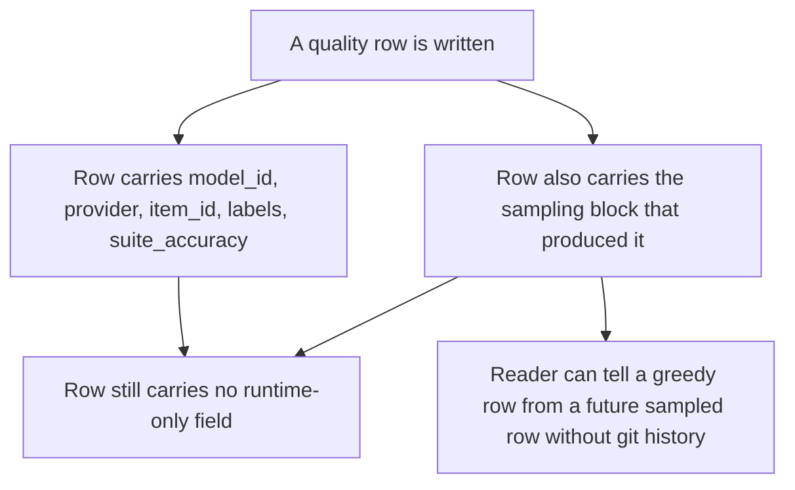
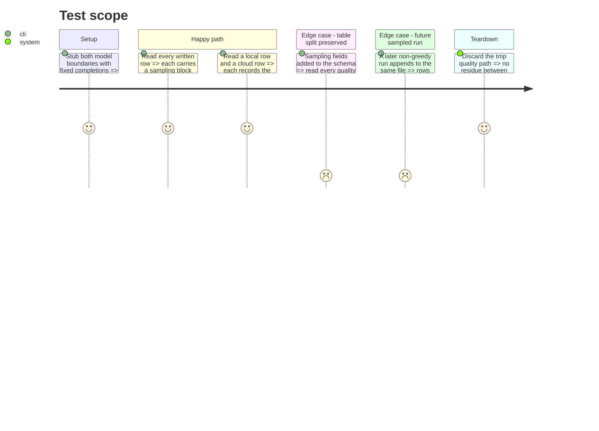

<!-- Fill or omit these sections; never add, rename, or reorder one. -->

# Instruction: Sampling provenance in every quality row

## Architecture projection

> Tree of the final files. ✅ create · ✏️ modify · ❌ delete

```txt
.
├── src/
│   └── wave_local_ai_v2/
│       └── quality_cli.py        ✏️ _score_and_write takes the sampling block and writes it into every row
└── tests/
    └── test_quality_cli.py       ✏️ assert every row carries its sampling block and stays disjoint from runtime fields
```

## User Journey



## Test Scope



## Tasks to do

### `1)` Carry the sampling block into the row builder

> The row records what produced it.

1. Pass the per-provider sampling parameters into `_score_and_write` rather than reaching for a module constant inside it.
2. Write them into each row under a single nested key, so one field addition cannot collide with a scoring field.
3. Keep the local and cloud blocks distinct: each row records the parameters sent to *its* provider, not a merged union.

### `2)` Hold the quality/runtime split

> A schema addition must not erode the architectural commitment.

1. Confirm no added key appears in the runtime row schema.
2. Extend the existing disjointness assertion so it still fails if a runtime-only field ever appears.

## Test acceptance criteria

| Task | Acceptance criteria |
| ---- | ------------------- |
| 1 | Every one of the `2 × 10` rows carries a sampling block recording the temperature, the seed and the penalty settings used for that row's provider. A row written without it fails the assertion. |
| 1 | A local row's recorded sampling values match what the local `/completion` call actually sent, and a cloud row's match what the Mistral call actually sent; swapping the two blocks between providers makes the assertion fail. |
| 2 | No quality row carries `cpu`, `ram_gb`, `gpu_name`, `ttft_ms`, `prompt_tok_per_s`, `gen_tok_per_s` or `energy_method`, and no runtime row gains a sampling field, so `aidd_docs/memory/architecture.md`'s "never merged into a single table" still holds. |
| 2 | Appending a row whose sampling block differs requires no change to the reader or the schema: `read_rows` returns both, each self-describing. |
