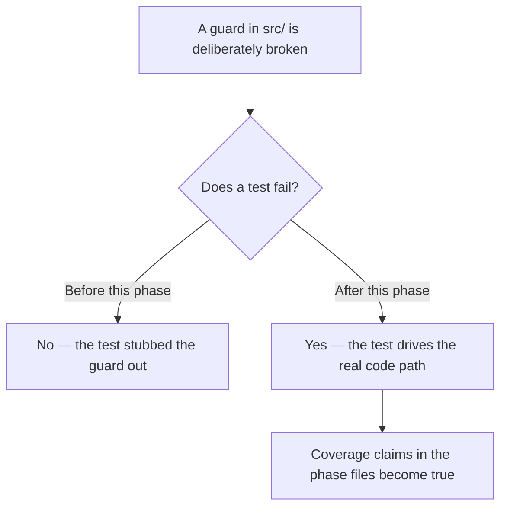
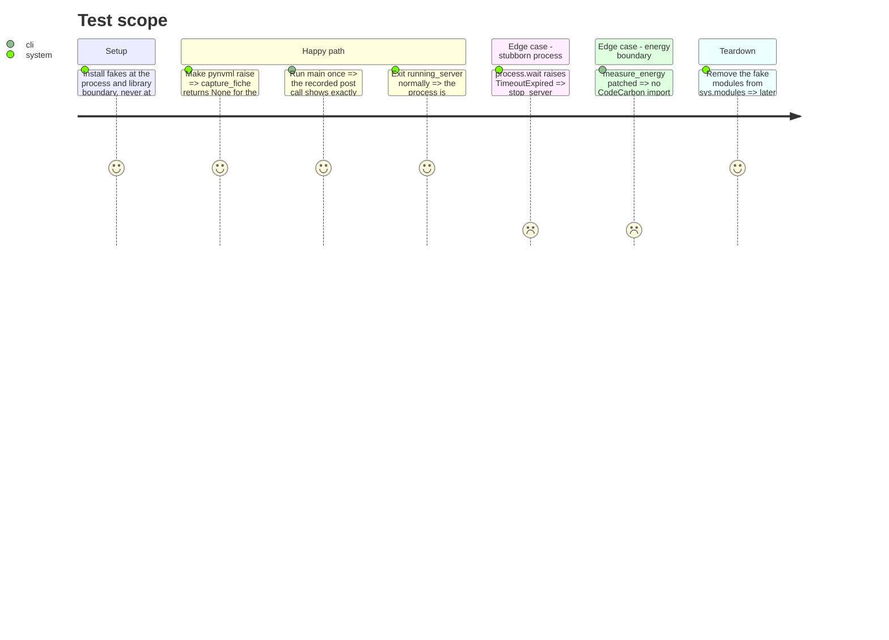

<!-- Fill or omit these sections; never add, rename, or reorder one. -->

# Instruction: Tests that exercise the real code path

## Architecture projection

> Tree of the final files. ✅ create · ✏️ modify · ❌ delete

```txt
.
└── tests/
    ├── test_hardware.py          ✏️ fake pynvml that raises, instead of stubbing the function under test
    ├── test_cli.py               ✏️ assert the post payload and call count; patch measure_energy
    └── test_server.py            ✏️ cover running_server normal exit and the TimeoutExpired -> kill fallback
```

## User Journey



## Test Scope



## Tasks to do

### `1)` Make the NVML degradation test exercise the guard

> Stop stubbing the function whose except path is the criterion.

1. Remove the `monkeypatch.setattr(hardware, "_capture_gpu_fields", ...)` in `tests/test_hardware.py`.
2. Install a fake `pynvml` in `sys.modules` whose call raises, following the pattern already used in `tests/test_gpu.py`.
3. Assert `gpu_name`, `gpu_driver_version` and `cuda_ceiling` all come back `None` and nothing propagates.

### `2)` Assert the runtime CLI's request, and stop the real energy tracker

> The phase-4 criterion is about the request that was sent.

1. In `tests/test_cli.py`, assert the stubbed `requests.post` was called exactly once.
2. Assert the recorded body carries the fixed prompt and the fixed `max_tokens`, read from the recorded call arguments.
3. Patch `measure_energy` in the fixture so no CodeCarbon tracker is constructed, and assert the resulting `energy_method` value rather than only its presence.
4. Correct the fixture docstring so it describes what it actually stubs.

### `3)` Cover both shutdown paths

> Normal exit and the kill escalation.

1. Add a `running_server` test that leaves the block normally and asserts the process is terminated, without mocking `stop_server`.
2. Add a `stop_server` test where `process.wait` raises `subprocess.TimeoutExpired` first, asserting `kill()` is called and the process is waited on again.
3. Replace the `send_signal.called or terminate.called` assertion with one that names the expected call for the platform.

## Test acceptance criteria

| Task | Acceptance criteria |
| ---- | ------------------- |
| 1 | With `pynvml` raising, `capture_fiche()` returns `None` for all three GPU fields and raises nothing; deleting the `except` block in `hardware._capture_gpu_fields` makes this test fail. |
| 2 | Running `main()` once issues exactly one completion request, and that request's recorded body carries the fixed prompt and the fixed `max_tokens`; changing either value or issuing a second request makes the test fail. |
| 2 | No CodeCarbon tracker is constructed during `tests/test_cli.py`, and the asserted `energy_method` is a concrete expected value rather than a presence check. The file's two `main()` tests complete in well under a second each, against the 5.39s and 2.95s measured before this phase. |
| 3 | Leaving `running_server` normally terminates the process, verified without mocking `stop_server`; removing the `finally` in `running_server` makes this test fail. |
| 3 | When `process.wait` first raises `TimeoutExpired`, `stop_server` calls `kill()` and waits again; deleting the kill escalation makes this test fail. |
| 3 | The shutdown assertion names one expected call for the platform, so swapping `terminate()` for `send_signal()` makes it fail. |
