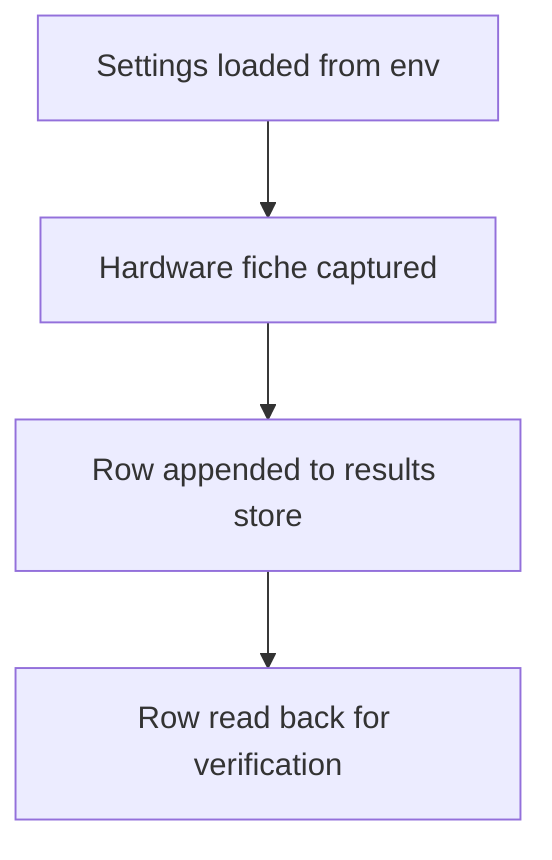
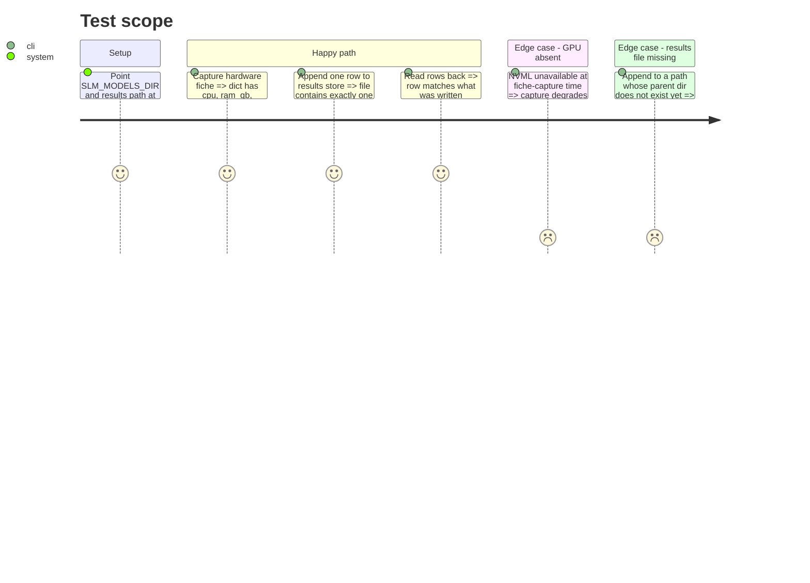

<!-- Fill or omit these sections; never add, rename, or reorder one. -->

# Instruction: Fiche and results store

## Architecture projection

> Tree of the final files. ✅ create · ✏️ modify · ❌ delete

```txt
.
├── pyproject.toml                                   ✏️ add psutil dependency
├── src/wave_local_ai_v2/
│   ├── hardware.py                                  ✅ hardware fiche capture (CPU, RAM, GPU name, driver, OS)
│   ├── results.py                                   ✅ append-only JSONL results store writer/reader
│   └── settings.py                                  ✅ env-backed config (model dir, llama-server path, results path)
└── tests/
    ├── test_hardware.py                              ✅ fiche fields present, no live GPU call required to pass
    └── test_results.py                               ✅ append/read round-trip on a tmp path
```

## User Journey



## Test Scope



## Tasks to do

### `1)` Settings module

> Load model dir, llama-server binary path, and results store path from environment, with `.env` support.

1. Add `LLAMA_SERVER_PATH` and `RUNTIME_RESULTS_PATH` to `.env` / `.env.example`, alongside the existing `SLM_MODELS_DIR`.
2. Write `settings.py` exposing a `Settings` dataclass/model populated from `os.environ`, defaulting `RUNTIME_RESULTS_PATH` to `aidd_docs/results/runtime.jsonl`.
3. Raise a clear error if `LLAMA_SERVER_PATH` or `SLM_MODELS_DIR` is unset or does not exist on disk.

### `2)` Hardware fiche capture

> Collect CPU, RAM, GPU, driver, OS fields without requiring a running llama-server.

1. Write `hardware.py` with a `capture_fiche()` function returning a dict: `cpu`, `ram_gb`, `gpu_name`, `gpu_driver_version`, `os`, `cuda_ceiling` (best-effort; `None` if NVML query fails).
2. Use `platform` for CPU/OS, and NVML (via the phase 3 dependency, imported lazily here) for GPU name/driver — wrap the NVML call in try/except so a fiche without a GPU still returns.
3. Leave `llama_cpp_build`, `model_file`, `quant`, and `flags` as fields the caller fills in later (phase 4 owns those, since they're run-specific, not machine-specific).

### `3)` Results store

> Append-only JSONL writer/reader for runtime rows.

1. Write `results.py` with `append_row(path, row: dict)` — creates parent dirs if missing, appends one `json.dumps(row)` line.
2. Write `read_rows(path) -> list[dict]` for tests and future inspection.
3. Add `aidd_docs/results/` to the tree (create the directory; do not commit a stray empty file — `append_row` creates it on first write).

## Test acceptance criteria

| Task | Acceptance criteria |
| ---- | -------------------- |
| 1    | Importing `settings` with the three env vars set returns a populated `Settings`; unset `LLAMA_SERVER_PATH` raises before any process is spawned. |
| 2    | `capture_fiche()` returns all documented keys; stubbing NVML to raise still returns a dict with `gpu_name is None`, no exception propagates. |
| 3    | `append_row` then `read_rows` on the same tmp path returns a list containing exactly the appended row, byte-for-byte equal on the JSON-safe fields. |
