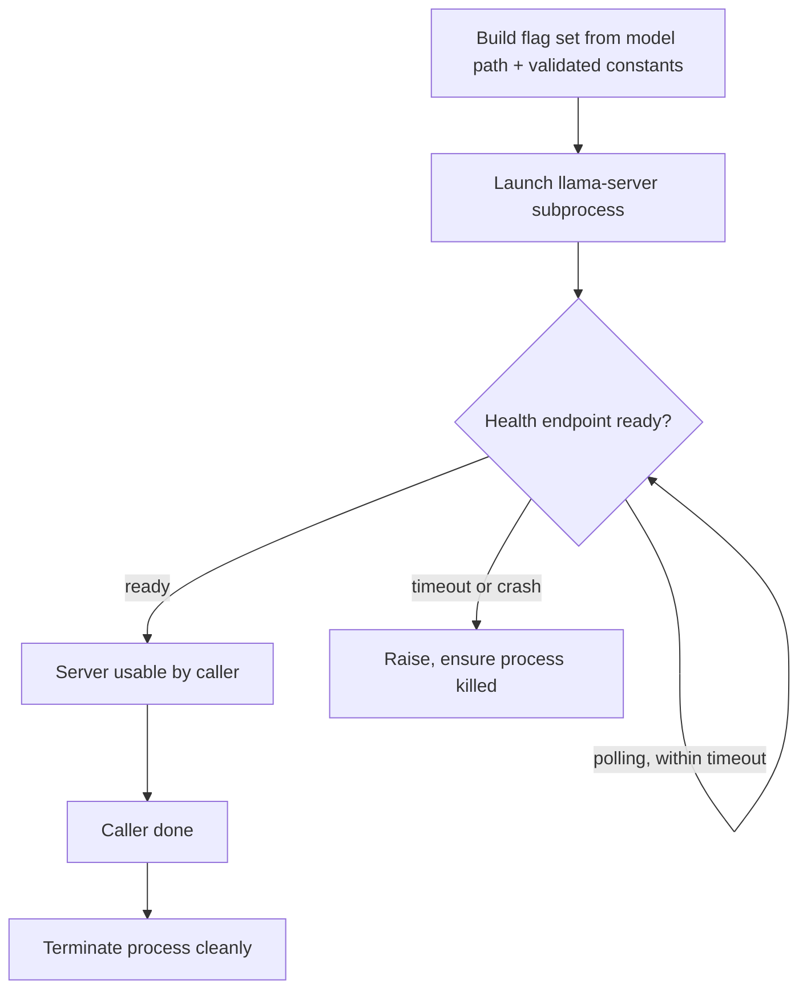
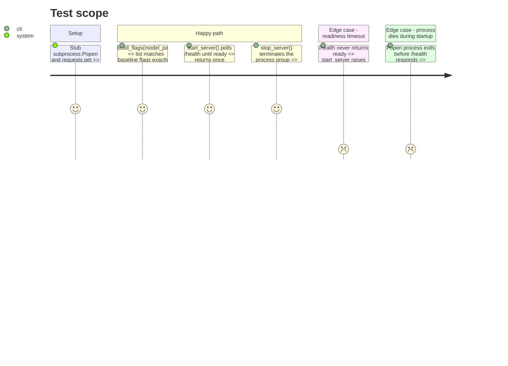

<!-- Fill or omit these sections; never add, rename, or reorder one. -->

# Instruction: llama-server process lifecycle

## Architecture projection

> Tree of the final files. ✅ create · ✏️ modify · ❌ delete

```txt
.
├── src/wave_local_ai_v2/
│   └── server.py                                     ✅ flag builder, launch, readiness wait, clean shutdown
└── tests/
    └── test_server.py                                ✅ flag builder + shutdown logic, no real process spawned
```

## User Journey



## Test Scope



## Tasks to do

### `1)` Flag builder

> Reproduce the validated baseline command exactly, parameterized only by model path (everything else fixed per `context_input/baseline_qwen36.md`).

1. Write `build_flags(model_path: Path) -> list[str]` returning the exact flag list from the baseline: `-m <model_path> -ngl 99 --n-cpu-moe 37 -c 32768 -fa on -t 8 --jinja -np 1 --load-mode none --temp 1.0 --top-p 0.95 --top-k 20 --min-p 0 --presence-penalty 1.5 --host 127.0.0.1 --port 8080`.
2. Keep every flag value a named constant at module top (no magic numbers inline) so a future increment can override `--n-cpu-moe` without touching the builder's shape.
3. Do not add, drop, or reorder-away any of the "known runtime constraints" flags — `--load-mode none`, `--jinja`, `--min-p 0`, `-np 1` are non-negotiable per the plan source.

### `2)` Launch and readiness wait

> Start the subprocess, poll until it accepts requests, fail loud and clean on timeout or crash.

1. Write `start_server(server_path, flags) -> subprocess.Popen`, launched with a new process group (Windows: `CREATE_NEW_PROCESS_GROUP`) so it can be signaled independently of the CLI process.
2. Poll `GET http://127.0.0.1:8080/health` (or the llama.cpp server's actual readiness endpoint — confirm the exact path/response shape against the running binary during implementation, since it wasn't verified in planning) every ~1s, with a generous timeout (model is 17.7GB — allow at least 120s) since load time was not part of the validated baseline.
3. If the process exits before becoming ready, raise immediately with the process's stderr tail included in the error — do not wait out the full timeout.

### `3)` Clean shutdown

> Terminate the server whether the run succeeded or failed.

1. Write `stop_server(process)` sending a graceful terminate signal first (Windows: `CTRL_BREAK_EVENT` to the process group, or `terminate()`), then `kill()` after a short grace period if still alive.
2. Expose this as a context manager (`with running_server(...) as proc:`) so callers get shutdown-on-exception for free — this is what phase 4 wires into the CLI's failure path.

## Test acceptance criteria

| Task | Acceptance criteria |
| ---- | -------------------- |
| 1    | `build_flags(Path("model.gguf"))` output contains every flag from the baseline command, in the values specified, verified by exact list comparison in a test. |
| 2    | With `requests.get` stubbed to return not-ready then ready, `start_server` returns only after the ready response; with `Popen.poll()` stubbed to show the process already exited, it raises without sleeping through the timeout. |
| 3    | The context manager calls terminate (and kill if still alive) on both normal exit and on an exception raised inside the `with` block. |
