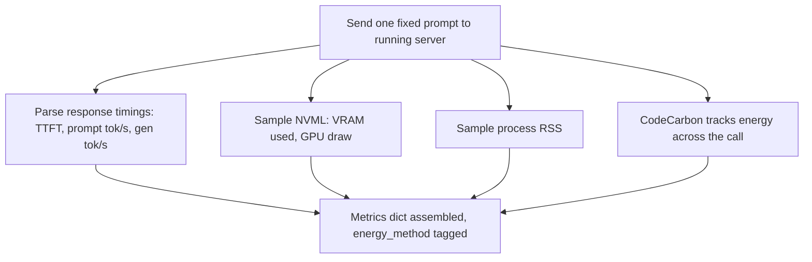
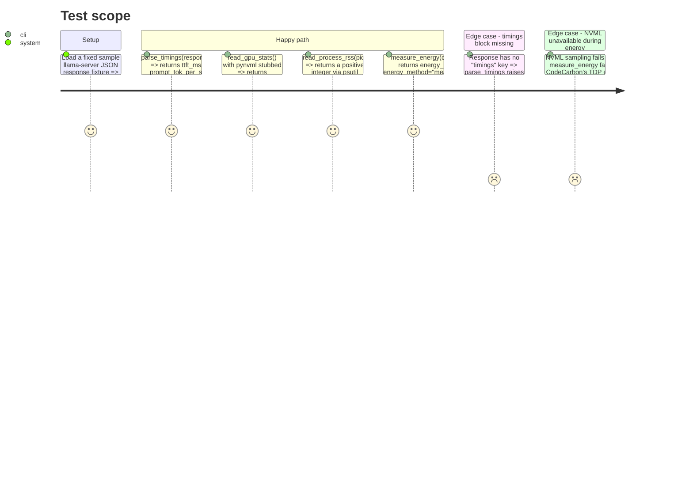

<!-- Fill or omit these sections; never add, rename, or reorder one. -->

# Instruction: Metrics collection

## Architecture projection

> Tree of the final files. ✅ create · ✏️ modify · ❌ delete

```txt
.
├── pyproject.toml                                   ✏️ add nvidia-ml-py, codecarbon, requests already present
├── src/wave_local_ai_v2/
│   ├── gpu.py                                        ✅ NVML wrapper: VRAM used, GPU draw (watts)
│   ├── energy.py                                     ✅ CodeCarbon wrapper scoped to one call, energy_method tagging
│   └── timings.py                                    ✅ parse llama-server response timings (TTFT, prompt tok/s, gen tok/s), process RSS
└── tests/
    ├── test_gpu.py                                    ✅ NVML wrapper against a stubbed pynvml
    ├── test_energy.py                                 ✅ energy_method tagging logic, no real CodeCarbon run
    └── test_timings.py                                ✅ timings parser against a fixed sample server response
```

## User Journey



## Test Scope



## Tasks to do

### `1)` Timings parser

> Extract TTFT, prompt tok/s, generation tok/s from the llama-server completion response, plus process RSS.

1. Write `timings.py` with `parse_timings(response_json: dict) -> dict` reading the server's `timings` object (confirm exact field names — `prompt_n`, `prompt_ms`, `predicted_n`, `predicted_ms` or equivalent — against a live response during implementation, since the schema wasn't fetched during planning) into `ttft_ms`, `prompt_tok_per_s`, `gen_tok_per_s`.
2. Raise a named error (not a bare `KeyError`) if the `timings` key is absent, since that means `--jinja`/server config produced a response shape the harness doesn't expect.
3. Add `read_process_rss(pid: int) -> int` using `psutil.Process(pid).memory_info().rss`.

### `2)` NVML GPU wrapper

> VRAM used and instantaneous GPU power draw, both real NVML measurements (not estimates).

1. Write `gpu.py` with `read_gpu_stats(device_index=0) -> dict` returning `vram_used_mib` and `gpu_draw_w`, using `nvidia-ml-py`'s `nvmlDeviceGetMemoryInfo` and `nvmlDeviceGetPowerUsage`.
2. Initialize/shutdown NVML (`nvmlInit`/`nvmlShutdown`) inside the function or a small context manager — do not leave a global NVML handle open across the process lifetime.
3. On any NVML failure, return `None` for both fields rather than raising — GPU stats are best-effort per the architecture memory's gotcha on estimate-vs-measurement labeling.

### `3)` Energy measurement with method tagging

> Wrap the generation call in CodeCarbon, tag the result with how the number was obtained.

1. Write `energy.py` with `measure_energy(fn: Callable) -> tuple[Any, dict]` — runs `fn()` inside a `codecarbon.EmissionsTracker` scoped tightly to that call, returns `(fn_result, {"energy_kwh": ..., "energy_method": ...})`.
2. Determine `energy_method`: `"measured_nvml"` if NVML GPU draw sampling (from task 2) succeeded during the tracked window, else `"estimated_tdp"` — per the architecture memory, CodeCarbon on Windows falls back to TDP estimation without RAPL access, and every row must carry this tag.
3. Do not let a CodeCarbon initialization failure crash the run — catch it, set `energy_kwh: None`, `energy_method: "unavailable"`.

## Test acceptance criteria

| Task | Acceptance criteria |
| ---- | -------------------- |
| 1    | `parse_timings` on the fixture response returns the three expected numeric fields with values matching a hand-computed expectation from the fixture; a response missing `timings` raises a named exception, not `KeyError`. |
| 2    | With `pynvml` calls stubbed to return fixed values, `read_gpu_stats` returns those values in the documented keys; stubbing a raise on any NVML call returns `None` fields without propagating. |
| 3    | `measure_energy` returns `energy_method="measured_nvml"` when the GPU-draw stub succeeds during the call, and `"estimated_tdp"` when it's stubbed to fail; a stubbed `EmissionsTracker` init failure yields `"unavailable"` without raising. |
