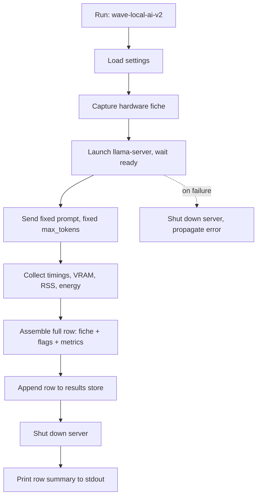
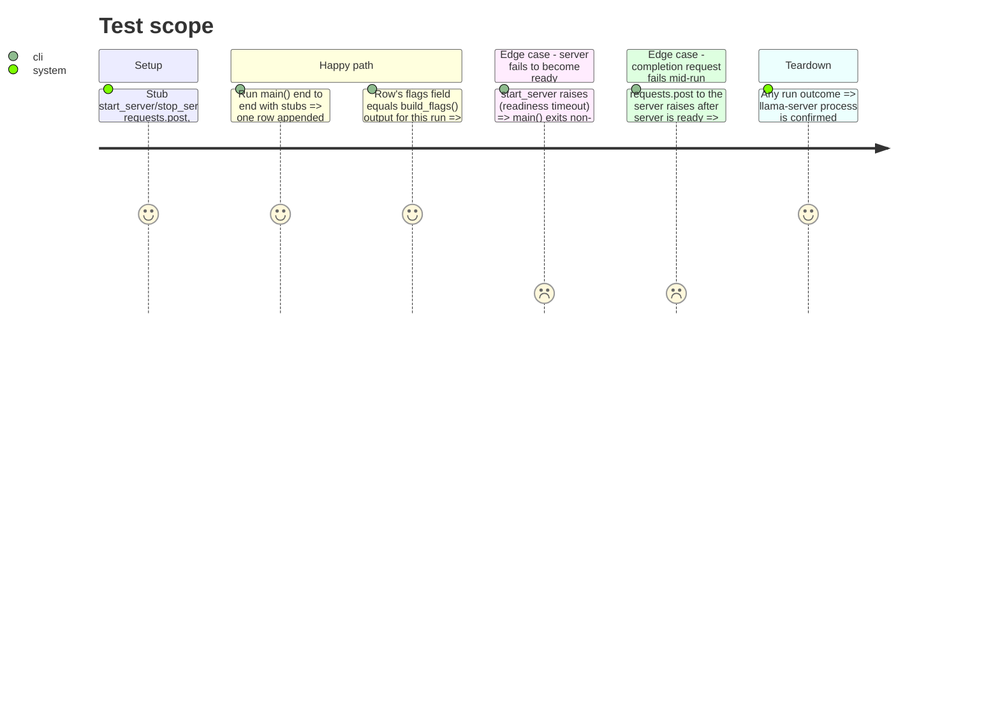

<!-- Fill or omit these sections; never add, rename, or reorder one. -->

# Instruction: CLI wiring (end to end)

## Architecture projection

> Tree of the final files. ✅ create · ✏️ modify · ❌ delete

```txt
.
├── src/wave_local_ai_v2/
│   └── __init__.py                                    ✏️ main() wires settings → server → prompt → metrics → fiche → results row
└── tests/
    └── test_cli.py                                     ✅ main() orchestration against stubbed server/metrics modules
```

## User Journey



## Test Scope



## Tasks to do

### `1)` Fixed prompt and request

> One fixed prompt, one fixed `max_tokens`, sent once per run — no suite, no loop.

1. Define the fixed prompt and `max_tokens` as module-level constants in `__init__.py` (or a small `prompt.py` if that reads cleaner) — pick a prompt long enough to make the prefill tok/s figure meaningful (baseline reports ~280 tok/s prefill, so a short prompt won't produce a stable measurement).
2. Send the request to the server's completion endpoint with `requests.post`, capturing wall-clock TTFT independently as a cross-check against the server-reported timings, per the acceptance bar of matching the baseline within noise.

### `2)` End-to-end orchestration

> `main()` wires every prior phase into the single command described in the goal.

1. In `main()`: load `Settings` → `capture_fiche()` → enter `running_server(...)` context (phase 2) → poll ready → send the fixed prompt wrapped in `measure_energy()` (phase 3) → sample `read_gpu_stats()` and `read_process_rss()` around the same call → `parse_timings()` the response.
2. Assemble the full row: hardware fiche fields + `llama_cpp_build` + `model_file` + `quant` + the exact flag list from `build_flags()` + all collected metrics + `energy_method`. Every field the acceptance criteria requires must be present, not just the metrics.
3. `append_row()` (phase 1) only after the request succeeds — a failed run must not write a partial or misleading row.
4. Ensure the server context manager's shutdown runs on every exit path (success, request failure, readiness timeout) — this is the context manager's job from phase 2, `main()` just needs to not swallow it.

### `3)` Verification against the baseline

> Confirm the acceptance bar, not just that the code runs.

1. Run the command for real once implementation is complete (not stubbed) and confirm the written row's `gen_tok_per_s` falls within ±1.5 tok/s of the validated ~26 tok/s, and prefill within reason of ~280 tok/s.
2. If it doesn't match, treat the harness as wrong per the plan's acceptance framing (mismeasured window, wrong endpoint, wrong flag) — do not adjust the baseline expectation.

## Test acceptance criteria

| Task | Acceptance criteria |
| ---- | -------------------- |
| 1    | The request sent to the stubbed `requests.post` carries the fixed prompt and fixed `max_tokens` exactly once per `main()` invocation. |
| 2    | A stubbed end-to-end `main()` run appends exactly one row containing every hardware-fiche field, the full flag list, and `energy_method`; a stubbed readiness failure or mid-run request failure appends zero rows and still calls the stubbed shutdown. |
| 3    | A real (non-stubbed) run of the CLI against the live model produces a row with `gen_tok_per_s` within ±1.5 tok/s of 26 and `prompt_tok_per_s` matching this harness's re-scoped bar (~255-260 tok/s, see `plan.md`'s Decisions table) — recorded as the manual verification evidence for this phase, not asserted in an automated test (the project's testing convention forbids tests starting a real server). Evidence: two real runs at `FIXED_PROMPT` length 1507 tokens produced `gen_tok_per_s`=26.0/25.5 and `prompt_tok_per_s`=255.9/259.3 (`aidd_docs/results/runtime.jsonl`); full root-cause and rejected-fix trail in `debug-prefill-gap.md`. |
