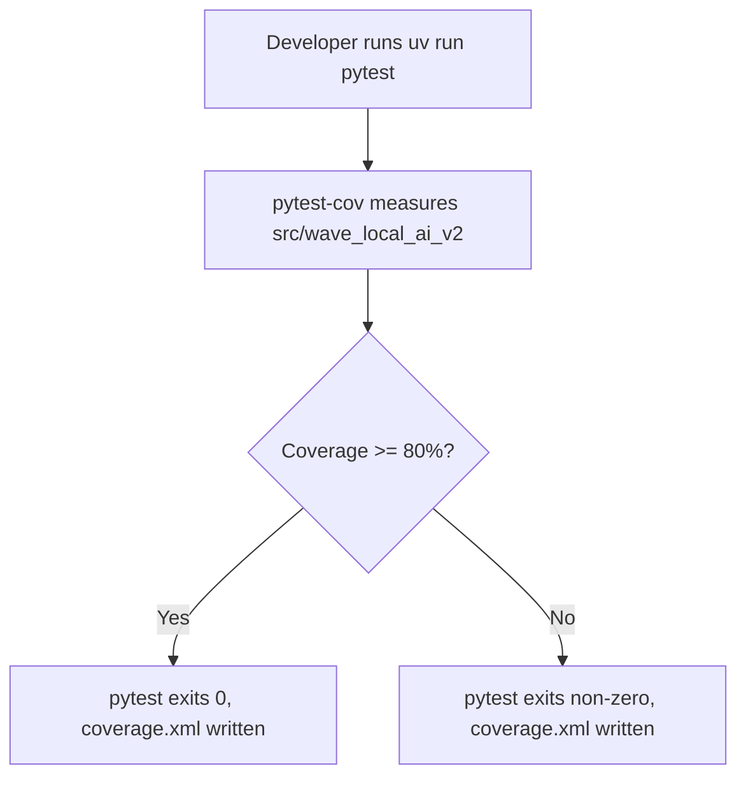
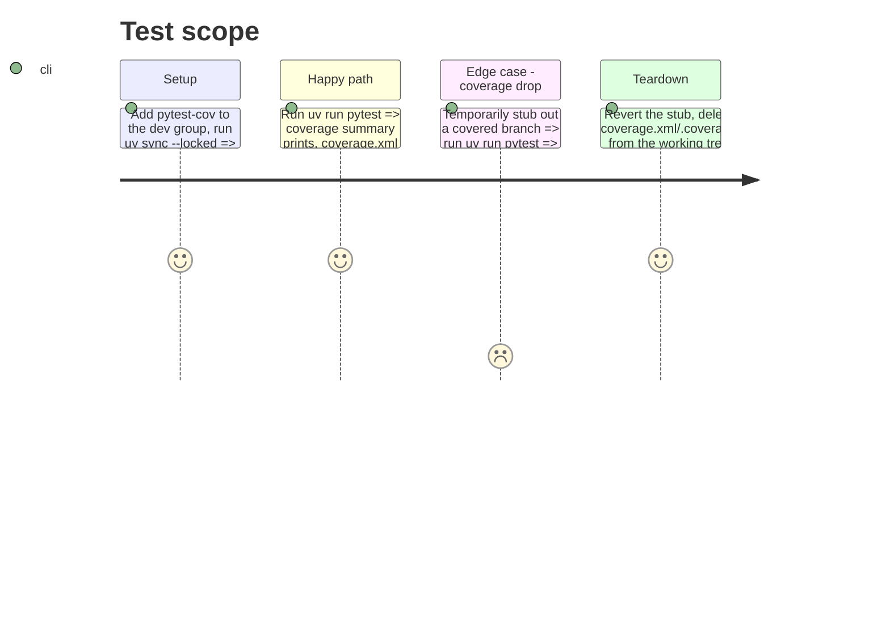

# Instruction: Coverage plumbing

## Architecture projection

> Tree of the final files. ✅ create · ✏️ modify · ❌ delete

```txt
.
├── .gitignore ✏️
└── pyproject.toml ✏️
```

## User Journey



## Test Scope



## Tasks to do

### `1)` Add pytest-cov as a dev dependency

> `uv run pytest` gains coverage measurement without a separate `--with` invocation.

1. `uv add --group dev pytest-cov` — updates `pyproject.toml`'s `dev` group and `uv.lock`.
2. Confirm `uv.lock` changed and is meant to be committed alongside `pyproject.toml`.

### `2)` Configure coverage in `pyproject.toml`

> One coverage config so the pre-push hook's plain `uv run pytest` and CI's `uv run pytest` measure the same thing.

1. Add `[tool.pytest.ini_options]` with `addopts` including `--cov=src/wave_local_ai_v2 --cov-report=term-missing --cov-report=xml --cov-fail-under=80`.
2. Add `[tool.coverage.run]` with `source = ["src/wave_local_ai_v2"]` if `--cov` alone under-scopes (verify against the current 443-statement/11-missed figure the story states — the measured total after this change should match).
3. Do not touch `.pre-commit-config.yaml`'s `pytest` hook entry (`uv run pytest`, unchanged) — the coverage behavior now comes from `pyproject.toml`, not from the hook command.

### `3)` Keep coverage output out of git

> The stray untracked `.coverage` in the working tree stops being a candidate for accidental commit.

1. Add `.coverage`, `coverage.xml`, and `htmlcov/` to `.gitignore`.
2. Remove the existing untracked `.coverage` file from the working tree (it is now ignored, not committed).

## Test acceptance criteria

| Task | Acceptance criteria                                                                                              |
| ---- | ------------------------------------------------------------------------------------------------------------------- |
| 1... | `uv sync --locked` succeeds and installs `pytest-cov`; `uv.lock` carries the new entry.                              |
| 2... | `uv run pytest` prints a coverage summary and writes `coverage.xml`; the reported total is close to the story's stated 98% (443 statements, 11 missed) baseline, not near-zero from a misconfigured `source`. |
| 2... | Dropping coverage below 80% (temporarily, for the check) makes `uv run pytest` exit non-zero with the missing lines named. |
| 3... | After running `uv run pytest`, `git status` shows no untracked `.coverage`, `coverage.xml`, or `htmlcov/`.           |
