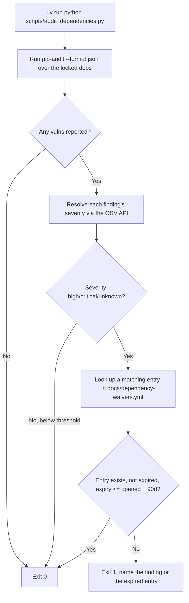
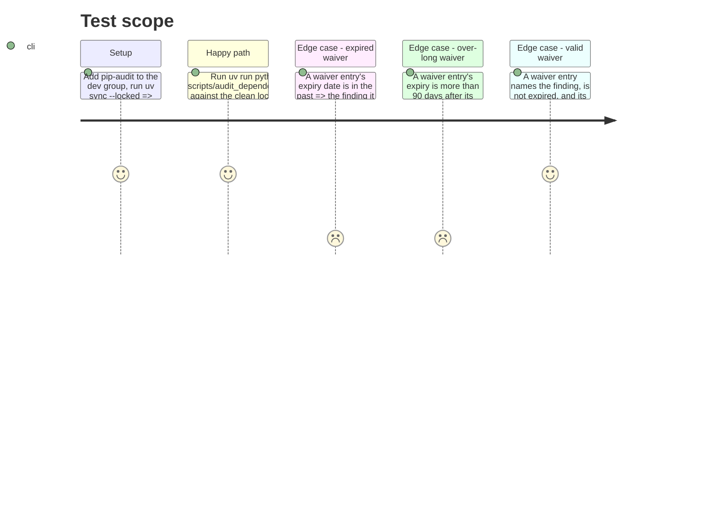

# Instruction: Dependency audit tool

## Architecture projection

> Tree of the final files. ✅ create · ✏️ modify · ❌ delete

```txt
.
├── docs/
│   └── dependency-waivers.yml ✅
├── scripts/
│   └── audit_dependencies.py ✅
├── tests/
│   └── test_audit_dependencies.py ✅
└── pyproject.toml ✏️
```

## User Journey



## Test Scope



## Tasks to do

### `1)` Add `pip-audit` as a dev dependency

> Chosen over `uv audit` per the plan's Decisions: `uv audit` (installed `uv 0.11.7`) is experimental with no JSON output; `pip-audit --format json` is stable.

1. `uv add --group dev pip-audit`.

### `2)` Create the waiver file

> `docs/dependency-waivers.yml` — the declared blocking severity and the 90-day maximum stated in its own header, empty of entries at first.

1. Header comment: blocking severities are `high` and `critical`; an entry's `expiry` must be at most 90 days after its `opened` date.
2. Body: a `waivers:` list, empty (`[]`) at creation. Each future entry carries `id` (advisory id), `package`, `reason`, `opened` (`YYYY-MM-DD`), `expiry` (`YYYY-MM-DD`), `owner`.

### `3)` Write `scripts/audit_dependencies.py`

> Pure-Python logic kept separate from the subprocess/network calls, so it is unit-testable without shelling out or hitting a network.

1. `run_pip_audit() -> dict` — subprocess `uv run pip-audit --format json --progress-spinner off --locked -s osv`, parse the JSON, return the raw dependency/vuln structure.
2. `resolve_severity(vuln_id: str) -> str` — GET `https://api.osv.dev/v1/vulns/{id}`; read `database_specific.severity` if present; otherwise return `"UNKNOWN"`. No CVSS-vector math — GHSA-sourced PyPI advisories carry this field directly, and an unresolved severity fails closed rather than being silently guessed.
3. `load_waivers(path) -> list[dict]` — parse `docs/dependency-waivers.yml`.
4. `evaluate_waiver(entry: dict, today: date) -> bool` — pure function: `False` if `expiry < today`, `False` if `expiry - opened > 90 days`, else `True`. No I/O, no `datetime.today()` default — `today` is always passed in, so it's a deterministic unit under test.
5. `select_blocking(findings: list[dict], waivers: list[dict], today: date) -> list[dict]` — pure function: keep findings whose severity is in `{HIGH, CRITICAL, UNKNOWN}` and that have no matching waiver entry passing `evaluate_waiver`.
6. `main()` — wires 1-5, prints a short report (package, id, severity, waived-or-not) to stdout, exits 1 if `select_blocking` is non-empty, else 0.

### `4)` Write `tests/test_audit_dependencies.py`

> The waiver logic decides a merge, so it is covered directly — no subprocess, no network, per the coding-assertions/testing conventions (stub, don't hit real services).

1. Test: an expired waiver (`expiry` in the past relative to the fixed `today` passed to `evaluate_waiver`) is rejected.
2. Test: a waiver whose `expiry` is more than 90 days after its `opened` date is rejected even when `today` is still before `expiry`.
3. Test: a current waiver within the 90-day window is accepted.
4. Test: `select_blocking` returns an unwaived `HIGH` finding and drops a `LOW` finding that needed no waiver.

## Test acceptance criteria

| Task | Acceptance criteria                                                                                                          |
| ---- | --------------------------------------------------------------------------------------------------------------------------------- |
| 1... | `uv sync --locked` installs `pip-audit`; `uv run pip-audit --version` succeeds.                                                    |
| 2... | `docs/dependency-waivers.yml` exists, parses as valid YAML, states the blocking severities and the 90-day rule in its header, and starts with zero entries. |
| 3... | `uv run python scripts/audit_dependencies.py` exits 0 against the current, vulnerability-free lock file.                           |
| 4... | `uv run pytest tests/test_audit_dependencies.py` passes; the expired-waiver and over-90-day-waiver cases each fail on their own when temporarily asserted the other way (mutation check), confirming the test isn't vacuous. |
