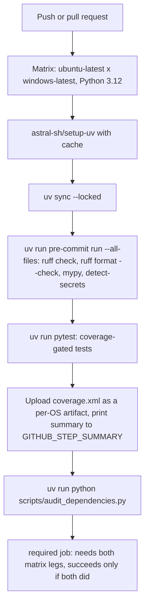
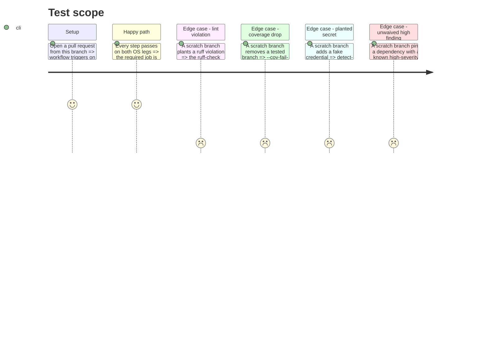

# Instruction: CI workflow

## Architecture projection

> Tree of the final files. ✅ create · ✏️ modify · ❌ delete

```txt
.
└── .github/
    └── workflows/
        └── ci.yml ✅
```

## User Journey



## Test Scope



## Tasks to do

### `1)` Triggers and matrix

> One workflow, two triggers, two OSes, one Python version — matches the story's acceptance line by line.

1. `on: push: branches: [main]` and `on: pull_request:`.
2. `jobs.test.strategy.matrix.os: [ubuntu-latest, windows-latest]`, `python-version: fixed at "3.12"` (the floor `pyproject.toml` declares with `requires-python = ">=3.12"`).
3. `runs-on: ${{ matrix.os }}`.

### `2)` Setup and install

> `uv sync --locked` so CI resolves the committed lockfile instead of a fresh solve, per the story's own wording.

1. `actions/checkout@v4`.
2. `astral-sh/setup-uv@<pinned tag or SHA, latest major at implementation time — verify against the marketplace listing, docs disagreed between v9 and v10 examples>` with `enable-cache: true` and `python-version: "3.12"`.
3. `uv sync --locked`.

### `3)` Fast gate, tests, coverage, audit — same commands as local

> Reuses the exact commands `.pre-commit-config.yaml` and `aidd_docs/memory/coding-assertions.md` already define, per the plan's Decisions.

1. `uv run pre-commit run --all-files` — runs the four before-commit hooks (ruff check, ruff format --check, mypy, detect-secrets) in the order `.pre-commit-config.yaml` defines, against every tracked file.
2. `uv run pytest` — the same pre-push command; coverage now comes from `pyproject.toml` (Phase 1), so this step alone produces `coverage.xml` and fails under 80%.
3. Upload `coverage.xml` (and `htmlcov/` if generated) as a build artifact named `coverage-${{ matrix.os }}`.
4. Print the coverage percentage to `$GITHUB_STEP_SUMMARY` (e.g. `uv run coverage report >> $GITHUB_STEP_SUMMARY` on a step following pytest, or parse `coverage.xml`).
5. `uv run python scripts/audit_dependencies.py` — runs on every matrix leg (per the plan's Decisions: platform-marker-only deps must not go unaudited on the OS that installs them).
6. No step starts `llama-server`, downloads model weights, or references a GPU or a cloud credential — confirmed by the finished step list containing none of those.

### `4)` One stable required check

> A single job name branch protection can reference, that stays the same as the matrix grows.

1. `jobs.required`: `needs: [test]`, `if: always()`.
2. Step: fail if any `needs.test.result` is not `success` (matrix job results are exposed per-leg via `needs.test.result`, which is `failure` if any leg failed).
3. Give the job a fixed `name:` (not derived from the matrix) so its check name never changes as OS/Python entries are added later.

## Test acceptance criteria

| Task | Acceptance criteria                                                                                                                       |
| ---- | ---------------------------------------------------------------------------------------------------------------------------------------------- |
| 1... | Opening a PR from this branch shows the workflow triggered, with two `test` jobs (one per OS) plus one `required` job.                          |
| 2... | Both `test` legs complete `uv sync --locked` without a lockfile diff (fails if `uv.lock` is stale).                                              |
| 3... | Both legs show `ruff check`, `ruff format --check`, `mypy src/`, `detect-secrets`, and `pytest` as passing steps; a coverage artifact is attached to the run for each OS; the job summary shows a coverage percentage; the audit step passes on the clean lock. |
| 4... | The `required` job is green only when both matrix legs are green, and its name is stable across runs (checkable by re-running the workflow and diffing the check name). |
