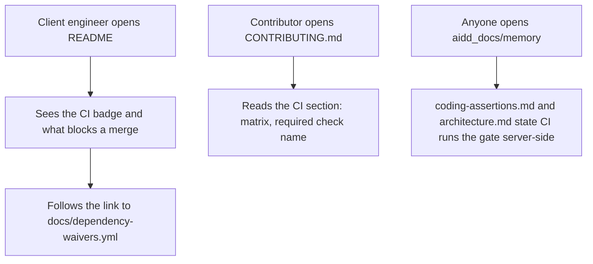
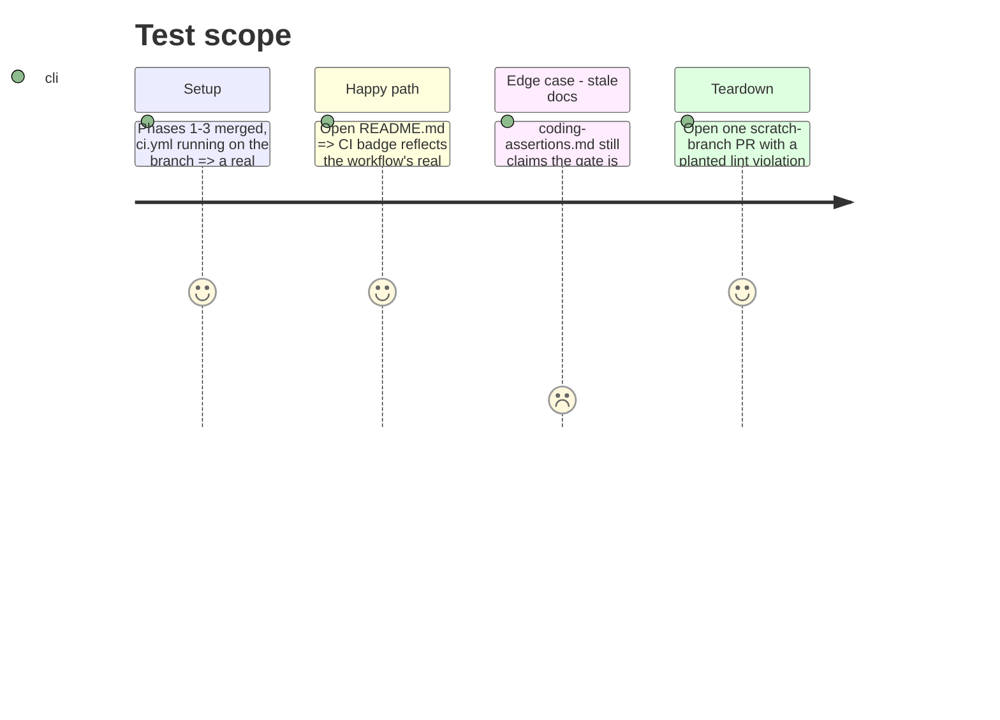

# Instruction: Docs and enforcement evidence

## Architecture projection

> Tree of the final files. ✅ create · ✏️ modify · ❌ delete

```txt
.
├── README.md ✏️
├── CONTRIBUTING.md ✏️
└── aidd_docs/
    └── memory/
        ├── coding-assertions.md ✏️
        └── architecture.md ✏️
```

## User Journey



## Test Scope



## Tasks to do

### `1)` README: badge and waiver link

> The declared severity and every open exception are readable by the client engineer the epic is written for, not buried in workflow YAML.

1. Add a CI status badge near the top (``), linking to the workflow runs.
2. Add one line stating what blocks a merge (lint, format, types, coverage floor, secrets, unwaived high+ dependency finding) and linking `docs/dependency-waivers.yml`.

### `2)` CONTRIBUTING.md: CI section

> Short — coding-assertions.md stays the source of truth for the exact commands.

1. Add a "Continuous Integration" section: what triggers it (push to `main`, every PR), the matrix (`ubuntu-latest` + `windows-latest`, Python 3.12), and the one required check name branch protection references.
2. Point to `aidd_docs/memory/coding-assertions.md` for the command list rather than repeating it.

### `3)` Update project memory

> The previous story (`the-fast-gate-refuses-a-bad-commit-before-it-is-written.md`) left both files stating enforcement is local-only; that line is now false.

1. `aidd_docs/memory/coding-assertions.md` — add a "CI (server-side)" section: the workflow runs the same before-commit table plus `pytest` with coverage plus the dependency audit, on every push and pull request, on both OSes.
2. `aidd_docs/memory/architecture.md` — replace "This is local, client-side enforcement only — nothing server-side runs yet, see `aidd_docs/backlog/stories/every-push-and-pull-request-runs-a-check-suite-that-can-refuse-it.md`" with a line stating CI now runs the gate server-side, referencing `.github/workflows/ci.yml`.

### `4)` Verification evidence

> Falsification the story asks for: a PR that should fail, does.

1. On a scratch branch, plant one lint violation (or reuse phase 3's edge cases if already exercised), open a PR, confirm the `required` check is red and cannot be argued green.
2. Fix it on the same branch, confirm the check turns green.
3. Keep the run URLs or screenshots as the evidence this story publishes (per its "How it is verified without a GPU" section) — attach to the PR description, not committed to the repo.

**Evidence (observed 2026-08-22):**

| State | Run | Result |
| ----- | --- | ------ |
| Green | PR #10 (`ci/check-suite`), <https://github.com/Aliquanto3/wave_local_ai_v2/actions/runs/32574496872> | `test (ubuntu-latest)` success, `test (windows-latest)` success, `required` success |
| Red | PR #11 (`ci/scratch-red`, planted unused import; PR closed and branch deleted), <https://github.com/Aliquanto3/wave_local_ai_v2/actions/runs/32574709902> | both legs failed at the `Fast gate` step on `F401 [*] \`os\` imported but unused`; `required` failed at `Check matrix result` |

The red run refused the change on both operating systems for the planted defect, not incidentally, and the summary job went red with it — so branch protection on `required` alone is sufficient.

## Test acceptance criteria

| Task | Acceptance criteria                                                                                                   |
| ---- | ---------------------------------------------------------------------------------------------------------------------------- |
| 1... | README shows a live CI badge and a working link to `docs/dependency-waivers.yml`, with a plain-language line on what blocks a merge. |
| 2... | CONTRIBUTING.md names the required check and the matrix, without duplicating the command list.                                |
| 3... | `grep -r "local, client-side enforcement only" aidd_docs/memory/` returns nothing; both files state CI enforcement.           |
| 4... | A deliberately failing PR on a scratch branch is red; the same branch turns green once fixed; both states are observed, not assumed. **Met**: red <https://github.com/Aliquanto3/wave_local_ai_v2/actions/runs/32574709902>, green <https://github.com/Aliquanto3/wave_local_ai_v2/actions/runs/32574496872>. |
