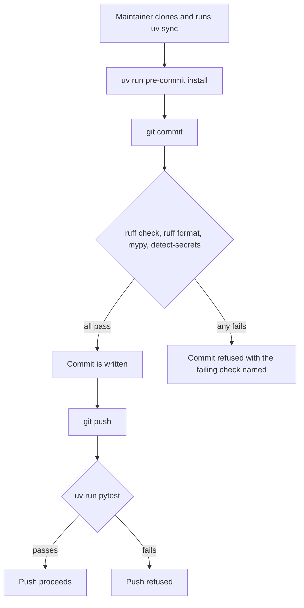
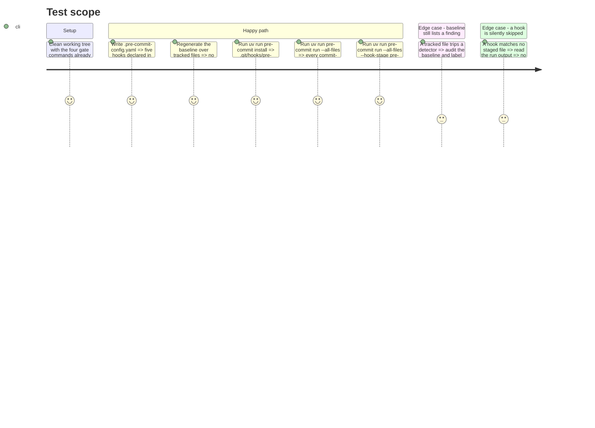

# Instruction: The gate exists and the tree passes it

## Architecture projection

> Tree of the final files. ✅ create · ✏️ modify · ❌ delete

```txt
.
├── .pre-commit-config.yaml   ✅ four commit-stage hooks in the documented order, one push-stage hook
└── .secrets.baseline         ✏️ rescoped to git-tracked files, every surviving entry audited
```

## User Journey



## Test Scope



## Tasks to do

### `1)` Author `.pre-commit-config.yaml`

> The hook file mirrors `aidd_docs/memory/coding-assertions.md` line for line, and resolves every tool through uv.

1. Top level: `default_install_hook_types: [pre-commit, pre-push]` and `default_stages: [pre-commit]`.
2. A single `repos:` entry with `repo: local`. Every hook uses `language: system` — no `rev`, no pinned hook repository, no second toolchain.
3. Hooks 1 to 3, in the order of the before-commit table, each with `pass_filenames: false` and `always_run: true` so the entry is exactly the documented command:
   - `uv run ruff check .`
   - `uv run ruff format --check .`
   - `uv run mypy src/`
4. Hook 4: `uv run detect-secrets-hook --baseline .secrets.baseline` with `pass_filenames: true` — this one is designed to receive the staged files and must scan them, not the tree.
5. Hook 5: `uv run pytest` with `stages: [pre-push]`, `pass_filenames: false`, `always_run: true`.
6. Give each hook an `id` and a `name` that read as the check they run, so a refusal names its own reason in the output.

### `2)` Rescope `.secrets.baseline`

> The baseline becomes an audited statement about this repository instead of an inventory of site-packages.

1. Run `uv run detect-secrets scan --baseline .secrets.baseline`. Do **not** pass `--all-files`: without it the scan covers git-tracked files only, and passing `--baseline` registers the filter that excludes the baseline from its own results. The command rewrites the file in place and carries over any existing audit verdict for a secret that still exists.
2. Assert on the regenerated file: every key of `results` appears in `git ls-files`; no key begins with `.venv/`; `.env` is absent; `aidd_docs/results/` and `uv.lock` contribute nothing.
3. Expect `results` to be empty on today's tree — before the rescope, the only tracked-file hit was `.secrets.baseline` itself. If any entry does survive, run `uv run detect-secrets audit .secrets.baseline`, label each one a non-secret, and leave the verdict in the file.

### `3)` Install the hooks and prove the tree passes

> The gate is live on this clone and agrees with the repository it is joining.

1. `uv run pre-commit install`, then confirm both `.git/hooks/pre-commit` and `.git/hooks/pre-push` exist and reference pre-commit.
2. `uv run pre-commit run --all-files` — read every line: each commit-stage hook must report `Passed`, none `Skipped`.
3. `uv run pre-commit run --all-files --hook-stage pre-push` — the pytest hook reports `Passed`.
4. If any hook fails, fix the tree, never the hook's command: the entry is the contract with `coding-assertions.md`.

## Test acceptance criteria

| Task | Acceptance criteria                                                                                                                                     |
| ---- | ------------------------------------------------------------------------------------------------------------------------------------------------------- |
| 1    | The config declares exactly five hooks; the four commit-stage entries are the four before-commit commands in the documented order, and pytest is the only push-stage hook. |
| 2    | The regenerated baseline holds no path under `.venv/`, no untracked path, and every key it does hold is returned by `git ls-files`; any surviving entry carries an audited non-secret verdict. |
| 3    | Both git hook files exist after a single install command, and both `pre-commit run --all-files` invocations report every hook Passed with nothing Skipped. |
