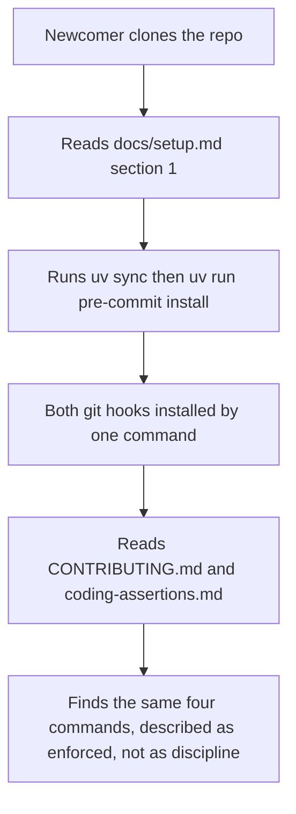
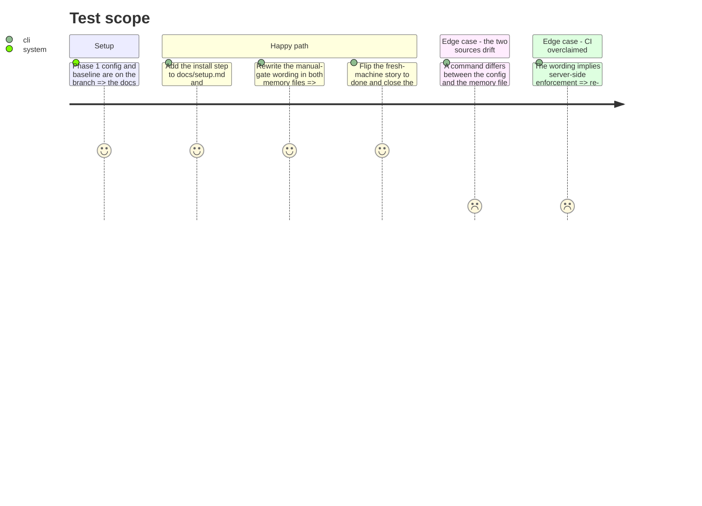

# Instruction: The docs and the memory stop saying manual

## Architecture projection

> Tree of the final files. ✅ create · ✏️ modify · ❌ delete

```txt
.
├── CONTRIBUTING.md                                                    ✏️ install step, gate described as enforced
├── docs/setup.md                                                      ✏️ install step in section 1, right after uv sync
└── aidd_docs/
    ├── memory/
    │   ├── coding-assertions.md                                       ✏️ "run manually, no hook installed" replaced
    │   └── architecture.md                                            ✏️ same, and the CI boundary kept honest
    └── backlog/
        ├── tech-debt.md                                               ✏️ the .secrets.baseline row closed
        └── stories/
            └── a-fresh-machine-reaches-both-benchmarks-from-the-readme-alone.md   ✏️ status ready to done
```

## User Journey



## Test Scope



## Tasks to do

### `1)` Replace the manual-gate wording in project memory

> Both files currently assert a fact this branch makes false.

1. `aidd_docs/memory/coding-assertions.md`: the "Before commit" line "Run manually — no pre-commit hook is installed (`architecture.md`)" is replaced by wording that names `.pre-commit-config.yaml`, the `pre-commit` stage, and the install command. State that the table and the hook entries must change together — the table is the contract.
2. Same file, "Before push": say pytest runs at the `pre-push` stage, and that it is deliberately not a commit-stage hook.
3. `aidd_docs/memory/architecture.md`, the Stack bullet at line 9: replace "is run manually" and "No pre-commit hook is installed yet" with what is now enforced, where, and how the versions resolve (`language: system` through `uv run`, so `uv.lock` is the single version source).
4. Keep the boundary honest: this is local, client-side enforcement. Server-side checks remain open — point at `aidd_docs/backlog/stories/every-push-and-pull-request-runs-a-check-suite-that-can-refuse-it.md` rather than implying CI exists.

### `2)` Write the install step into both docs

> A fresh clone must reach the same enforcement without being told.

1. `docs/setup.md`, section 1: add `uv run pre-commit install` immediately after `uv sync`, with one line saying it installs both the commit-stage and push-stage hooks. Keep the existing claim that step 1 needs no GPU and no API key — it still holds.
2. `CONTRIBUTING.md`: the "Fast gate — run before every commit" heading currently instructs a manual routine. Keep the four commands visible, but say the hook runs them, add the install command, and say what to do when the hook refuses (fix the tree, not the hook).
3. Both docs use the same single install command as `coding-assertions.md`. Three different phrasings of one step is how the next drift starts.

### `3)` Settle the backlog rows this work closes

> One line each; nothing else in these files is touched.

1. `aidd_docs/backlog/stories/a-fresh-machine-reaches-both-benchmarks-from-the-readme-alone.md`: `status: ready` becomes `status: done` — its acceptance shipped in the merged fresh-machine docs work.
2. `aidd_docs/backlog/tech-debt.md`: the `.secrets.baseline` row ("generated by scanning the venv") moves from `open` to closed, since phase 1 is exactly its fix.
3. Change nothing else in either file, and do not touch this story's own status — that is the review layer's call.

## Test acceptance criteria

| Task | Acceptance criteria                                                                                                                          |
| ---- | ---------------------------------------------------------------------------------------------------------------------------------------------- |
| 1    | Neither memory file claims the gate is manual or that no hook is installed; each names the hook file and the stage, and neither claims server-side CI. |
| 2    | Both `docs/setup.md` and `CONTRIBUTING.md` carry the same one-line install command, placed where a fresh clone reaches it before its first commit. |
| 3    | The fresh-machine story reads `done`, the baseline tech-debt row is closed, and no other line in either file changed.                          |
