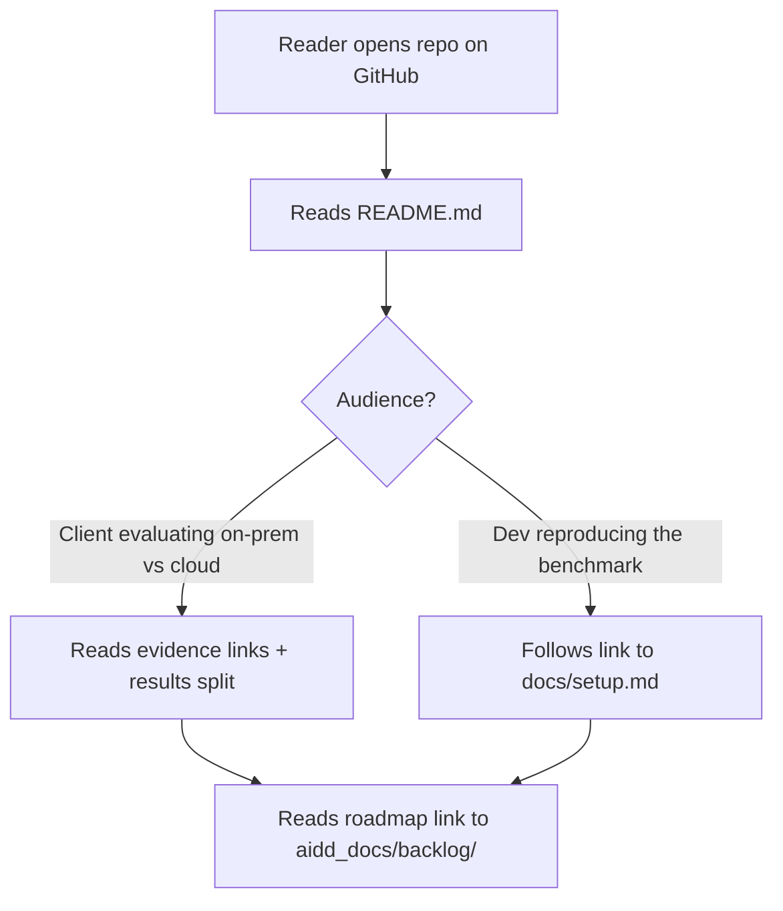
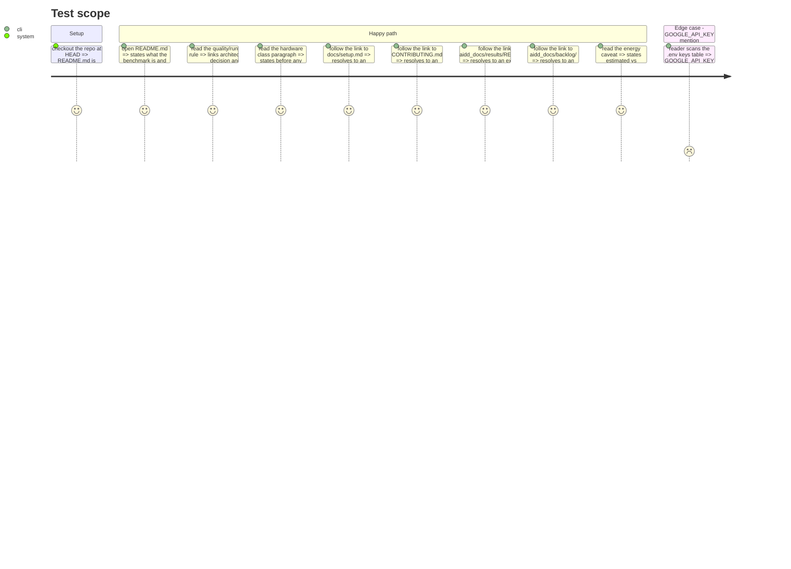

# Instruction: README as the entry point

## Architecture projection

> Tree of the final files. ✅ create · ✏️ modify · ❌ delete

```txt
.
└── README.md ✏️  (0 bytes today; becomes the entry point)
```

## User Journey



## Test Scope



## Tasks to do

### `1)` Write the README skeleton and pitch

> Give the reader what it is and who it's for before anything else.

1. Title + one-paragraph pitch, drawn from `project-brief.md`'s "What it is": reproducible benchmark of local SLMs (llama.cpp) vs cloud LLM APIs, runtime and quality measured separately.
2. Two named audiences: clients evaluating on-prem vs cloud deployment (read the evidence, don't run anything), and developers reproducing the benchmark on their own machine (run both CLIs).
3. State the never-merged rule explicitly: the quality table and the runtime table are never combined into one; link `aidd_docs/memory/architecture.md`'s "Quality / runtime split" decision and `aidd_docs/results/README.md`.

### `2)` State the hardware class before any download step

> A reader must know if their machine can run the roster model before fetching gigabytes.

1. State the minimum hardware for `Qwen3.6-35B-A3B-UD-IQ4_XS` (17.7 GB GGUF): 32 GB system RAM, an NVIDIA GPU with CUDA 12.x support (the committed evidence used a 6 GB laptop GPU via `--n-cpu-moe` CPU offload — VRAM is not the ceiling, RAM is), ~18 GB free disk for the model file plus the `llama-server` binary.
2. Name this as the laptop fiche's class, per `context_input/hardware.md`, and note runtime numbers are not portable across machines (link the "Gotchas" section of `architecture.md`).

### `3)` Document setup, running, and results at a glance

> The reader gets the shape before the step-by-step, which lives in `docs/setup.md`.

1. `uv sync` as the one setup command; link `docs/setup.md` for everything before it (binary, weights, `.env`).
2. Table of every `.env.example` key: `SLM_MODELS_DIR`, `LLAMA_SERVER_PATH`, `RUNTIME_RESULTS_PATH`, `QUALITY_RESULTS_PATH`, `MISTRAL_API_KEY`, `GOOGLE_API_KEY` — for each, what it holds and which command reads it (source: `src/wave_local_ai_v2/settings.py`, `quality_cli.py:98`). Mark `GOOGLE_API_KEY` reserved for the planned second judge (`context_input/model_candidates.md`), read by nothing today.
3. State explicitly: `wave-local-ai-v2` needs no cloud credential at all; `wave-local-ai-v2-quality` is the only command that needs `MISTRAL_API_KEY`. Name both commands and what each produces: one runtime row with its hardware fiche to `runtime.jsonl`; one row per (item, model) to `quality.jsonl`.
4. Results layout: `runtime.jsonl` / `quality.jsonl` are per-machine, untracked, append-only; `runtime-reference.jsonl` / `quality-reference.jsonl` are the curated, committed evidence no CLI ever writes to. Link `aidd_docs/results/README.md`.
5. Energy caveat, verbatim in substance from `architecture.md`'s Gotchas: energy/carbon figures are estimates unless a row's `energy_method` says `measured_nvml`; GPU draw via NVML is a real measurement; CPU on Windows is TDP-estimated (no RAPL) and can be off by 2-3x under thermal throttling.

### `4)` Project status and roadmap

> Close the page by telling the reader where the project stands and what's next.

1. One short paragraph: this is an active benchmark harness, not a finished product; link `aidd_docs/backlog/` (epics and stories) as the roadmap, and `CONTRIBUTING.md` for anyone who wants to pick up an item.

## Test acceptance criteria

| Task | Acceptance criteria                                                                                                    |
| ---- | ------------------------------------------------------------------------------------------------------------------------ |
| 1    | README opens with what the benchmark is and names both audiences without the reader following a link first.            |
| 1    | The never-merged rule is stated in prose, not only implied by a table, and links `architecture.md` and `aidd_docs/results/README.md`. |
| 2    | The hardware class paragraph appears above every download instruction on the page (or its linked setup page's table of contents), not after it. |
| 3    | Every `.env.example` key appears in the table; `GOOGLE_API_KEY` reads "reserved" or equivalent, not blank and not silently absent. |
| 3    | The sentence "no cloud credential" is attached to `wave-local-ai-v2` and `MISTRAL_API_KEY` is attached to `wave-local-ai-v2-quality`, by name. |
| 3    | The energy caveat names both `estimated_tdp` and `measured_nvml` and the Windows TDP factor-of-2-to-3 qualifier. |
| 4    | `aidd_docs/backlog/` and `CONTRIBUTING.md` are both linked and both paths exist on disk. |
