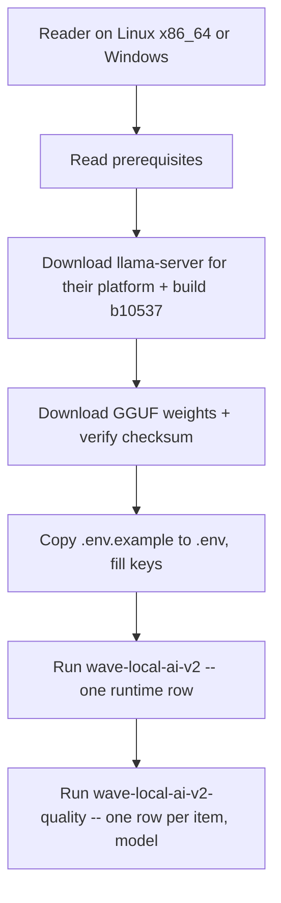
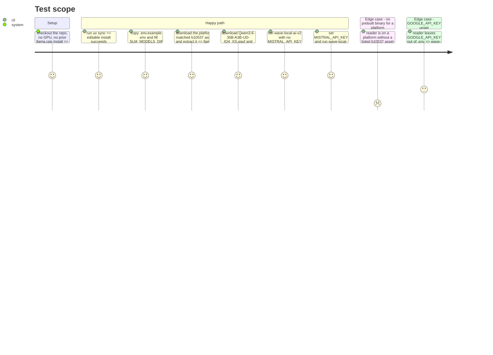

# Instruction: Fresh-machine setup walk + env hygiene

## Architecture projection

> Tree of the final files. ✅ create · ✏️ modify · ❌ delete

```txt
.
├── docs/
│   └── setup.md ✅  (new: prerequisites → llama-server → weights → .env → first two runs)
├── .env.example ✏️  (annotate GOOGLE_API_KEY as reserved, comment per key)
└── .gitignore ✏️  (French section header → English)
```

## User Journey



## Test Scope



## Tasks to do

### `1)` Write prerequisites and `uv sync`

> Everything that runs with no GPU, so the walk is checkable on a CI-class Linux container.

1. Prerequisites: Python 3.12+, `uv` installed, `git`. Note the GPU/CUDA driver is only required to *run* the benchmarks, not to reach this point.
2. `git clone` + `uv sync` as copy-pasteable commands, one block, no platform split needed here.

### `2)` Document `llama-server` acquisition, per platform, pinned to `b10537`

> Name the exact asset for each covered platform; never omit a platform silently.

1. State the pinned build once: `b10537` — the build the committed reference evidence (`aidd_docs/results/*-reference.jsonl`) was produced under. A different build is not wrong to use, but its results are not comparable to the committed evidence without saying so.
2. Windows (GPU path, matches this project's own laptop fiche): download `llama-b10537-bin-win-cuda-12.4-x64.zip` and `cudart-llama-bin-win-cuda-12.4-x64.zip` from `https://github.com/ggml-org/llama.cpp/releases/tag/b10537`, extract both into the same folder, set `LLAMA_SERVER_PATH` to the extracted `llama-server.exe`.
3. Windows (CPU-only path, no NVIDIA GPU): `llama-b10537-bin-win-cpu-x64.zip` from the same release page.
4. Linux x86_64 (the container's CPU path): `llama-b10537-bin-ubuntu-x64.tar.gz` from the same release page; extract, set `LLAMA_SERVER_PATH` to the extracted `llama-server`.
5. Fallback bullet, not a platform omission: if a future pinned build drops the asset for a reader's platform, build from source per `https://github.com/ggml-org/llama.cpp/blob/master/docs/build.md`, checking out the matching build tag first.

### `3)` Document GGUF weight download and checksum

> Name repo, revision, file, and the command that verifies it before first use.

1. Source: `unsloth/Qwen3.6-35B-A3B-GGUF` on Hugging Face, revision `main` (commit `a483e9e6cbd595906af30beda3187c2663a1118c` at the time this was written), file `Qwen3.6-35B-A3B-UD-IQ4_XS.gguf` (17.7 GB).
2. Download command using the `hf` CLI (or the direct `resolve/main/...` URL as an alternative): target path `<SLM_MODELS_DIR>/Qwen3.6-35B-A3B/Qwen3.6-35B-A3B-UD-IQ4_XS.gguf` — this exact relative path, since it matches `MODEL_RELATIVE_PATH` in `src/wave_local_ai_v2/__init__.py:26` and `quality_cli.py:29` byte for byte.
3. Checksum: sha256 `649d7508507b84638732c4f52c24c8b15843c6dca2f3ff793ae07c14a67ebbb3`. Give both a POSIX command (`sha256sum`) and a Windows command (`Get-FileHash -Algorithm SHA256`), each labelled with its platform.

### `4)` Document `.env`, then the two first runs

> Wire the downloaded pieces to the settings the CLIs actually read.

1. `cp .env.example .env` (or `copy` on Windows, both labelled), then fill `SLM_MODELS_DIR` and `LLAMA_SERVER_PATH` with the paths from tasks 2-3.
2. First run: `uv run wave-local-ai-v2` — no `MISTRAL_API_KEY` needed; one row lands in `RUNTIME_RESULTS_PATH` (default `aidd_docs/results/runtime.jsonl`).
3. Second run: set `MISTRAL_API_KEY`, then `uv run wave-local-ai-v2-quality` — one row per (item, model) lands in `QUALITY_RESULTS_PATH` (default `aidd_docs/results/quality.jsonl`).
4. Label the point where a GPU-bearing machine becomes mandatory: everything before task 4.2 runs on a GPU-less container; task 4.2 onward needs the runtime.

### `5)` Annotate `.env.example` and fix `.gitignore`

> Small, mechanical, but named in acceptance.

1. In `.env.example`, add a one-line comment above `GOOGLE_API_KEY` stating it is reserved for the planned second LLM-as-a-judge and read by nothing under `src/` today. Do not remove the key or change any other line.
2. In `.gitignore`, rename the `# --- Projet ---` section header to `# --- Project ---`. No other line changes.

## Test acceptance criteria

| Task | Acceptance criteria                                                                                                          |
| ---- | -------------------------------------------------------------------------------------------------------------------------- |
| 1    | `uv sync` is the only command listed before the platform-specific steps, and needs no GPU or API key.                       |
| 2    | Each of Windows-CUDA, Windows-CPU, and Linux x86_64 names its exact `.zip`/`.tar.gz` asset filename and the release URL; the build tag `b10537` is stated as the pinned build, distinct from "whatever a reader downloads later". |
| 2    | The source-build fallback is present and is not conditioned on today's release actually missing an asset (it documents what to do if one ever is). |
| 3    | Repo, revision, exact filename, and sha256 all appear together, immediately followed by the verification command for both POSIX and Windows. |
| 3    | The documented target path for the downloaded file matches `MODEL_RELATIVE_PATH` in `src/wave_local_ai_v2/__init__.py` and `quality_cli.py` exactly. |
| 4    | The command that needs no cloud credential and the command that needs `MISTRAL_API_KEY` are each named next to the command they gate. |
| 5    | `.env.example` still has six keys (none removed); `GOOGLE_API_KEY` carries a reserved comment. `.gitignore`'s section header contains no French word. |
