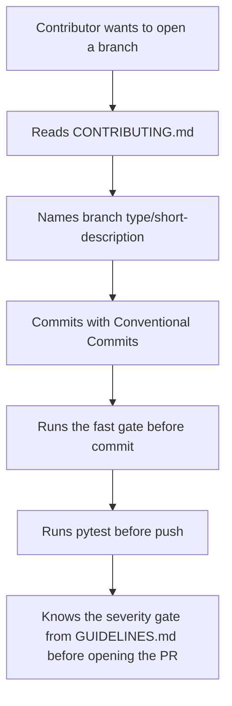
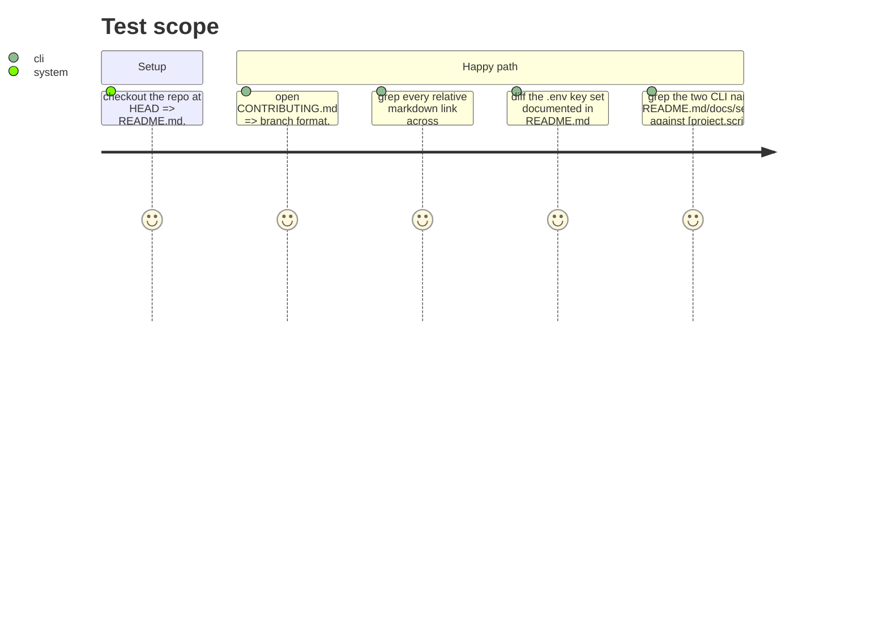

# Instruction: Contribution gate + cross-doc proof

## Architecture projection

> Tree of the final files. ✅ create · ✏️ modify · ❌ delete

```txt
.
└── CONTRIBUTING.md ✅  (new: branch naming, commits, fast gate, severity gate)
```

## User Journey



## Test Scope



## Tasks to do

### `1)` Write `CONTRIBUTING.md`

> No template placeholder left; every line sourced from an existing doc, not invented.

1. Branch naming: `type/short-description`, types `feat`, `fix`, `chore`, `docs`, `test`, `refactor` (source: `aidd_docs/memory/vcs.md`).
2. Commit convention: Conventional Commits, `type(scope): description`, imperative mood, lowercase, English only (source: `vcs.md`).
3. Fast gate, run before commit, in order: `uv run ruff check .`, `uv run ruff format --check .`, `uv run mypy src/`, `uv run detect-secrets-hook --baseline .secrets.baseline` (source: `aidd_docs/memory/coding-assertions.md`).
4. Before push: `uv run pytest` (same source).
5. Severity gate, verbatim in substance from `aidd_docs/GUIDELINES.md`: 🔴 and 🟡 findings block merge and are fixed on the same branch; 🟢 findings are appended to `aidd_docs/backlog/tech-debt.md`, never block, never trigger another review round. Link `aidd_docs/GUIDELINES.md` for the full house rules.
6. One line on tests: they stub HTTP and never start `llama-server` or call a live API (same source), so a contributor knows why `pytest` needs no GPU or key either.

### `2)` Verify the three pages as one reader would

> The story's own verification method, run once all three phases exist.

1. Collect every relative markdown link (`](...)`) across `README.md`, `docs/setup.md`, `CONTRIBUTING.md`; resolve each against the filesystem from the repo root; report any target that doesn't exist.
2. Collect every `.env` key name mentioned in `README.md`'s table; diff against the key names in `.env.example` (`grep -oP '^[A-Z_]+(?==)' .env.example`); the two sets must match exactly, six keys.
3. Grep `wave-local-ai-v2` and `wave-local-ai-v2-quality` as they appear in `README.md`/`docs/setup.md` command blocks against `[project.scripts]` in `pyproject.toml`; the spelling must match verbatim, including the `-quality` suffix.
4. Record the outcome of 1-3 in this phase's PR description or commit body; fix any mismatch before merge rather than filing it as tech debt (this story's verification is documentation correctness, not a nice-to-have).

## Test acceptance criteria

| Task | Acceptance criteria                                                                                                      |
| ---- | ------------------------------------------------------------------------------------------------------------------------- |
| 1    | `CONTRIBUTING.md` contains no `{...}` placeholder text and all five items (branch, commits, fast gate, before-push, severity gate) are present. |
| 1    | The fast gate's four commands appear in the same order as `coding-assertions.md`.                                       |
| 2    | Every relative link found across the three pages resolves to a file or directory that exists at HEAD.                   |
| 2    | The `.env` key set documented in README.md and the key set in `.env.example` are identical, six keys each.              |
| 2    | `wave-local-ai-v2` and `wave-local-ai-v2-quality` are spelled identically to `[project.scripts]` in `pyproject.toml` everywhere they're used as a command. |
