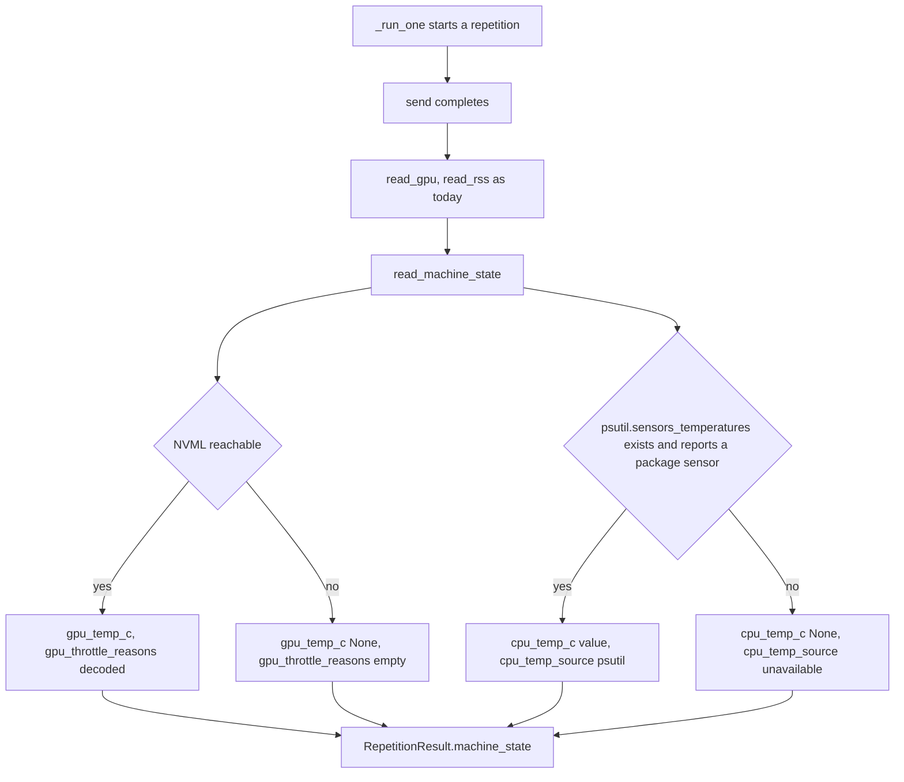
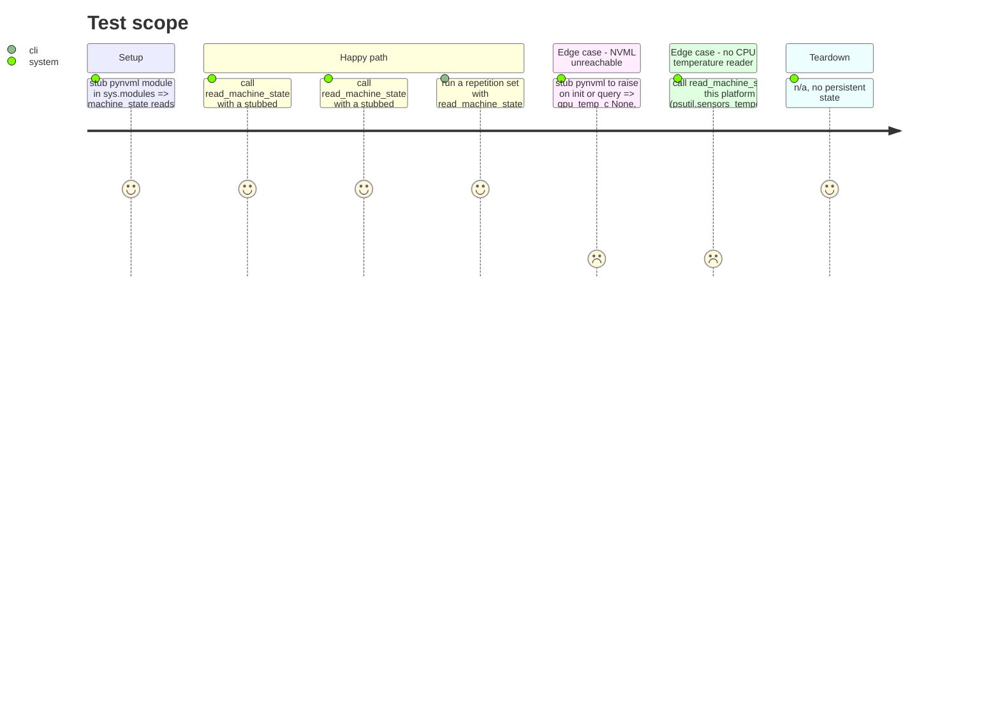

<!-- Fill or omit these sections; never add, rename, or reorder one. -->

# Instruction: NVML temperature/throttle reads and per-repetition sampling

## Architecture projection

> Tree of the final files. ✅ create · ✏️ modify · ❌ delete

```txt
.
├── src/wave_local_ai_v2/
│   ├── nvml.py             ✏️ decode_clocks_event_reasons + the two new NVML queries (GPU temperature, throttle reasons)
│   ├── machine_state.py    ✅ per-repetition reader: GPU temp + throttle reasons via nvml.py, CPU package temp or "unavailable"
│   └── repetitions.py      ✏️ RepetitionResult gains `machine_state`; run_repetition_set/`_run_one` take a `read_machine_state` closure
└── tests/
    ├── test_nvml.py        ✏️ the two new queries, decoded reasons, best-effort None on failure
    ├── test_machine_state.py ✅ pynvml stubbed: temp/reasons read and decoded; every NVML failure degrades to None; no CPU reader yields "unavailable"
    └── test_repetitions.py ✏️ every repetition carries a machine_state block; the closure is called once per repetition
```

## User Journey



## Test Scope



## Tasks to do

### `1)` Add the two NVML queries `machine_state.py` needs

> `nvml.py` stays the shared session/decode module; the new queries live beside `decode_nvml_str`.

1. Add `read_gpu_temperature_c(handle) -> float | None`: calls `pynvml.nvmlDeviceGetTemperature(handle, pynvml.NVML_TEMPERATURE_GPU)`, returns `None` on any exception. Follow `gpu.py`'s try/except-to-`None` pattern rather than letting NVML failures propagate.
2. Add `CLOCKS_EVENT_REASON_NAMES: dict[int, str]` mapping each `pynvml.nvmlClocksEventReason*` bit constant to a short label (`"gpu_idle"`, `"applications_clocks_setting"`, `"sw_power_cap"`, `"hw_slowdown"`, `"sync_boost"`, `"sw_thermal_slowdown"`, `"hw_thermal_slowdown"`, `"hw_power_brake_slowdown"`, `"display_clock_setting"`) — read the installed `pynvml.py` for the exact constant names, do not guess them.
3. Add `decode_clocks_event_reasons(bitmask: int) -> list[str]`: returns the sorted list of names whose bit is set in `bitmask`, `[]` when the bitmask is 0 (`nvmlClocksEventReasonNone`).
4. Add `read_clocks_event_reasons(handle) -> list[str]`: calls `pynvml.nvmlDeviceGetCurrentClocksEventReasons(handle)`, decodes it, returns `[]` on any exception — never raises.
5. Comment naming why `...EventReasons` was chosen over the still-present `...ThrottleReasons` (NVML's own naming migration; both return the same bitmask on this binding, confirmed live against `nvidia-ml-py==13.610.43`).

### `2)` Build `machine_state.py`

> One function a repetition calls after its completion returns, alongside the existing `read_gpu`/`read_rss` calls.

1. Define `MachineState(TypedDict)`: `gpu_temp_c: float | None`, `gpu_throttle_reasons: list[str]`, `cpu_temp_c: float | None`, `cpu_temp_source: str`.
2. `CPU_TEMP_SOURCE_PSUTIL = "psutil"`, `CPU_TEMP_SOURCE_UNAVAILABLE = "unavailable"` as named constants.
3. `read_machine_state(device_index: int = 0) -> MachineState`: opens one `nvml.nvml_device(device_index)` session (matching `gpu.py`'s pattern — short-lived, not held open), reads GPU temperature and throttle reasons through the phase's new queries.
4. CPU package temperature: try `psutil.sensors_temperatures()` — guarded with `hasattr(psutil, "sensors_temperatures")` first, since the attribute does not exist on this platform's build (confirmed live) and calling it directly would raise `AttributeError` rather than return an empty mapping. When present, look for a package-level sensor (`coretemp`/`k10temp`/`cpu_thermal` label conventions — read `psutil`'s own docs section on `sensors_temperatures` for the exact label vocabulary, do not invent one) and take its `current` value; when absent, or when the platform-appropriate label is not found, `cpu_temp_c = None`, `cpu_temp_source = CPU_TEMP_SOURCE_UNAVAILABLE`.
5. Wrap the whole function body's GPU half in the same best-effort `except Exception: pass`-to-`None` discipline `gpu.py` and `hardware.py` already use — a machine-state read must never fail a repetition.

### `3)` Wire per-repetition sampling into `repetitions.py`

> Same shape the existing `read_gpu`/`read_rss` closures already use.

1. Add `machine_state: MachineState` to `RepetitionResult`.
2. Add a `read_machine_state: Callable[[], MachineState]` parameter to `run_repetition_set` and thread it into `_run_one`, called once per repetition (warm-up included, matching how `read_gpu`/`read_rss` are already called on every repetition) immediately after the existing GPU/RSS reads — same "decode has stopped, allocation-level state holds steady" reasoning already documented there.
3. Update the module docstring's read order if it names the existing reads explicitly.

### `4)` Wire the CLI call site

> `__init__.py` passes a real `read_machine_state` closure; the row shape itself is phase 2's job.

1. In `_run`, define `read_machine_state = lambda: machine_state.read_machine_state()` (or a direct reference) and pass it into both `run_repetition_set` calls (warm-up and counted), matching how `read_gpu_stats`/`read_rss` are already passed.
2. Do not add `machine_state` fields to the top-level row yet — the raw repetitions already carry it once phase 1 lands, and phase 2 is the one that reads it back out for the thermal-posture declaration.

## Test acceptance criteria

<!-- Each criterion is an observable behavior, not a command. -->

| Task | Acceptance criteria                                                                                                                                                                                                    |
| ---- | ------------------------------------------------------------------------------------------------------------------------------------------------------------------------------------------------------------------- |
| 1    | With `pynvml` stubbed, a handle reporting a temperature and a throttle bitmask decode to the expected value and reason list; any stubbed exception from either query yields `None` / `[]` without raising.            |
| 2    | `read_machine_state()` on a stubbed NVML session returns all four `MachineState` fields; on this platform (no `sensors_temperatures`, no admin-free reader), `cpu_temp_c` is `None` and `cpu_temp_source` is `"unavailable"`. |
| 3    | With `send`, `read_gpu`, `read_rss` and `read_machine_state` stubbed, every returned `RepetitionResult` (warm-up and counted) carries a `machine_state` dict from the stub, called exactly once per repetition.        |
| 4    | The CLI's repetition calls pass a working `read_machine_state` closure; a full `_run` invocation (server/HTTP stubbed at the `test_cli.py` level) writes repetitions whose entries each carry a `machine_state` key.  |

## Spike classification

The story's spike — "which thermal signals actually explain observed runtime variance on this platform, at ordinary privilege" — is resolved here, not deferred: `psutil.sensors_temperatures` does not exist on this Windows build (`hasattr` is `False`, confirmed live), and `Get-CimInstance -Namespace root/wmi -ClassName MSAcpi_ThermalZoneTemperature` returns `Access denied` at ordinary privilege with no `wmi` package installed — no admin-free CPU package temperature reader exists on this platform. **Outcome: `unavailable`**, degrading exactly as the story specifies, no dependency added. The signals that do explain variance on this machine are the NVML pair this phase implements: GPU temperature and clock event reasons.
