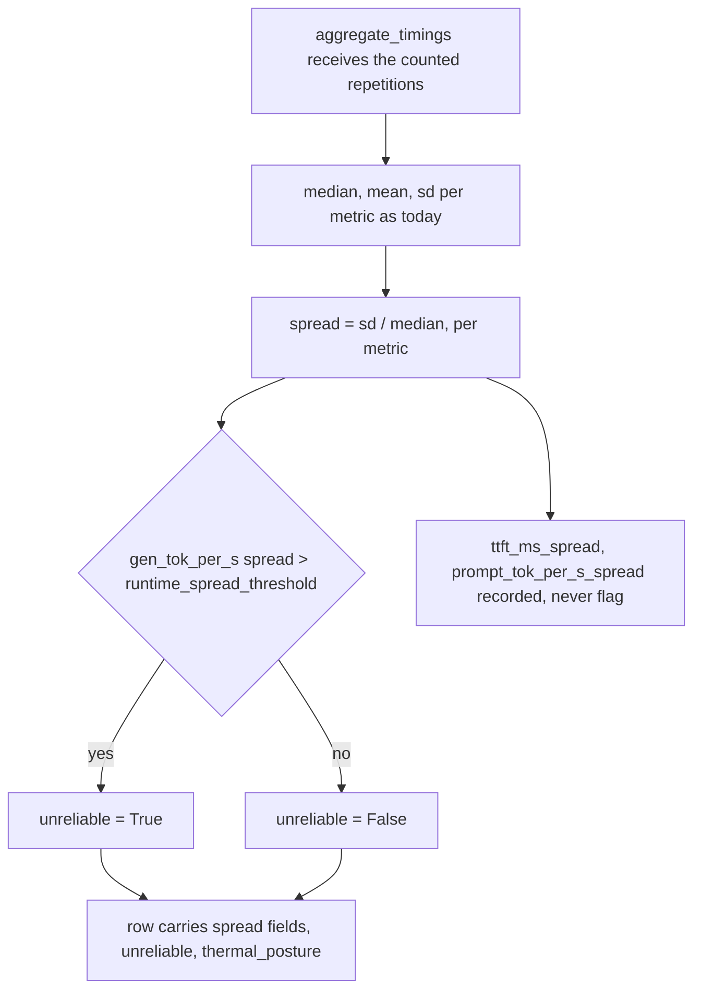
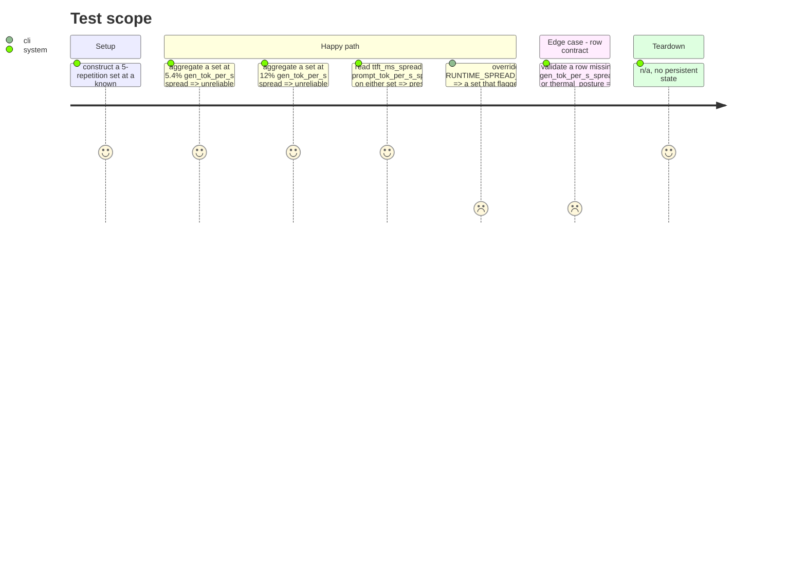

<!-- Fill or omit these sections; never add, rename, or reorder one. -->

# Instruction: Spread, the unreliable flag, thermal posture, settings

## Architecture projection

> Tree of the final files. ✅ create · ✏️ modify · ❌ delete

```txt
.
├── src/wave_local_ai_v2/
│   ├── settings.py     ✏️ `runtime_spread_threshold: float = 0.10`, env `RUNTIME_SPREAD_THRESHOLD`
│   ├── aggregation.py  ✏️ spread (sd/median) per aggregated timing metric, `unreliable` from gen_tok_per_s's spread vs threshold, thermal-posture constant
│   ├── row_contract.py ✏️ new required fields: the three `*_spread` fields, `unreliable`, `thermal_posture`
│   └── __init__.py     ✏️ row carries the spread fields, `unreliable`, `thermal_posture`
└── tests/
    ├── test_settings.py     ✏️ the new setting defaults and overrides
    ├── test_aggregation.py  ✏️ 5.4% spread does not flag, 12% flags, all three metrics carry a spread
    ├── test_row_contract.py ✏️ the new fields are required; a row missing one is refused
    └── test_cli.py          ✏️ the written row carries the new fields and a plausible thermal_posture
```

## User Journey



## Test Scope



## Tasks to do

### `1)` Add the spread threshold setting

> Same pattern as `runtime_repetitions`/`runtime_cooldown_s`/`runtime_warmup_count`.

1. Add `runtime_spread_threshold: float = 0.10` to `Settings`.
2. Read it in `load_settings` via `_require_numeric("RUNTIME_SPREAD_THRESHOLD", 0.10, float, minimum=0.0, minimum_reason="a spread threshold cannot be negative")`.
3. Add it to `.env.example` with the default commented as the PRD's published value.

### `2)` Compute spread and the flag in `aggregation.py`

> Extends `aggregate_timings`; no new module, per the story's own file list.

1. Add `spread(sd: float, median_value: float) -> float`: returns `sd / median_value`. Let a division by zero raise rather than silently returning `0.0` or `inf` — a zero-median timing metric is a different failure than "no spread", and this module already prefers raising (`AggregationError`) to fabricating a number.
2. In `aggregate_timings`, after computing each metric's median/mean/sd, add `f"{metric}_spread"` for all three of `AGGREGATED_TIMING_METRICS`.
3. Add `UNRELIABLE_SPREAD_METRIC = "gen_tok_per_s"` as a named constant (the one metric whose spread can set the flag) and `unreliable(spread_value: float, threshold: float) -> bool` returning `spread_value > threshold`.
4. `aggregate_timings` takes the threshold (parameter, not an import from `settings.py` — `aggregation.py` stays settings-agnostic like the rest of this module) and adds `"unreliable"` to its returned dict, computed from `UNRELIABLE_SPREAD_METRIC`'s spread only.
5. Extend `AGGREGATION_LABELS` with one entry per `*_spread` field: `"sample_sd_over_median"` for all three — same statistic, same label, since criterion 7 states it identically for all three metrics.
6. Add `THERMAL_POSTURE_FIXED_COOLDOWN = "fixed_cooldown"` as a named constant next to `SLOT_RESET_METHOD` in `repetitions.py` (not `aggregation.py` — it describes the protocol `repetitions.py` already runs, matching where `SLOT_RESET_METHOD` already lives) with a comment naming the two other postures the field's `Literal` could someday take (`back_to_back`, `cooldown_to_temp_ceiling`) and that this increment's protocol is a fixed cooldown between counted repetitions, unconditionally.

### `3)` Extend the row contract

> New required runtime fields, following the existing declaration style.

1. Add `"gen_tok_per_s_spread"`, `"ttft_ms_spread"`, `"prompt_tok_per_s_spread"`, `"unreliable"`, `"thermal_posture"` to `REQUIRED_FIELDS["runtime"]`, grouped under the `aggregation.aggregate_timings` / `aggregation.AGGREGATION_LABELS` comment block that already lists the metric fields.
2. Confirm (and let `test_row_contract.py`'s existing `test_every_declared_measurement_is_a_required_runtime_field` catch a drift) that every new `AGGREGATION_LABELS` entry from task 2 has a matching `REQUIRED_FIELDS` entry.

### `4)` Wire the row in `__init__.py`

> `aggregated_timings` already gets spread into the row via its existing `**aggregated_timings` spread — most of this task is passing the threshold in and adding `thermal_posture`.

1. Pass `settings.runtime_spread_threshold` into `aggregation.aggregate_timings(counted, threshold=...)`.
2. Add `"thermal_posture": repetitions.THERMAL_POSTURE_FIXED_COOLDOWN` to the row dict.
3. Update the stdout summary line to print `unreliable` alongside the existing metrics, so a operator sees the flag without opening the row.

## Test acceptance criteria

<!-- Each criterion is an observable behavior, not a command. -->

| Task | Acceptance criteria                                                                                                                                                                                       |
| ---- | ---------------------------------------------------------------------------------------------------------------------------------------------------------------------------------------------------- |
| 1    | `RUNTIME_SPREAD_THRESHOLD` defaults to `0.10`, is overridable, and a negative value is refused by name.                                                                                                    |
| 2    | A constructed 5-repetition set at 5.4% `gen_tok_per_s` spread returns `unreliable: False`; one at 12% returns `unreliable: True`; both carry the recorded spread. `ttft_ms_spread` and `prompt_tok_per_s_spread` are present on both and never appear in the `unreliable` computation. |
| 3    | A row missing any of the five new fields is refused by `validate_row`, naming the missing field; a complete row passes.                                                                                     |
| 4    | The written row carries all five new fields, `thermal_posture` reads `"fixed_cooldown"`, and the row remains acceptable to the writer gate.                                                                |
