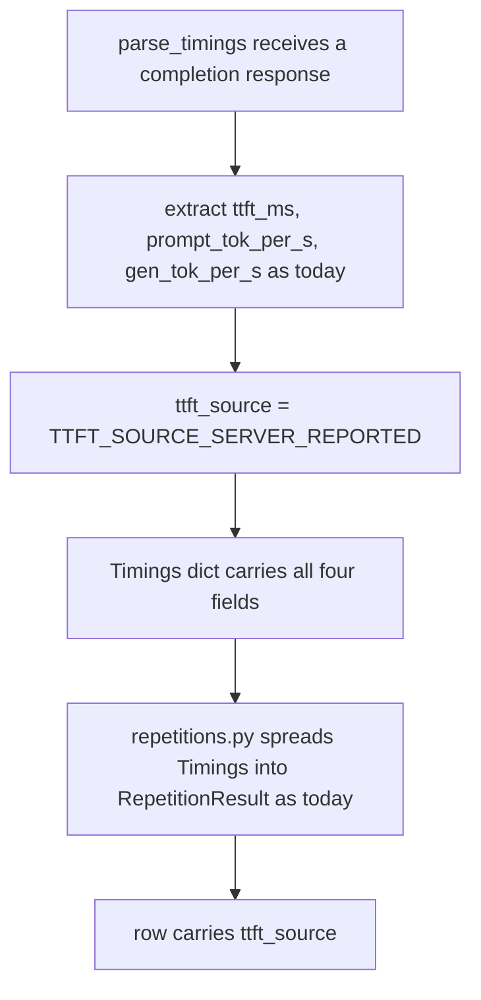
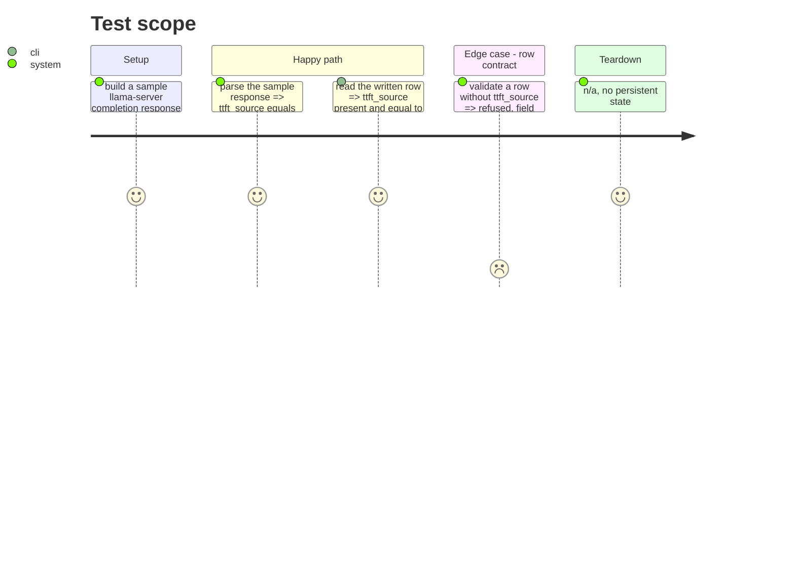

<!-- Fill or omit these sections; never add, rename, or reorder one. -->

# Instruction: TTFT provenance

## Architecture projection

> Tree of the final files. ✅ create · ✏️ modify · ❌ delete

```txt
.
├── src/wave_local_ai_v2/
│   ├── timings.py       ✏️ parse_timings returns `ttft_source` beside the three metrics
│   ├── row_contract.py  ✏️ `ttft_source` becomes a required runtime field
│   └── __init__.py      ✏️ row carries ttft_source; the __init__.py:184-199 comment shrinks
└── tests/
    ├── test_timings.py     ✏️ a parsed response yields `ttft_source == "server_reported"`; an unrecognised value is rejected
    ├── test_row_contract.py ✏️ `ttft_source` required; a row without it refused
    └── test_cli.py          ✏️ the written row carries ttft_source
```

## User Journey



## Test Scope



## Tasks to do

### `1)` Produce `ttft_source` where TTFT is read

> `parse_timings` is the single place `ttft_ms` is extracted; the label is produced beside it, not derived downstream.

1. Add `TTFT_SOURCE_SERVER_REPORTED = "server_reported"` and `TTFT_SOURCE_CLIENT_MEASURED = "client_measured"` as named constants in `timings.py` — both named now even though only the first is reachable today, so the row contract's future acceptance of the second needs no new constant later.
2. Add `ttft_source: str` to the `Timings` TypedDict.
3. `parse_timings` sets `ttft_source=TTFT_SOURCE_SERVER_REPORTED` unconditionally — today's only call path reads `timings["prompt_ms"]` straight from llama-server's response, which is exactly what that label means.
4. Do not add a validity check inside `parse_timings` for an "unrecognised source value" — there is nothing to validate yet, since this function only ever produces `server_reported`. The story's "unrecognised source value is rejected" acceptance belongs to the row contract (task 2), which is where a value the row itself carries is checked, not where it is produced.

### `2)` Require and validate `ttft_source` on the row contract

> Matches the discipline `energy_method` and `prompt_capture` already get.

1. Add `"ttft_source"` to `REQUIRED_FIELDS["runtime"]`, grouped under the `timings.Timings` comment block.
2. Add a check in `validate_row` (alongside the existing `prompt_provenance.is_consistent` check, inside the `kind == "runtime"` branch) that `row["ttft_source"]` is one of `{timings.TTFT_SOURCE_SERVER_REPORTED, timings.TTFT_SOURCE_CLIENT_MEASURED}`, raising `RowContractError` naming the value otherwise. This is what satisfies "an unrecognised source value is rejected rather than passed through" — enforced at the point that gates every written row, not inside the parser.

### `3)` Wire the row and shrink the comment

> `RepetitionResult` already carries `ttft_ms` from `Timings`; this task surfaces `ttft_source` the same way and retires the caveat it replaces.

1. `RepetitionResult` (in `repetitions.py`) gains `ttft_source: str`, populated from `timings["ttft_source"]` in `_run_one` alongside the existing `ttft_ms`/`prompt_tok_per_s`/`gen_tok_per_s` assignments.
2. Add `"ttft_source": counted[0]["ttft_source"]` to the row in `__init__.py`, next to where `ttft_ms` is spread from the aggregated timings — every counted repetition carries the same value today (one call path), so citing the first is not a loss of information, and a comment says so.
3. Rewrite the comment block at `__init__.py:184-199` (locate by content, not line number — prior phases may have shifted it) documenting the streaming-TTFT revert: shrink it to what the row does not already say once `ttft_source` is a published field. Keep the factual record of what was tried and why (the thermal-slowdown confound, the SSE-flush hypothesis) — the story asks for the *caveat* ("uncorroborated") to move from comment to row, not for the investigation history to be deleted.

## Test acceptance criteria

<!-- Each criterion is an observable behavior, not a command. -->

| Task | Acceptance criteria                                                                                                                                                    |
| ---- | ------------------------------------------------------------------------------------------------------------------------------------------------------------------ |
| 1    | `parse_timings` on a well-formed response returns `ttft_source == "server_reported"` alongside the existing three metrics.                                            |
| 2    | `validate_row` accepts a row with `ttft_source: "server_reported"` or `"client_measured"`, refuses one missing the field, and refuses one carrying any other string, naming it. |
| 3    | The written row carries `ttft_source`; the comment at the old `__init__.py:184-199` location states only what the row does not, and the investigation history it recorded is still present. |
