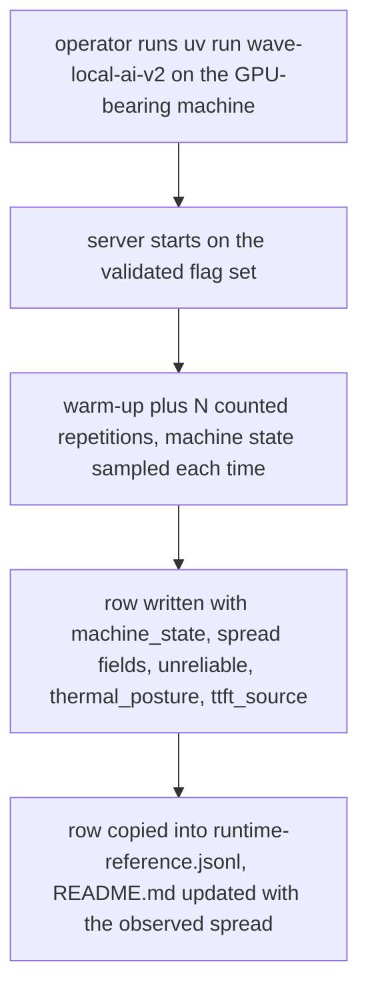
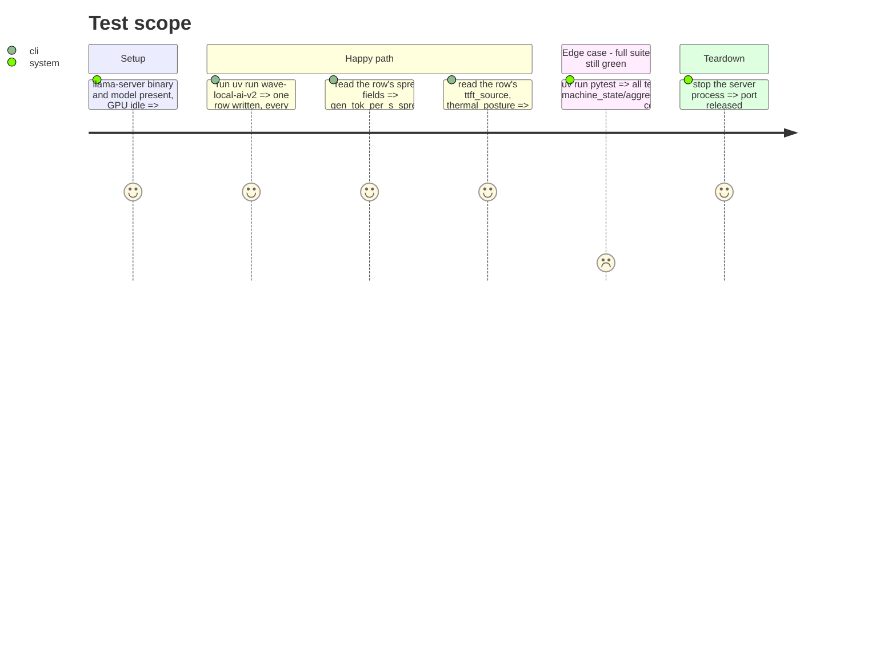

<!-- Fill or omit these sections; never add, rename, or reorder one. -->

# Instruction: Live validation, changelog, docs

## Architecture projection

> Tree of the final files. ✅ create · ✏️ modify · ❌ delete

```txt
.
├── CHANGELOG.md                          ✏️ machine state, spread/unreliable, thermal posture, ttft_source entries
├── docs/setup.md                         ✏️ row-field notes for the new fields
└── aidd_docs/results/
    ├── runtime-reference.jsonl           ✏️ regenerated, each repetition carrying machine_state, new top-level fields present
    └── README.md                         ✏️ observed spread recorded against the 10% threshold, GPU temperature/throttle reasons noted
```

## User Journey



## Test Scope



## Tasks to do

### `1)` One live run

> The GPU-bearing development machine, default settings (`RUNTIME_REPETITIONS=5`, `RUNTIME_COOLDOWN_S=10.0`).

1. Run `uv run wave-local-ai-v2`. Confirm the process completes and a row lands in `RUNTIME_RESULTS_PATH`.
2. Inspect the written row: every entry in `repetitions` carries a `machine_state` block with a real `gpu_temp_c` (not `None` — this is the one signal this phase asserts is actually populated on real hardware) and a `gpu_throttle_reasons` list (possibly empty, that is a valid observation).
3. Record the observed `gen_tok_per_s_spread`, `ttft_ms_spread`, `prompt_tok_per_s_spread` and whether `unreliable` fired, in this phase file's Evidence table below.
4. Record `cpu_temp_c` / `cpu_temp_source` as observed — expected `None` / `"unavailable"` per phase 1's spike conclusion; note here if reality differs.

### `2)` Regenerate the published evidence

> Story's evidence requirement: the reference bundle carries the new fields, not asserted to satisfy the threshold.

1. Copy the new row (or the best of a short local batch) into `aidd_docs/results/runtime-reference.jsonl`, following the existing convention for how prior increments added rows there (check `aidd_docs/results/README.md` for the documented process).
2. Update `aidd_docs/results/README.md`: record the observed spread against the 10% threshold — state plainly whether the flag fired, rather than curating only a row that stays under it.

### `3)` CHANGELOG

1. Add an `### Added` (or `### Changed`, matching the existing `[Unreleased]` section's convention) entry: per-repetition machine state (GPU temperature, NVML clock event reasons, CPU package temperature or its declared unavailability), the `gen_tok_per_s`/`ttft_ms`/`prompt_tok_per_s` spread statistic with the `unreliable` flag on excess `gen_tok_per_s` spread, the declared `thermal_posture`, and `ttft_source` on every runtime row.

### `4)` `docs/setup.md` row-field notes

1. Extend the section documenting the runtime row's fields (near the existing `runtime.jsonl` walkthrough) with one line per new field: `machine_state` (per repetition), `gen_tok_per_s_spread`/`ttft_ms_spread`/`prompt_tok_per_s_spread`, `unreliable`, `thermal_posture`, `ttft_source`, and `RUNTIME_SPREAD_THRESHOLD`'s default alongside the existing `RUNTIME_REPETITIONS`/`RUNTIME_COOLDOWN_S`/`RUNTIME_WARMUP_COUNT` documentation.

### `5)` Full suite

1. `uv run pytest` — every test green, including phases 1-3's new and extended tests.

## Test acceptance criteria

<!-- Each criterion is an observable behavior, not a command. -->

| Task | Acceptance criteria                                                                                                                                                     |
| ---- | ------------------------------------------------------------------------------------------------------------------------------------------------------------------ |
| 1    | The live row's repetitions each carry a `machine_state` block with a real GPU temperature; the observed spread and CPU-temperature outcome are recorded in this file's Evidence table. |
| 2    | `runtime-reference.jsonl` and its `README.md` are regenerated/updated to show the new fields and the observed spread against the 10% threshold.                        |
| 3    | `CHANGELOG.md`'s `[Unreleased]` section names all four capabilities this increment ships.                                                                              |
| 4    | `docs/setup.md` documents every new row field and the new setting.                                                                                                      |
| 5    | `uv run pytest` passes in full.                                                                                                                                          |

## Evidence

<!-- Filled during execution, not at plan time. -->

| Field | Observed value |
| --- | --- |
| `gpu_temp_c` (repetition range) | 66.0-68.0 |
| `gpu_throttle_reasons` (union across repetitions) | `sw_power_cap`, `sw_thermal_slowdown` |
| `cpu_temp_c` / `cpu_temp_source` | `null` / `"unavailable"` -- matches phase 1's spike conclusion |
| `gen_tok_per_s_spread` | 0.0518 (5.2%) |
| `ttft_ms_spread` | 0.0125 |
| `prompt_tok_per_s_spread` | 0.0127 |
| `unreliable` | `false` |
| `thermal_posture` | `"fixed_cooldown"` |
| `ttft_source` | `"server_reported"` |

Full run: `gen_tok_per_s=15.3 prompt_tok_per_s=260.3 ttft_ms=5724.2 repetitions_n=5
unreliable=False energy_method=measured_nvml`. Row copied into
`aidd_docs/results/runtime-reference.jsonl` as its third row (see that
directory's `README.md`). `gen_tok_per_s` (15.3) is well below the branch's
prior headline figure (~26 tok/s, see rows 1-2 of the same reference file):
the GPU was observed in `sw_thermal_slowdown`/`sw_power_cap` for part of this
run (`gpu_throttle_reasons` union above), consistent with the machine having
run other real benchmarks earlier in the session per `__init__.py`'s
streaming-TTFT comment. The repetition set's own internal spread (5.2%)
stayed well under the 10% threshold regardless -- `unreliable` correctly
reports the set as internally consistent even though its absolute throughput
was thermally suppressed relative to a cooler run, which is exactly the
distinction the spread flag is scoped to (see plan.md's Decisions table).
