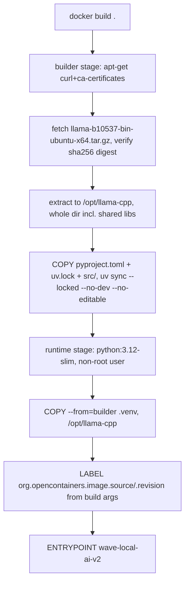
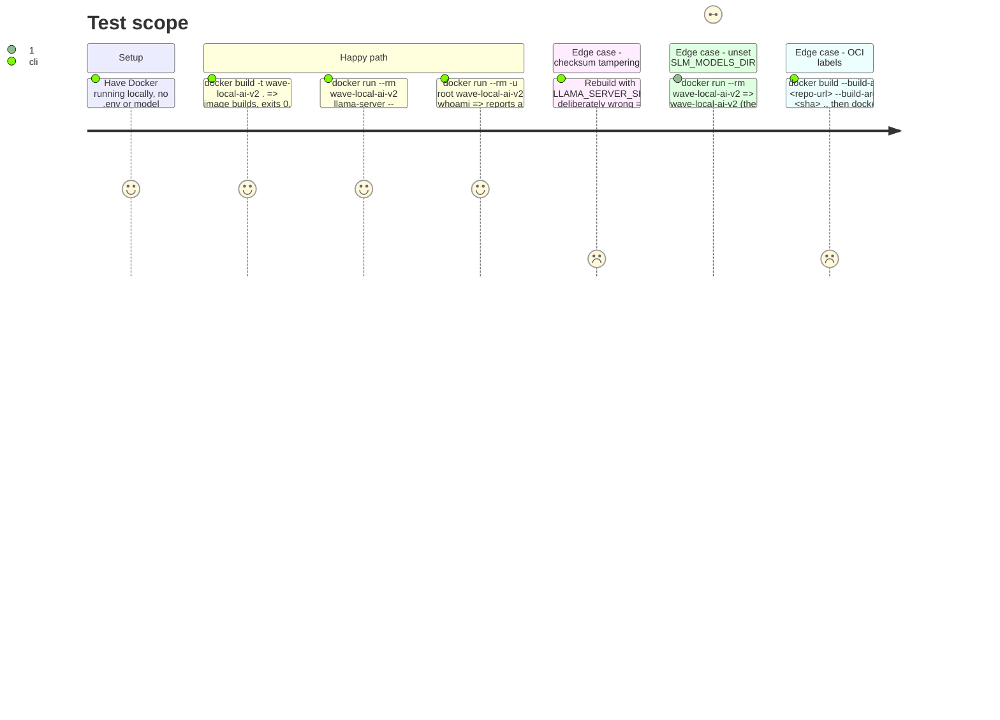

<!-- Fill or omit these sections; never add, rename, or reorder one. -->

# Instruction: Dockerfile and build context

## Architecture projection

> Tree of the final files. ✅ create · ✏️ modify · ❌ delete

```txt
.
├── Dockerfile ✅
└── .dockerignore ✅
```

## User Journey



## Test Scope



## Tasks to do

### `1)` `.dockerignore`

> Mirrors `.gitignore`'s intent for the build context: keep weights, secrets, caches, and the dev virtualenv out of what gets sent to the Docker daemon.

1. Start from `.gitignore`'s entries (`__pycache__/`, `*.py[oc]`, `build/`, `dist/`, `wheels/`, `*.egg-info`, `.venv/`, `.env`, `models/`, `*.gguf`, `*.safetensors`, `results/raw/`, `aidd_docs/results/*.jsonl` with `!aidd_docs/results/*-reference.jsonl` re-included, `.pytest_cache/`, `.ruff_cache/`, `.mypy_cache/`, `.coverage`, `coverage.xml`, `htmlcov/`).
2. Add Docker/VCS-specific entries `.git/`, `.github/`, `Dockerfile`, `.dockerignore` itself is not excluded (Docker always reads it), `docs/`, `aidd_docs/` except the reference evidence files the build never needs — keep the exclusion narrow: excluding all of `aidd_docs/` is fine since nothing under it is a build input.
3. Do not exclude `pyproject.toml`, `uv.lock`, `src/`, `README.md` (`pyproject.toml`'s `readme` field points at it, so `uv_build` needs it present at build time) — these are the actual build inputs.

### `2)` Dockerfile — builder stage, `llama-server` fetch and verify

> Reuses the exact tag `docs/setup.md` §2 pins and the checksum trust model its §3 documents, sourced from the one checksum GitHub actually publishes for this asset.

1. `FROM python:3.12-slim AS llama-fetch`; `RUN apt-get update && apt-get install -y --no-install-recommends curl ca-certificates && rm -rf /var/lib/apt/lists/*`.
2. `ARG LLAMA_CPP_TAG=b10537`, `ARG LLAMA_SERVER_ASSET=llama-b10537-bin-ubuntu-x64.tar.gz`, `ARG LLAMA_SERVER_SHA256=47963587b8e2eee2ecc2ac0884450b2f50c24b35bcff23d68c92694da1d1ac0f`.
3. `RUN curl -fsSL -o /tmp/llama.tar.gz "https://github.com/ggml-org/llama.cpp/releases/download/${LLAMA_CPP_TAG}/${LLAMA_SERVER_ASSET}" && echo "${LLAMA_SERVER_SHA256}  /tmp/llama.tar.gz" | sha256sum -c - && mkdir -p /opt/llama-cpp && tar -xzf /tmp/llama.tar.gz -C /opt/llama-cpp --strip-components=1 && rm /tmp/llama.tar.gz`.
4. Do not extract only `llama-server`: the archive's top-level directory holds `llama-server` plus ~20 `.so` files it dynamically links against (verified locally by listing the archive), so the whole extracted tree is the unit that moves forward.

### `3)` Dockerfile — builder stage, project install

> `--locked` matches `docs/setup.md`'s own install command; `--no-dev` and `--no-editable` are the two flags a container needs beyond what a developer runs.

1. `FROM python:3.12-slim AS project-build`.
2. `COPY --from=ghcr.io/astral-sh/uv:0.11.7 /uv /usr/local/bin/uv` (pins the same `uv` version `pyproject.toml`'s `uv_build` upper-bounds against).
3. `WORKDIR /app`; `COPY pyproject.toml uv.lock README.md ./`; `COPY src/ src/`.
4. `RUN uv sync --locked --no-dev --no-editable`.
5. No `COPY` of `tests/`, `scripts/`, `.env.example`, or any dev-only file into this stage.

### `4)` Dockerfile — runtime stage

> Only the installed venv and the fetched runtime cross into the final image; no compiler, no `curl`, no `.git`.

1. `FROM python:3.12-slim AS runtime`.
2. `RUN groupadd --system app && useradd --system --gid app --create-home --home-dir /home/app app`.
3. `COPY --from=llama-fetch /opt/llama-cpp /opt/llama-cpp`; `ENV PATH="/opt/llama-cpp:/app/.venv/bin:${PATH}" LD_LIBRARY_PATH="/opt/llama-cpp"`.
4. `COPY --from=project-build /app/.venv /app/.venv`.
5. `WORKDIR /app`; `RUN chown -R app:app /app /home/app`.
6. `ARG SOURCE` `ARG REVISION`; `LABEL org.opencontainers.image.source="${SOURCE}" org.opencontainers.image.revision="${REVISION}"` (both default empty so a plain `docker build .` with no build-args still succeeds).
7. `USER app`.
8. `ENTRYPOINT ["wave-local-ai-v2"]`.

## Test acceptance criteria

| Task | Acceptance criteria                                                                                                                                          |
| ---- | ------------------------------------------------------------------------------------------------------------------------------------------------------------- |
| 1... | `docker build .` from a clone containing `.env`, a populated `models/`, and `aidd_docs/results/*.jsonl` does not error on those paths and the resulting image contains none of them (`docker run --rm --entrypoint find  / -name '*.gguf'` finds nothing). |
| 2... | `docker run --rm --entrypoint llama-server  --version` exits 0 and its output names `b10537` or the build's own version string; no missing-`.so` error. |
| 3... | `docker run --rm --entrypoint sh  -c "test -d /app/.venv && python -c 'import wave_local_ai_v2'"` exits 0 with no source tree present (`test -d /app/src` fails). |
| 4... | `docker run --rm ` (no env) exits 1 and stderr is exactly `error: SLM_MODELS_DIR is not set`; `docker inspect ` shows a non-root `User`; a build with `--build-arg SOURCE=... --build-arg REVISION=...` reports both in `docker inspect`'s `Config.Labels`. |
