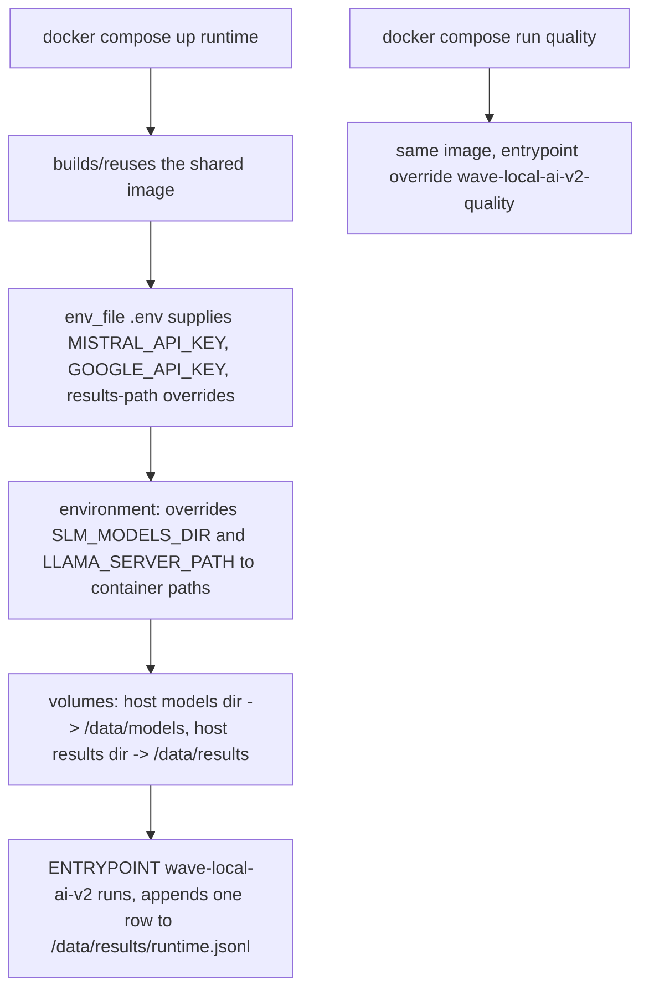
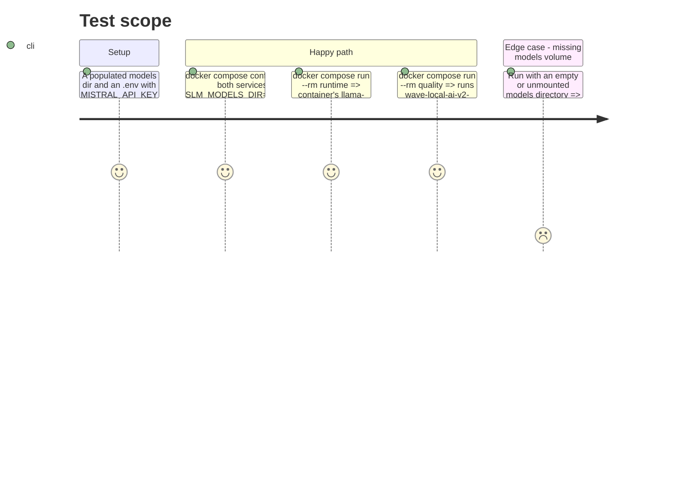

<!-- Fill or omit these sections; never add, rename, or reorder one. -->

# Instruction: Compose definition

## Architecture projection

> Tree of the final files. ✅ create · ✏️ modify · ❌ delete

```txt
.
└── compose.yaml ✅
```

## User Journey



## Test Scope



## Tasks to do

### `1)` Shared build and image

1. Top-level `services.runtime` and `services.quality` both set `build: context: ., dockerfile: Dockerfile` and the same `image: wave-local-ai-v2:local` tag, so Compose builds once and both services reuse the tag (Compose's own dedup on identical `build:` + `image:` keys).

### `2)` Environment layering

> `.env` stays exactly what a developer already fills in per `docs/setup.md`/README's `.env` keys table; only the two host-path keys get a container-correct override.

1. Both services: `env_file: .env`.
2. Both services: `environment:` block sets `SLM_MODELS_DIR: /data/models` and `LLAMA_SERVER_PATH: /opt/llama-cpp/llama-server` — these two keys always win over whatever the host's `.env` holds for them (Compose merge order: `environment:` overrides `env_file:`).
3. `runtime` additionally sets `RUNTIME_RESULTS_PATH: /data/results/runtime.jsonl`; `quality` sets `QUALITY_RESULTS_PATH: /data/results/quality.jsonl`. Neither touches `MISTRAL_API_KEY`/`GOOGLE_API_KEY` — those still come from `env_file`.

### `3)` Volumes

1. Both services mount a models volume: `${SLM_MODELS_DIR}:/data/models:ro` — read-only, since neither CLI writes into the models directory; `${SLM_MODELS_DIR}` here is the *host* shell variable a user exports or keeps in a compose-adjacent `.env` override, not the container-internal path from task 2 (Compose resolves `${VAR}` in `volumes:` from the shell/`.env` at the project root before container env is applied, so this is the same file but a different resolution point — call this out with an inline comment in `compose.yaml`).
2. Both services mount a results volume: `./aidd_docs/results:/data/results` (read-write), so `runtime.jsonl`/`quality.jsonl` land back on the host exactly like a bare-metal run would, at the same repo-relative path the README/`docs/setup.md` already describe.

### `4)` Entrypoint override for `quality`

1. `runtime` service: no `entrypoint:` override — uses the Dockerfile's `ENTRYPOINT ["wave-local-ai-v2"]` as-is.
2. `quality` service: `entrypoint: ["wave-local-ai-v2-quality"]` — Compose's `command:` cannot swap the executable, only append args to the fixed entrypoint, so this is the one field that actually runs the other console script in the same image.

## Test acceptance criteria

| Task | Acceptance criteria                                                                                                                                 |
| ---- | ------------------------------------------------------------------------------------------------------------------------------------------------------ |
| 1... | `docker compose build` builds one image; `docker compose config` shows both services referencing the same `image:` value.                              |
| 2... | `docker compose config` renders `SLM_MODELS_DIR=/data/models` and `LLAMA_SERVER_PATH=/opt/llama-cpp/llama-server` for both services regardless of what `.env` sets for those two keys; `MISTRAL_API_KEY` in the rendered config matches `.env`'s value verbatim. |
| 3... | With a real model under a host directory and that directory exported/set, `docker compose run --rm runtime` finds the model at `/data/models/...` inside the container; after the run, the row appears in the host's `aidd_docs/results/runtime.jsonl`. |
| 4... | `docker compose run --rm quality` invokes `wave-local-ai-v2-quality` (visible in its stdout/behavior, e.g. it reads `MISTRAL_API_KEY` and writes to `quality.jsonl`, not `runtime.jsonl`); `docker compose run --rm runtime` still invokes the runtime CLI, unaffected. |
