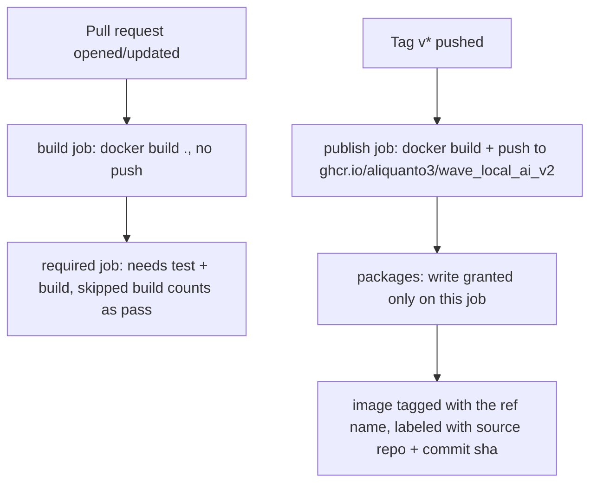
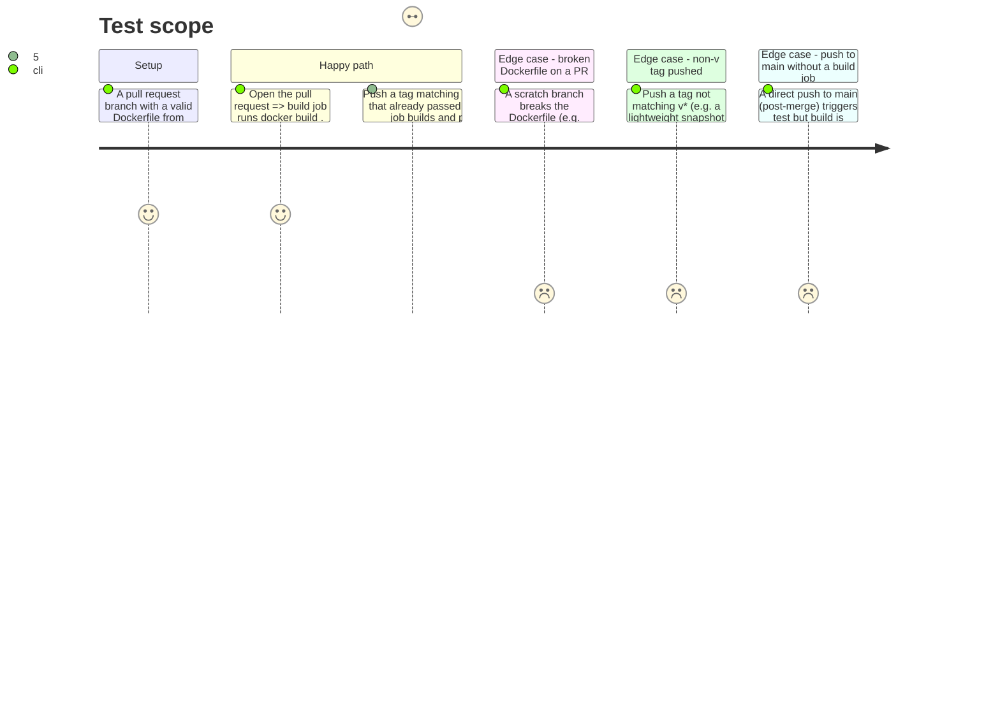

<!-- Fill or omit these sections; never add, rename, or reorder one. -->

# Instruction: CI build and publish jobs

## Architecture projection

> Tree of the final files. ✅ create · ✏️ modify · ❌ delete

```txt
.
└── .github/
    └── workflows/
        └── ci.yml ✏️
```

## User Journey



## Test Scope



## Tasks to do

### `1)` Add the tag trigger

1. `on.push.tags: ['v*']` alongside the existing `on.push.branches: [main]` and `on.pull_request:` — a tag push and a branch push are independent trigger conditions under the same `push:` key.

### `2)` `build` job — PR only, build no push

> Proves the image still builds on every change before a tag could ever publish it broken.

1. `jobs.build`: `if: github.event_name == 'pull_request'`, `runs-on: ubuntu-latest`, `permissions: contents: read` (no elevation — it never authenticates to a registry).
2. `actions/checkout@v4` (matches the `test` job's existing checkout).
3. `docker/setup-buildx-action@<pinned sha> # v<version>` (verify the current release the same way `astral-sh/setup-uv` was pinned in the prior CI phase: resolve the marketplace listing to a real tag, then its commit sha via the GitHub API, comment the version).
4. `docker/build-push-action@<pinned sha> # v<version>` with `context: .`, `push: false`, `tags: wave-local-ai-v2:pr-${{ github.event.pull_request.number }}`, `build-args: SOURCE=${{ github.server_url }}/${{ github.repository }} REVISION=${{ github.sha }}`.
5. No `docker/login-action` step in this job — it never needs registry credentials.

### `3)` `publish` job — tag only, push to GHCR

> The one job in the whole workflow allowed to write to the registry, gated to the one event that should ever trigger a publish.

1. `jobs.publish`: `if: startsWith(github.ref, 'refs/tags/v')`, `runs-on: ubuntu-latest`.
2. Job-level `permissions: contents: read packages: write` — this is the only place `packages: write` appears anywhere in the file; the workflow's top-level `permissions:` stays `contents: read`.
3. `actions/checkout@v4`; `docker/setup-buildx-action@<same pinned sha as task 2>`.
4. `docker/login-action@<pinned sha> # v<version>` with `registry: ghcr.io`, `username: ${{ github.actor }}`, `password: ${{ secrets.GITHUB_TOKEN }}`.
5. `docker/build-push-action@<same pinned sha as task 2>` with `context: .`, `push: true`, `tags: ghcr.io/aliquanto3/wave_local_ai_v2:${{ github.ref_name }}`, `build-args: SOURCE=${{ github.server_url }}/${{ github.repository }} REVISION=${{ github.sha }}`, `labels: org.opencontainers.image.source=${{ github.server_url }}/${{ github.repository }} org.opencontainers.image.revision=${{ github.sha }}` (belt-and-suspenders with the Dockerfile's own `ARG`/`LABEL`: `build-push-action`'s `labels:` input is additive and confirms the label lands even if a build-arg is ever dropped from one path).

### `4)` Keep `required` accurate without depending on `publish`

1. `jobs.required.needs: [test, build]` (was `[test]`).
2. The step's shell logic gains a `build` branch: fail if `needs.build.result` is not in `(success, skipped)` — `skipped` is the expected, passing state whenever the triggering event was not `pull_request` (a push to `main`, or a tag push, both skip `build` by task 2's `if:`).
3. `required` does **not** list `publish` in `needs:` — a PR event never runs `publish`, so requiring it would leave `required` permanently unsatisfiable on every PR.

## Test acceptance criteria

| Task | Acceptance criteria                                                                                                                            |
| ---- | --------------------------------------------------------------------------------------------------------------------------------------------- |
| 1... | The workflow's trigger config, viewed via `gh workflow view ci.yml` or the Actions tab, lists a tags condition alongside the branch and PR ones. |
| 2... | Opening a pull request from the phase 1 branch shows a `build` job that succeeds without any push/write step, and no artifact appears under the repo's GHCR packages page from that run. |
| 3... | Pushing a tag `v0.0.1-test` (or an equivalent throwaway) on a green commit produces a `publish` job run whose logs show a successful push, and the resulting package is visible and pullable from `ghcr.io/aliquanto3/wave_local_ai_v2` by a signed-out/anonymous `docker pull`. |
| 4... | On the same pull request from task 2, the `required` check is green with `build: success` and no `publish` job listed at all; on a direct push to `main`, `required` is still green with `build: skipped`. |
