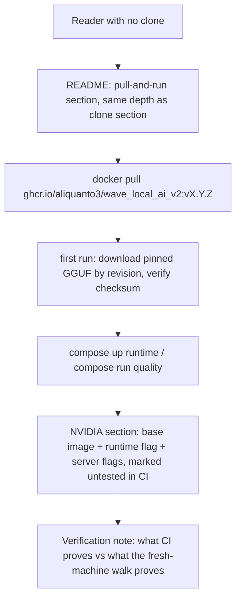
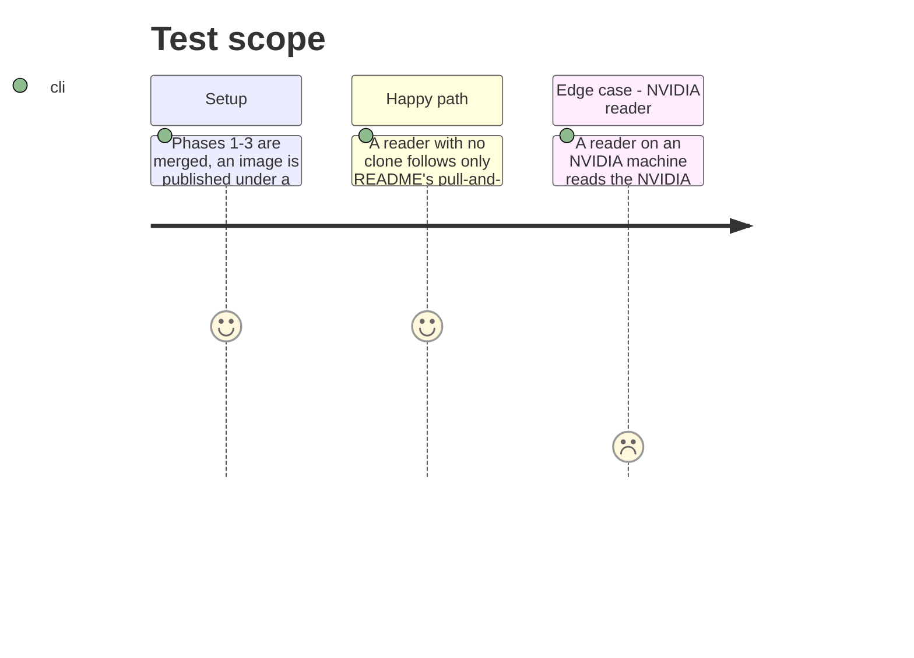

<!-- Fill or omit these sections; never add, rename, or reorder one. -->

# Instruction: Pull-and-run docs

## Architecture projection

> Tree of the final files. ✅ create · ✏️ modify · ❌ delete

```txt
.
├── README.md ✏️
└── docs/
    └── setup.md ✏️
```

## User Journey



## Test Scope



## Tasks to do

### `1)` README — pull-and-run path beside the clone path

> Same level of detail as the existing clone-and-`uv sync` path in "Setup, running, results — at a glance", not a stub pointing elsewhere.

1. Add a subsection (e.g. "Pull and run (no clone)") at the same heading depth as the existing setup walkthrough pointer, right after or beside it.
2. Document: `docker pull ghcr.io/aliquanto3/wave_local_ai_v2:<version>`; obtaining `compose.yaml` (the one file a pull-only reader still needs — link to it directly in the repo, e.g. via the raw GitHub URL for that tag, since they have no clone to read it from disk).
3. Document the first-run weight download explicitly: the image ships no GGUF, so the reader's first `docker compose run` needs `SLM_MODELS_DIR` (host-side) populated exactly as `docs/setup.md` §3 describes — restate the exact relative path and the sha256, don't just link to it, since this is the one step every pull-path reader must do that a clone-path reader might have already done.
4. State plainly, next to the constants the story requires calling out: `N_CPU_MOE`, `THREADS`, the pinned model filename, and the pinned `llama.cpp` build are fitted to this project's own development laptop, and that a machine-portable image is `every-published-row-explains-and-reproduces-itself`'s scope, not this one's.

### `2)` NVIDIA section — documented, explicitly untested in CI

1. New subsection under the pull-and-run path (or in `docs/setup.md`, whichever already hosts the hardware/platform breakdown — keep it beside the existing CPU-build platform list in `docs/setup.md` §2 for symmetry).
2. Name the CUDA base image an NVIDIA container would need (e.g. `nvidia/cuda:12.4.1-runtime-ubuntu22.04` or equivalent matching the CUDA 12.x the README's hardware section already requires) and that it is **not** what `Dockerfile` builds — the shipped image is CPU-only.
3. Name the Docker runtime flag needed (`--gpus all`, or `--runtime=nvidia` depending on the reader's Docker/NVIDIA Container Toolkit setup) and the `llama-server` flags that would change from the CPU build's implicit defaults (e.g. `-ngl`/`--n-cpu-moe` values suited to GPU offload, referencing `src/wave_local_ai_v2/server.py`'s existing constants as the bare-metal precedent rather than restating a second set of magic numbers).
4. State explicitly, in the same section: "untested in CI — no GitHub-hosted runner carries a GPU", so a reader does not mistake documentation for a CI-verified path.

### `3)` Verification note — what CI proves, what the epic's fresh-machine walk proves

> Answers the story's own "How it is verified without a GPU" section for a documentation reader, not just for this plan's phases.

1. Add a short note (README or `docs/setup.md`, co-located with the pull-and-run section) stating exactly:
   - CI proves: the image builds on every pull request; `llama-server --version` runs inside the built image on CPU with no GPU and no model; the console script exits 1 with `error: SLM_MODELS_DIR is not set` when unconfigured; the built image's OCI labels name the source repo and commit.
   - CI does not prove: that a real CPU or GPU inference run completes inside the container, that the compose volumes behave correctly against real weights, or that the NVIDIA path works at all — those are the epic's fresh-machine walk, done by a human on real hardware, not by this repository's CI.
2. Do not overstate: phrase this so a reader cannot conclude "CI ran the benchmark" from anything written here.

## Test acceptance criteria

| Task | Acceptance criteria                                                                                                                       |
| ---- | -------------------------------------------------------------------------------------------------------------------------------------------- |
| 1... | A reader following only the new README subsection, with no access to a clone, can name the exact `docker pull` command, get `compose.yaml`, populate `SLM_MODELS_DIR` with the correctly-checksummed weight file, and run both CLIs — verified by re-reading the section as if blind to the rest of the repo. |
| 2... | The NVIDIA section names a specific base image, a specific Docker runtime flag, and at least one specific `llama-server` flag that changes for GPU, and contains the literal phrase marking it untested in CI. |
| 3... | The verification note lists the four CI-proven checks and the fresh-machine-walk-only items as two distinct, non-overlapping lists, matching what phases 1-3 actually implemented (no claim of a CI check that was not built). |
