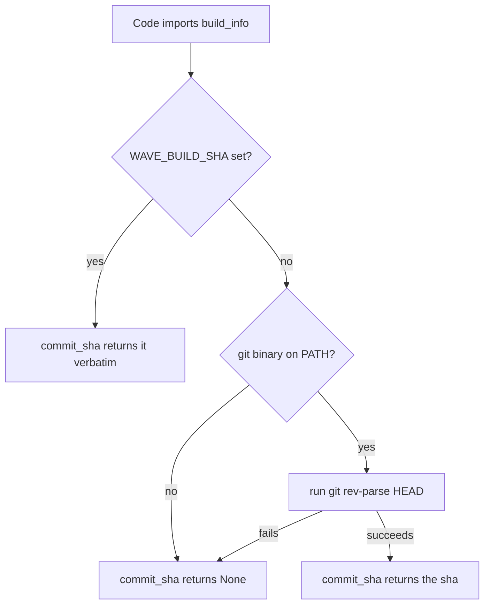
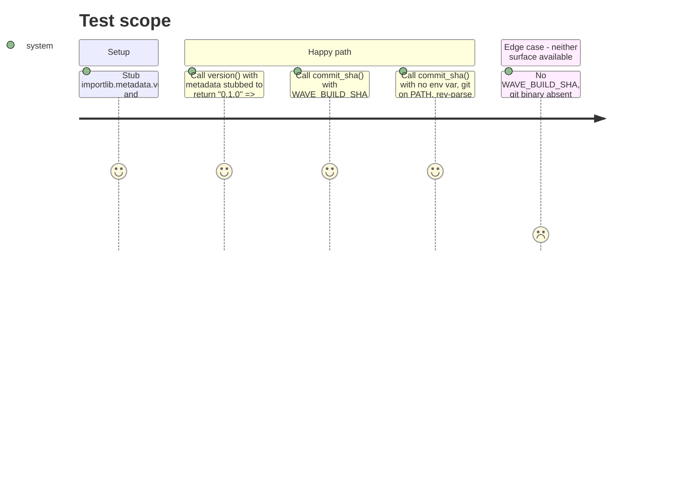

# Instruction: `build_info` surface and its tests

## Architecture projection

> Tree of the final files. ✅ create · ✏️ modify · ❌ delete

```txt
.
└── src/wave_local_ai_v2/
    └── build_info.py          ✅ version() from installed metadata, commit_sha() with the injected → git → None fallback
└── tests/
    └── test_build_info.py     ✅ the four resolution cases, metadata and subprocess stubbed
```

## User Journey



## Test Scope



## Tasks to do

### `1)` Write `build_info.py`

> Two functions, no class: `version()` reads installed metadata; `commit_sha()` resolves injected build value, then git, then `None`.

1. `version() -> str`: return `importlib.metadata.version("wave-local-ai-v2")` (the distribution name from `pyproject.toml`'s `[project].name`). No try/except — every context this runs in (dev venv, CI, the built image) has the project installed; a `PackageNotFoundError` here is a real defect, not a case to hide.
2. `commit_sha() -> str | None`: read `os.environ.get("WAVE_BUILD_SHA")` first; if truthy, return it as-is.
3. Else, resolve the `git` binary with `shutil.which("git")`; if `None`, return `None` (no git available — not "we didn't check").
4. Else, run `subprocess.run([git_binary, "rev-parse", "HEAD"], capture_output=True, text=True, check=True)` inside a `try`; on `subprocess.CalledProcessError` or `OSError` (e.g. not a git checkout, or the binary vanished mid-call), return `None`.
5. On success, return `result.stdout.strip()` — guard against an empty/whitespace-only result also collapsing to `None` rather than an empty string.
6. Module docstring states the resolution order and that the degradation is deliberate (explicit `None`, never stale or fabricated), so a reader doesn't need the story to understand the contract.

### `2)` Write `tests/test_build_info.py`

> Four cases. Stub `importlib.metadata.version` for the version case; stub `os.environ`, `shutil.which`, and `subprocess.run` (via `monkeypatch`) for the three `commit_sha()` cases — never invoke a real git process or read real installed metadata.

1. `test_version_reads_installed_metadata`: import `importlib.metadata.version` into `build_info.py` under a private alias (e.g. `_installed_version`) so the test can `monkeypatch.setattr` that alias directly, rather than patching the stdlib function globally; assert `version()` returns the stubbed value unchanged.
2. `test_commit_sha_prefers_the_injected_build_value`: `monkeypatch.setenv("WAVE_BUILD_SHA", "abc123")`; assert `commit_sha() == "abc123"`; assert `shutil.which`/`subprocess.run` were not called (patch both with a `MagicMock` and assert `.called is False`) — proves the injected value short-circuits before touching git at all.
3. `test_commit_sha_falls_back_to_git_rev_parse`: `monkeypatch.delenv("WAVE_BUILD_SHA", raising=False)`; monkeypatch `shutil.which` to return a fake path; monkeypatch `subprocess.run` to return a stubbed `CompletedProcess`-like object with `stdout="deadbeef\n"`; assert `commit_sha() == "deadbeef"`.
4. `test_commit_sha_is_none_when_neither_surface_is_available`: `monkeypatch.delenv("WAVE_BUILD_SHA", raising=False)`; monkeypatch `shutil.which` to return `None`; assert `commit_sha() is None`.

## Test acceptance criteria

| Task | Acceptance criteria                                                                                                         |
| ---- | ------------------------------------------------------------------------------------------------------------------------------ |
| 1... | `uv run python -c "from wave_local_ai_v2.build_info import version, commit_sha; print(version()); print(commit_sha())"` runs with no error in the dev venv and prints `0.1.0` then either a real sha or `None`. |
| 2... | `uv run pytest tests/test_build_info.py -v` passes all four tests, and no test spawns a real `git` subprocess or reads this checkout's real installed metadata. |
