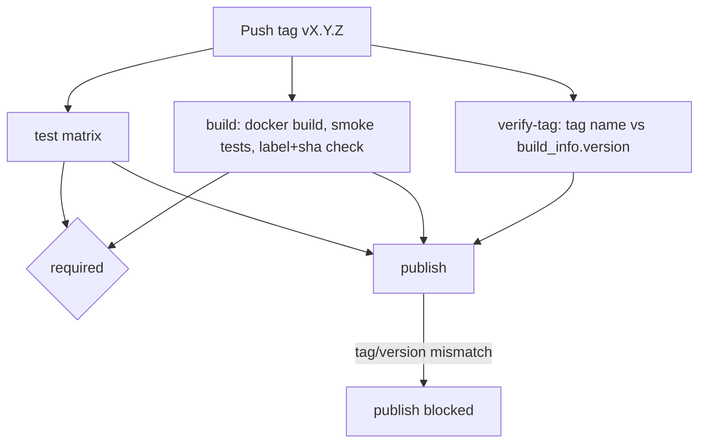
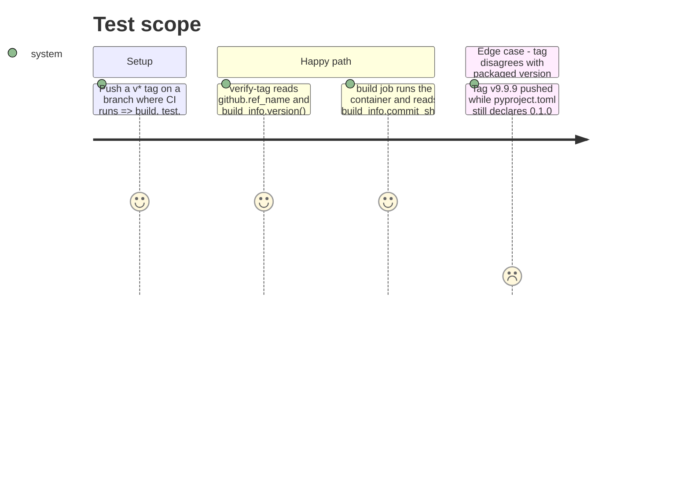

# Instruction: CI tag gate and image sha injection

## Architecture projection

> Tree of the final files. ✅ create · ✏️ modify · ❌ delete

```txt
.
├── Dockerfile              ✏️ REVISION build arg also feeds ENV WAVE_BUILD_SHA, not only the OCI label
└── .github/workflows/
    └── ci.yml               ✏️ new verify-tag job (publish depends on it); build job's label check extended to read commit_sha() out of the running container
```

## User Journey



## Test Scope



## Tasks to do

### `1)` Bake the sha into the image as an ENV, not only a LABEL

> `Dockerfile` already declares `ARG REVISION` for the OCI label; reuse it for `WAVE_BUILD_SHA` so the value is readable by `commit_sha()` inside the running container with no git checkout present.

1. In the `runtime` stage, right after `ARG REVISION` and before the `LABEL` instruction, add `ENV WAVE_BUILD_SHA="${REVISION}"`.
2. Leave the existing `LABEL org.opencontainers.image.revision="${REVISION}"` untouched — both the label and the env var read the same build arg, so they cannot drift from each other by construction.

### `2)` Add the `verify-tag` job

> A tag whose name and packaged version disagree must fail before `publish` runs. New job, not a step folded into `build` (see plan's Decisions table).

1. Add a `verify-tag` job to `.github/workflows/ci.yml`, `if: startsWith(github.ref, 'refs/tags/v')`, `runs-on: ubuntu-latest`, `permissions: { contents: read }`.
2. Steps: `actions/checkout@v4`, the same `astral-sh/setup-uv` step (pinned SHA, `enable-cache: true`, `python-version: "3.12"`) and `uv sync --locked` the `test` job already uses, then one step that computes `tag_version="${GITHUB_REF_NAME#v}"` and `packaged_version=$(uv run python -c "from wave_local_ai_v2.build_info import version; print(version())")`, and `exit 1` with a message naming both values when they differ.
3. Add `verify-tag` to `publish`'s `needs:` list, alongside `test` and `build`.

### `3)` Extend the image label check to compare the reported sha

> The existing `build` job step `"Smoke test: the OCI labels name the source and the commit"` already reads the source and revision labels; add the third comparison in the same step rather than a new one, since it is the same claim (label vs. reality) extended one field.

1. After the existing label reads, add: `reported_sha=$(docker run --rm --entrypoint python "$IMAGE" -c "from wave_local_ai_v2.build_info import commit_sha; print(commit_sha())")` (the image's default entrypoint is the CLI, so this step must override it to `python`).
2. Fail with a clear message (naming both values) if `reported_sha` differs from `revision_label`, and again if it differs from `$GITHUB_SHA` — three-way agreement (label, `commit_sha()`, the workflow's own trigger sha), not just label-vs-code.

## Test acceptance criteria

| Task | Acceptance criteria                                                                                                                    |
| ---- | ------------------------------------------------------------------------------------------------------------------------------------------ |
| 1... | `docker build --build-arg REVISION=deadbeef -t test .` then `docker run --rm --entrypoint python test -c "from wave_local_ai_v2.build_info import commit_sha; print(commit_sha())"` prints `deadbeef`. |
| 2... | Pushing a tag whose name doesn't match `pyproject.toml`'s version fails the `verify-tag` job and `publish` never starts (`needs` unmet); a tag that matches lets `verify-tag` succeed. |
| 3... | On the next tag build in CI, the extended "OCI labels name the source and the commit" step passes, proving `commit_sha()`, the revision label, and `github.sha` all agree. |
