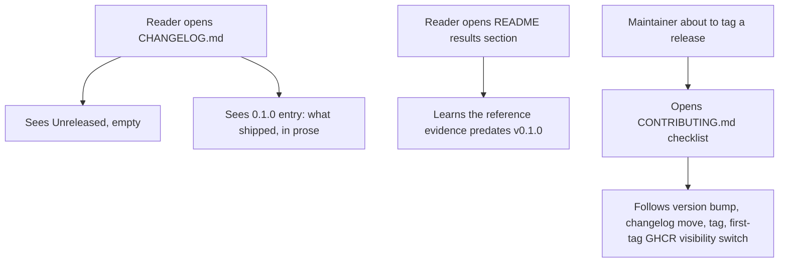
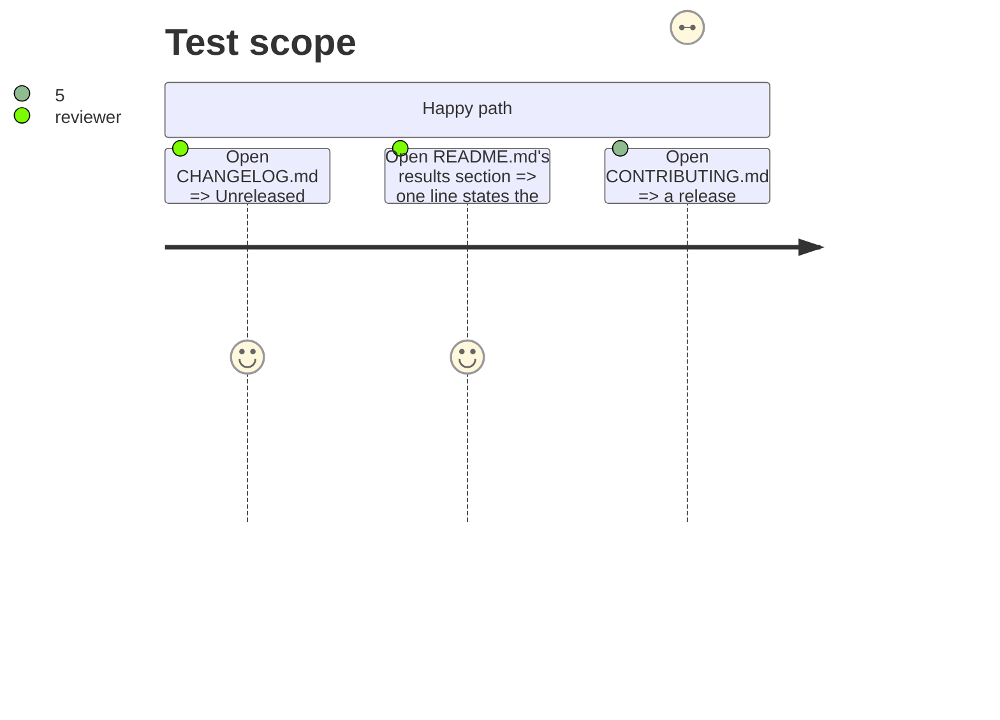

# Instruction: Changelog and release documentation

## Architecture projection

> Tree of the final files. ✅ create · ✏️ modify · ❌ delete

```txt
.
├── CHANGELOG.md      ✅ Keep a Changelog form: Unreleased + the 0.1.0 entry in prose
├── README.md          ✏️ one line: the committed reference evidence predates the first tag
└── CONTRIBUTING.md    ✏️ new "Cutting a release" checklist section
```

## User Journey



## Test Scope



## Tasks to do

### `1)` Write `CHANGELOG.md`

> Keep a Changelog (keepachangelog.com) form. `## [Unreleased]` first, empty; then `## [0.1.0] - 2026-08-22` with an `### Added` list in prose describing what shipped since the first commit — not a list of commit subjects.

1. Header: title, one-line description of what the file tracks, and the two "based on Keep a Changelog" / "adheres to Semantic Versioning" lines with their canonical links.
2. `## [Unreleased]` section, left empty until the next change lands.
3. `## [0.1.0] - 2026-08-22`, `### Added`, prose bullets covering: the runtime benchmark harness and its hardware-fiche-bound JSONL store; the reproducible quality/classification scoring harness (pinned sampler, local vs. cloud models); the README and `docs/setup.md` onboarding walk; the pre-commit fast gate; the CI check suite and its coverage/audit gates; the branch protection ruleset on `main`; the container image and its publish-on-tag pipeline. Each bullet says what capability exists and why it matters, not which commit added it.
4. Footer compare links: `[Unreleased]: .../compare/v0.1.0...HEAD` and `[0.1.0]: .../releases/tag/v0.1.0`, using this repo's GitHub URL.

### `2)` Add the provenance line to `README.md`

> One line, placed in the existing "Results layout" section (the natural neighbor of the `*-reference.jsonl` description already there).

1. State plainly that the committed `*-reference.jsonl` evidence predates the first release tag — it was produced before any `v*` tag existed, so it carries no version binding and must not be read as evidence "for v0.1.0" or any other tag.

### `3)` Add the release checklist to `CONTRIBUTING.md`

> New `## Cutting a release` section, placed after "Continuous Integration" and before "Branch protection on `main`" (or at the file's end — pick whichever reads better once the surrounding sections are in front of you).

1. Ordered checklist: confirm `pyproject.toml`'s version is the one being released; move the `Unreleased` changelog entries into a new dated `## [X.Y.Z]` section; land that change on `main` through the normal pull request path; cut the annotated tag with the `aidd-vcs:03-release-tag` skill.
2. Name the `verify-tag` CI job from phase 2: it fails the tag push if the tag name and the packaged version disagree, and `publish` needs it.
3. A first-tag-only step: after `publish` succeeds, the package GHCR pushed under `GITHUB_TOKEN` lands **private** regardless of the repository's visibility, and no API pre-creates a public user package — the checklist says to open the package's settings once and switch visibility to public, then verify with an anonymous `docker pull ghcr.io/aliquanto3/wave_local_ai_v2:<tag>` from a machine with no `docker login`, and to update this checklist item with the tag it was verified against once done (this plan writes the checklist; performing the switch happens after the tag is cut, per the story's scope note).

## Test acceptance criteria

| Task | Acceptance criteria                                                                                                                     |
| ---- | -------------------------------------------------------------------------------------------------------------------------------------------- |
| 1... | `CHANGELOG.md` has an `## [Unreleased]` section and a `## [0.1.0]` section whose bullets are readable prose naming capabilities, with zero raw commit-subject lines. |
| 2... | README's "Results layout" section states the reference evidence predates the first tag, in one sentence a reader doesn't have to infer. |
| 3... | `CONTRIBUTING.md` has a "Cutting a release" section covering the version bump, the changelog move, `aidd-vcs:03-release-tag`, the `verify-tag` gate, and the first-tag GHCR visibility switch with its anonymous-pull verification step. |
