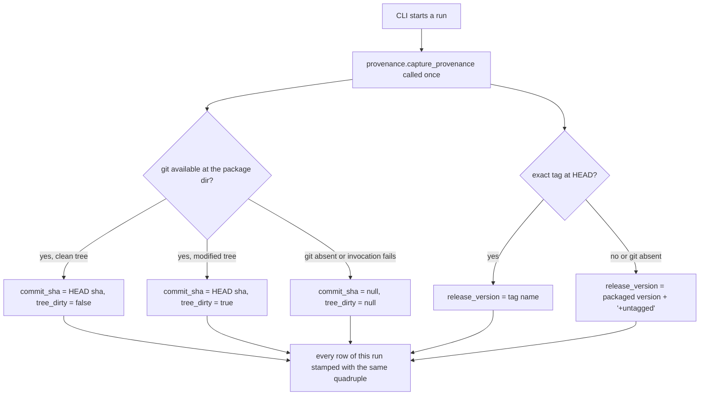
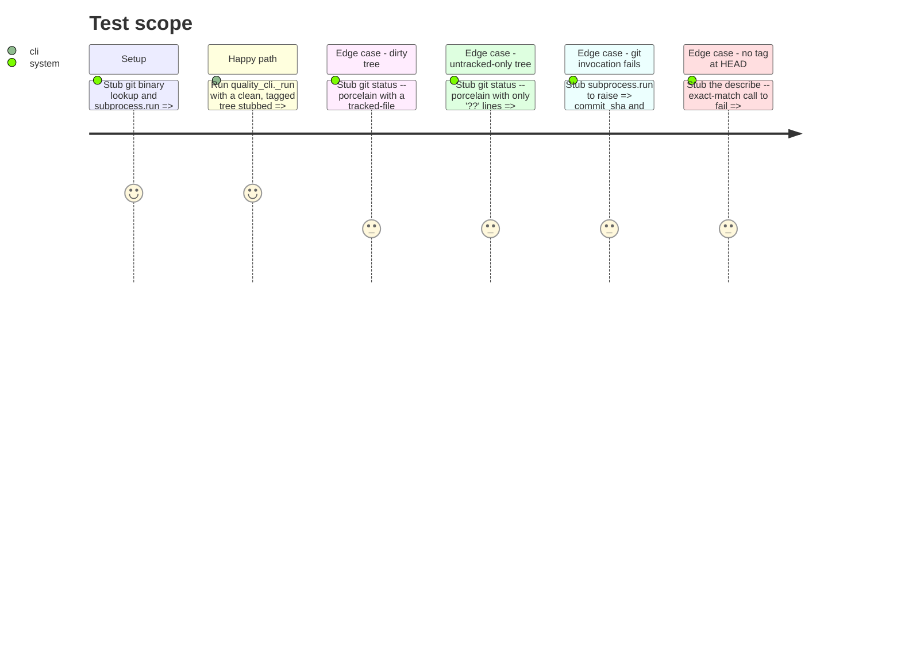

# Instruction: Rows name the code and the tree that produced them

## Architecture projection

```txt
.
├── src/wave_local_ai_v2/
│   ├── build_info.py        ✏️ refactor: shared `_run_git` helper, `commit_sha()` becomes a thin wrapper
│   ├── provenance.py         ✅ new: release_version / commit_sha / tree_dirty, captured once per run
│   ├── row_contract.py      ✏️ add release_version, commit_sha, tree_dirty to both REQUIRED_FIELDS sets
│   ├── __init__.py           ✏️ capture provenance once, stamp it on the runtime row
│   └── quality_cli.py        ✏️ capture provenance once, stamp it on every quality row
└── tests/
    ├── test_provenance.py    ✅ new
    ├── test_build_info.py    ✏️ still passes unchanged against the refactor (no new tests required)
    ├── test_cli.py           ✏️ stub provenance, assert the quadruple on the runtime row
    └── test_quality_cli.py   ✏️ stub provenance, assert the quadruple is identical across every row of one run
```

## User Journey



## Test Scope



## Tasks to do

### `1)` Refactor `build_info.py` to expose one shared git-invocation helper

> `provenance.py` must reuse the existing git resolution instead of duplicating `shutil.which` + `subprocess.run`.

1. Add a module-private `_run_git(args: list[str]) -> str | None`: resolve the `git` binary with `shutil.which`, return `None` immediately if absent; otherwise run `subprocess.run([git_binary, *args], capture_output=True, text=True, check=True)`, return `None` on `CalledProcessError`/`OSError`, else the stripped stdout (`None` if empty after stripping).
2. Rewrite `commit_sha()` to call `_run_git(["-C", str(_PACKAGE_DIR), "rev-parse", "HEAD"])` and return its result directly (the injected `WAVE_BUILD_SHA` check stays first, unchanged).
3. Keep `_PACKAGE_DIR`, `_DISTRIBUTION_NAME`, `version()` untouched. Update the module docstring's mention of the git query only if the wording no longer matches (it should still, since behavior is unchanged).
4. Run `tests/test_build_info.py` unmodified and confirm every existing test still passes — the refactor must be behavior-preserving for `commit_sha()` and `version()`.

### `2)` Write `provenance.py`

> New module: resolves `release_version`, `commit_sha`, `tree_dirty` once per run, degrading to explicit nulls rather than raising.

1. Import `build_info` and reuse `build_info._run_git` and `build_info._PACKAGE_DIR` (do not re-derive the package directory independently).
2. `commit_sha()`: delegate to `build_info.commit_sha()` directly — no new logic.
3. `tree_dirty() -> bool | None`: call `build_info._run_git(["-C", str(build_info._PACKAGE_DIR), "status", "--porcelain"])`. If the result is `None`, return `None`. Otherwise split into lines and return `True` if any line's first two characters are not `"??"`, else `False`. An empty string (clean tree, no output at all) returns `False`.
4. `release_version() -> str`: call `build_info._run_git(["-C", str(build_info._PACKAGE_DIR), "describe", "--tags", "--exact-match", "HEAD"])`. If it returns a non-empty string, return it verbatim (the tag name, e.g. `v0.1.0`). Otherwise return `f"{build_info.version()}+untagged"`. This function never returns `None` — the packaged version is always resolvable once the distribution is installed, independent of git.
5. `capture_provenance() -> dict[str, Any]`: returns `{"release_version": release_version(), "commit_sha": commit_sha(), "tree_dirty": tree_dirty()}`. This is the one function both CLIs call.
6. Module docstring states the degrade-to-null contract plainly (mirror `build_info.py`'s docstring style) and that `capture_provenance()` is meant to be called exactly once per CLI invocation, with its result spread into every row that run writes.

### `3)` Extend `row_contract.py`

> Widen both `REQUIRED_FIELDS` sets, don't fork them.

1. Add `"release_version"`, `"commit_sha"`, `"tree_dirty"` to both the `"runtime"` and `"quality"` frozensets in `REQUIRED_FIELDS`. `run_id` and `captured_at` are already present in both — do not duplicate them.
2. No change to `validate_row`'s logic: a key present with value `None` (the degraded `commit_sha`/`tree_dirty` case) already satisfies the contract as documented in the module docstring.

### `4)` Wire both writers to capture once and stamp every row

1. `src/wave_local_ai_v2/__init__.py`: in `_run()`, call `provenance.capture_provenance()` once (alongside `fiche = capture_fiche()`), and spread its three keys into the `row` dict built at the end of `_run()`.
2. `src/wave_local_ai_v2/quality_cli.py`: in `_run()`, call `provenance.capture_provenance()` once (after `run_id = new_run_id()`), and pass it through to `_score_and_write` (new keyword parameter, e.g. `provenance_fields: dict[str, Any]`) so both the local and cloud batches of one invocation stamp the identical quadruple. Spread it into the per-item `row` dict inside `_score_and_write`, alongside the existing `run_id`/`captured_at` keys.
3. Import `provenance` in both modules.

### `5)` Tests

1. `tests/test_provenance.py` (new): stub `build_info.shutil.which` and `build_info.subprocess.run` (the same pattern `tests/test_build_info.py` already uses) to cover: a clean tree (`git status --porcelain` returns `""`) yields `tree_dirty is False`; a tracked-file modification (a `porcelain` line like `" M src/foo.py"`) yields `tree_dirty is True`; a `??`-only line yields `tree_dirty is False`; a failed git invocation (`subprocess.run` raising, or `which` returning `None`) yields `commit_sha is None` and `tree_dirty is None`; an exact tag at HEAD yields `release_version` equal to that tag string; no tag (the `describe --exact-match` call failing) yields `release_version == f"{version}+untagged"` with `build_info.version` stubbed.
2. `tests/test_cli.py`: extend the `stubbed_run` fixture to patch `wave_local_ai_v2.provenance.capture_provenance` with a fixed return value (e.g. `{"release_version": "v0.1.0", "commit_sha": "deadbeef", "tree_dirty": False}`); add an assertion that the written row carries exactly those three values plus the existing `run_id`/`captured_at`.
3. `tests/test_quality_cli.py`: same fixture-level stub of `provenance.capture_provenance`; extend `test_all_rows_of_one_run_share_one_run_id` (or add a sibling test) asserting every row of the 2×10-item run carries the identical `release_version`/`commit_sha`/`tree_dirty` triple.

## Test acceptance criteria

| Task | Acceptance criteria |
| ---- | -------------------- |
| 1... | `build_info.commit_sha()` and `build_info.version()` behave exactly as before the refactor; `tests/test_build_info.py` passes unmodified. |
| 2... | `provenance.capture_provenance()` never raises regardless of git's presence or exit state; on total git failure it returns `commit_sha=None, tree_dirty=None` and a non-null `release_version`. |
| 3... | `row_contract.validate_row` refuses a runtime or quality row dict missing any of `release_version`, `commit_sha`, `tree_dirty`, and accepts one where they are present with value `None`. |
| 4... | One stubbed run of `wave-local-ai-v2` writes a runtime row carrying the provenance triple; one stubbed run of `wave-local-ai-v2-quality` writes 20 quality rows all carrying the identical triple. |
| 5... | All five listed test files pass; the four new `test_provenance.py` cases each fail if their corresponding branch in `provenance.py` were reverted. |
