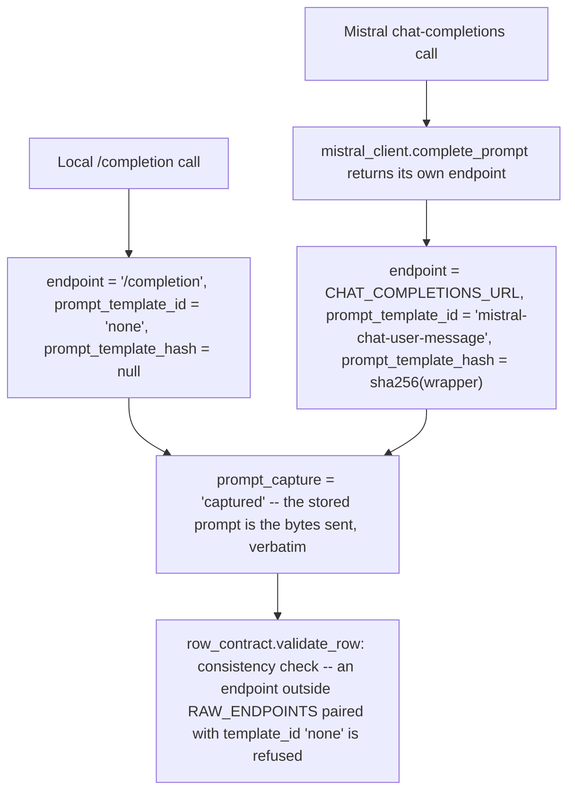
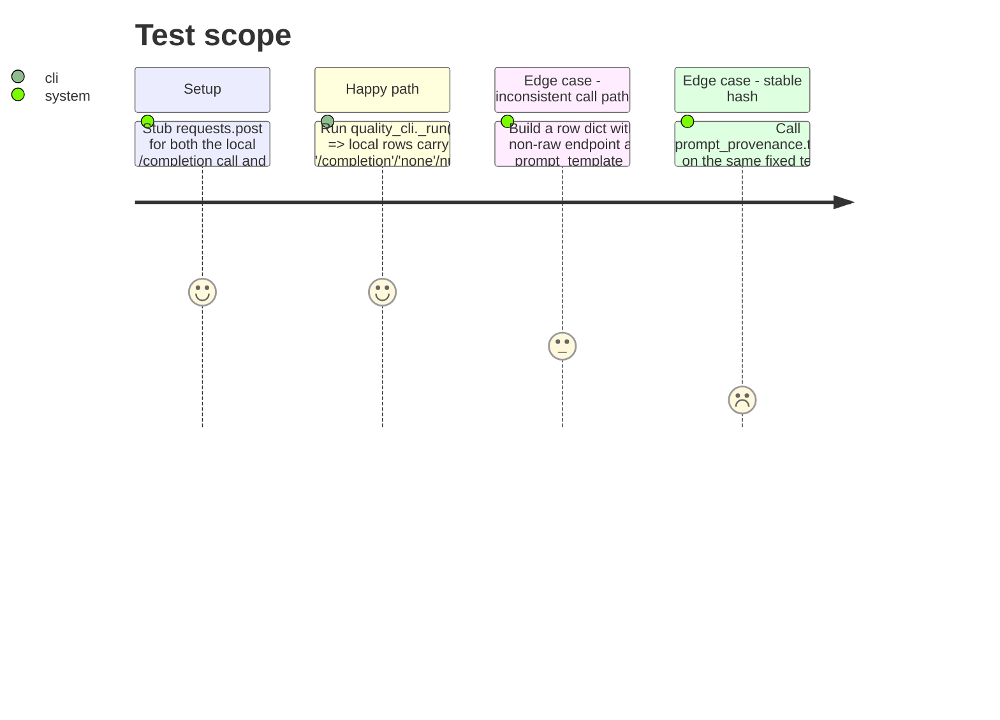

# Instruction: Rows name the endpoint and prompt template that produced them

## Architecture projection

```txt
.
├── src/wave_local_ai_v2/
│   ├── prompt_provenance.py  ✅ new: endpoint/template-id constants, template hash, consistency check
│   ├── row_contract.py      ✏️ add endpoint, prompt_template_id, prompt_template_hash, prompt_capture; call the consistency check
│   ├── mistral_client.py     ✏️ complete_prompt returns a MistralCompletion (content, endpoint) instead of a bare string
│   ├── __init__.py           ✏️ stamp the four call-path fields on the runtime row
│   └── quality_cli.py        ✏️ stamp the four call-path fields on every quality row, from each provider's own values
└── tests/
    ├── test_prompt_provenance.py ✅ new
    ├── test_mistral_client.py    ✏️ complete_prompt's new return shape
    ├── test_cli.py               ✏️ assert the runtime row's call-path fields
    └── test_quality_cli.py       ✏️ assert local vs. cloud rows record distinct endpoints/template ids
```

## User Journey



## Test Scope



## Tasks to do

### `1)` Write `prompt_provenance.py`

> Owns the endpoint/template constants and the consistency rule the writer gate enforces.

1. `LOCAL_COMPLETION_ENDPOINT = "/completion"` — the local llama-server raw completion path, sent verbatim with no chat template applied.
2. `TEMPLATE_ID_NONE = "none"` — legitimate only for `LOCAL_COMPLETION_ENDPOINT`.
3. `TEMPLATE_ID_MISTRAL_CHAT_MESSAGE = "mistral-chat-user-message"` — the id for today's Mistral call path.
4. `_MISTRAL_CHAT_MESSAGE_TEMPLATE = '{"role": "user", "content": <prompt>}'` (a module-private string constant documenting the fixed structural wrapper the chat endpoint applies; the literal prompt text is not part of the hashed template).
5. `template_hash(template: str | None) -> str | None`: `None` in, `None` out; otherwise `hashlib.sha256(template.encode("utf-8")).hexdigest()`.
6. `MISTRAL_CHAT_MESSAGE_HASH = template_hash(_MISTRAL_CHAT_MESSAGE_TEMPLATE)` — module-level constant, computed once.
7. `PROMPT_CAPTURE_CAPTURED = "captured"` and `PROMPT_CAPTURE_RECONSTRUCTED = "reconstructed"` — the two legal values of the fourth field; only `CAPTURED` is produced by any code path today.
8. `RAW_ENDPOINTS = frozenset({LOCAL_COMPLETION_ENDPOINT})` — the set of endpoints that legitimately carry `TEMPLATE_ID_NONE`.
9. `is_consistent(endpoint: str, prompt_template_id: str) -> bool`: returns `False` only when `endpoint not in RAW_ENDPOINTS and prompt_template_id == TEMPLATE_ID_NONE`; `True` otherwise. Pure function, no I/O.
10. Module docstring states the rule in one sentence: `none` is legitimate only for the endpoint that sends a prompt byte-for-byte with no chat structure applied.

### `2)` Extend `row_contract.py`

1. Add `"endpoint"`, `"prompt_template_id"`, `"prompt_template_hash"`, `"prompt_capture"` to both `"runtime"` and `"quality"` frozensets in `REQUIRED_FIELDS`.
2. In `validate_row`, after the missing-fields check (so a row missing these keys still reports "missing field", not a confusing consistency error), call `prompt_provenance.is_consistent(row["endpoint"], row["prompt_template_id"])`; if `False`, raise `RowContractError` naming the offending endpoint and template id.
3. Import `prompt_provenance` at module level.

### `3)` Change `mistral_client.complete_prompt`'s return shape

1. Add a `MistralCompletion` `TypedDict` with keys `content: str` and `endpoint: str` (phase 3 adds two more keys to this same type — don't over-build it here).
2. `complete_prompt` returns `MistralCompletion(content=content, endpoint=CHAT_COMPLETIONS_URL)` instead of the bare `content` string. Every existing internal check (non-200 status, malformed body, non-string content) stays unchanged — only the final return line changes.
3. Update the module docstring's "response has choices[0].message.content" line if it now reads as if that were the whole return value.

### `4)` Wire both writers

1. `src/wave_local_ai_v2/__init__.py`: in the `row` dict built at the end of `_run()`, add `"endpoint": prompt_provenance.LOCAL_COMPLETION_ENDPOINT`, `"prompt_template_id": prompt_provenance.TEMPLATE_ID_NONE`, `"prompt_template_hash": None`, `"prompt_capture": prompt_provenance.PROMPT_CAPTURE_CAPTURED`. Import `prompt_provenance`.
2. `src/wave_local_ai_v2/quality_cli.py`:
   - `_run_local_suite`: no endpoint change needed (still the local literal), but its return value stays plain content strings for now — phase 3 changes this signature further, so keep the smallest diff here.
   - `_run_cloud_suite`: `mistral_client.complete_prompt(...)` now returns a `MistralCompletion`; extract `["content"]` for the completions list this function still returns, but also capture `["endpoint"]` once (e.g. return a tuple `(endpoint, list[str])`, or capture it from the first item — pick one and keep `_score_and_write`'s signature change minimal since phase 3 will touch this function again).
   - `_score_and_write`: add the four call-path fields to the per-item `row` dict, sourced per `provider`: local rows always get `prompt_provenance.LOCAL_COMPLETION_ENDPOINT` / `TEMPLATE_ID_NONE` / `None` / `PROMPT_CAPTURE_CAPTURED`; mistral rows get the `endpoint` captured from `complete_prompt`'s return, `TEMPLATE_ID_MISTRAL_CHAT_MESSAGE`, `MISTRAL_CHAT_MESSAGE_HASH`, `PROMPT_CAPTURE_CAPTURED`.
   - Import `prompt_provenance`.

### `5)` Tests

1. `tests/test_prompt_provenance.py` (new): `is_consistent(LOCAL_COMPLETION_ENDPOINT, TEMPLATE_ID_NONE)` is `True`; `is_consistent(some_other_endpoint, TEMPLATE_ID_NONE)` is `False`; `is_consistent(some_other_endpoint, TEMPLATE_ID_MISTRAL_CHAT_MESSAGE)` is `True`; `template_hash(None) is None`; `template_hash(x) == template_hash(x)` for a fixed string (stable digest); and one test that builds a minimal-but-complete row dict with an inconsistent pair and asserts `row_contract.validate_row` raises `RowContractError` — this is the "writer gate refuses it" case from the story's acceptance.
2. `tests/test_mistral_client.py`: update `test_complete_prompt_returns_content_and_sends_expected_request` (and any other assertion on the return value) to unpack the `MistralCompletion` — assert `result["content"] == "billing"` and `result["endpoint"] == EXPECTED_CHAT_COMPLETIONS_URL`.
3. `tests/test_cli.py`: assert the written runtime row's `endpoint == "/completion"`, `prompt_template_id == "none"`, `prompt_template_hash is None`, `prompt_capture == "captured"`.
4. `tests/test_quality_cli.py`: stub `complete_prompt` to return a `MistralCompletion`-shaped dict instead of a bare string (update the `stubbed_run` fixture's `"complete_prompt"` patch); add an assertion that local rows carry `/completion`/`none`/null hash and mistral rows carry the Mistral URL/`mistral-chat-user-message`/a non-null hash, and that the hash is identical across every mistral row of the run.

## Test acceptance criteria

| Task | Acceptance criteria |
| ---- | -------------------- |
| 1... | `is_consistent` returns `False` for exactly the one forbidden combination described in the story, `True` otherwise; `template_hash` is deterministic. |
| 2... | `row_contract.validate_row` raises on a row whose endpoint is not `/completion` and whose `prompt_template_id` is `"none"`, and accepts every other combination the two writers actually produce. |
| 3... | `complete_prompt`'s callers (only `quality_cli.py`, after task 4) receive a dict with `content` and `endpoint`; existing error paths (401, malformed body, null content) are unaffected. |
| 4... | A stubbed runtime run's row and every stubbed quality run's local/mistral rows carry the correct, distinct call-path quadruple per provider. |
| 5... | All four listed test files pass; `test_prompt_provenance.py`'s consistency-violation test fails if the `row_contract.validate_row` call to `is_consistent` were removed. |
