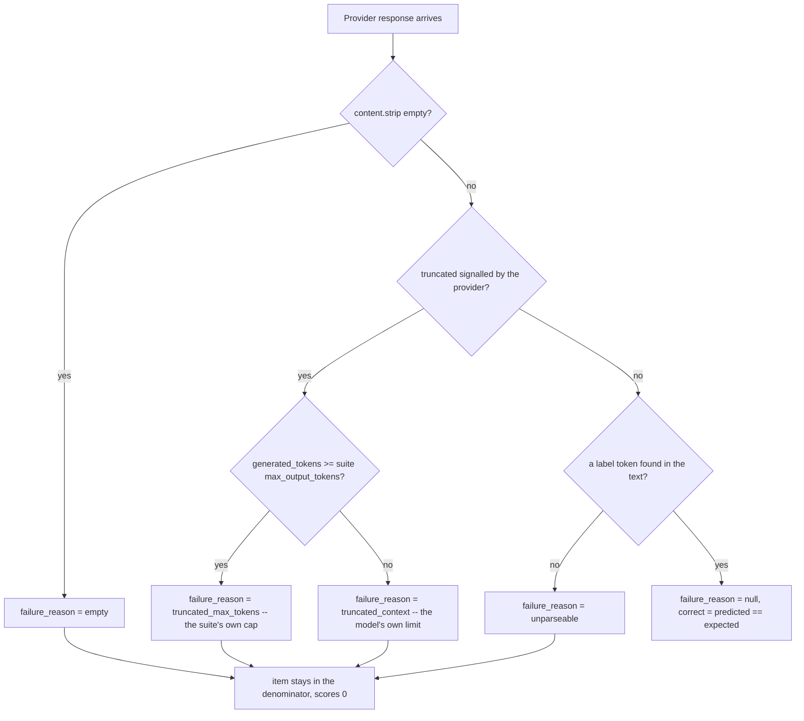
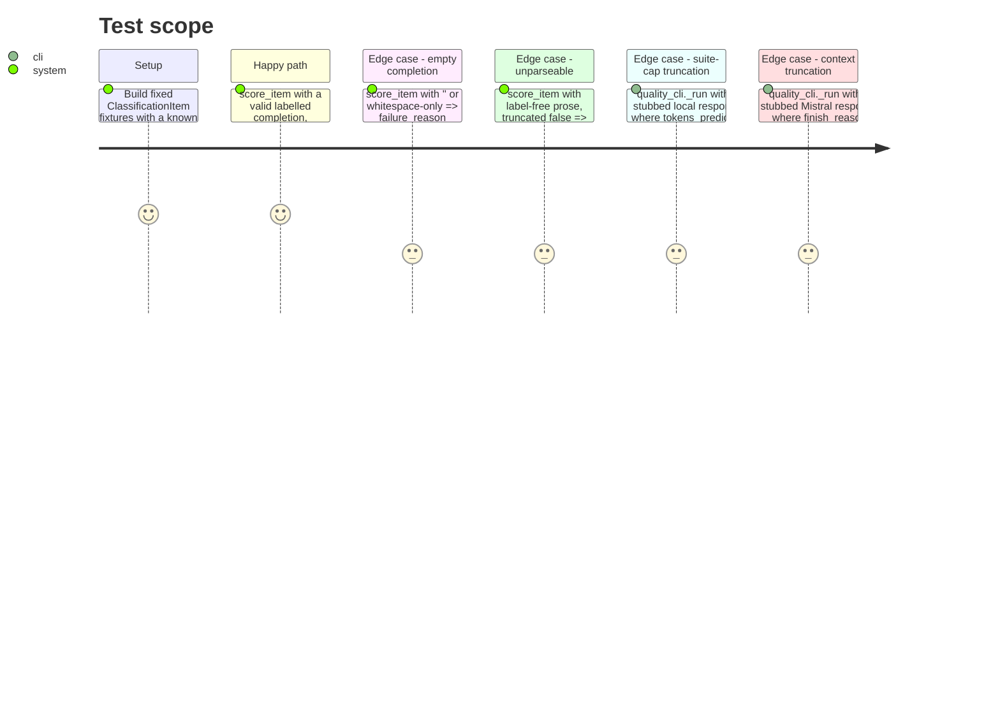

# Instruction: A failed generation scores zero and names its reason

## Architecture projection

```txt
.
├── src/wave_local_ai_v2/
│   ├── scoring.py             ✏️ score_item takes truncated/generated_tokens/max_output_tokens, returns failure_reason; score_suite returns a SuiteScore
│   ├── mistral_client.py      ✏️ MistralCompletion gains finish_reason and generated_tokens
│   ├── row_contract.py       ✏️ add failure_reason, failure_counts to the quality REQUIRED_FIELDS
│   └── quality_cli.py         ✏️ reads stopped_limit/tokens_predicted (local) and finish_reason/usage (mistral), maps both to truncated+generated_tokens, writes failure_reason and failure_counts on every row
└── tests/
    ├── test_scoring.py        ✏️ the four-state taxonomy on score_item, failure_counts on score_suite
    ├── test_mistral_client.py ✏️ finish_reason and generated_tokens surfaced
    └── test_quality_cli.py    ✏️ cap-truncated and context-truncated stub responses produce the two distinct reasons
```

## User Journey



## Test Scope



## Tasks to do

### `1)` Extend `scoring.py`

1. `ScoredItem` TypedDict gains `failure_reason: str | None`.
2. `score_item(item, raw_completion, *, truncated: bool, generated_tokens: int, max_output_tokens: int) -> ScoredItem`:
   - `raw_completion.strip() == ""` → `predicted_label=None, correct=False, failure_reason="empty"`.
   - elif `truncated` → `predicted_label=None, correct=False, failure_reason="truncated_max_tokens" if generated_tokens >= max_output_tokens else "truncated_context"`.
   - else: `predicted_label = normalize_label(raw_completion, LABELS)`; if `None` → `correct=False, failure_reason="unparseable"`; else → `correct = predicted_label == item["expected_label"], failure_reason=None`.
3. `SuiteScore` TypedDict: `accuracy: float`, `failure_counts: dict[str, int]`.
4. `score_suite(scored_items: list[ScoredItem]) -> SuiteScore`: keep the existing accuracy computation (0.0 for empty list); additionally build `failure_counts` with the four fixed keys `"empty"`, `"unparseable"`, `"truncated_max_tokens"`, `"truncated_context"` always present (0 when absent), counted from each item's `failure_reason`.
5. Update the module docstring's "deterministic" claim to note the new parameters are still deterministic inputs, not I/O — the "no network, no randomness" guarantee is unchanged.

### `2)` Extend `mistral_client.MistralCompletion` and `complete_prompt`

1. Add `finish_reason: str` and `generated_tokens: int` to `MistralCompletion`.
2. Extract `response_json["choices"][0]["finish_reason"]` (guard with the same `try/except (KeyError, IndexError, TypeError)` pattern already used for `content`, raising `MistralRequestError` on an unexpected shape) and `response_json["usage"]["completion_tokens"]` (same guard).
3. Return both alongside `content` and `endpoint`.
4. Update the module docstring's confirmed-response-shape note to mention `finish_reason` and `usage.completion_tokens`.

### `3)` Extend `row_contract.py`

1. Add `"failure_reason"`, `"failure_counts"` to the `"quality"` frozenset in `REQUIRED_FIELDS` only — these are quality-row-only concepts, the runtime row kind is untouched by this story.

### `4)` Wire `quality_cli.py`

1. `_run_local_suite`: for each item, also extract `stopped_limit: bool` (default `False` if absent) and `tokens_predicted: int` (default `0` if absent) from `response_json`, alongside the existing `content` extraction. Return a list of a small local structure carrying `content`, `truncated=stopped_limit`, `generated_tokens=tokens_predicted` per item (a `TypedDict` local to this module, e.g. `LocalCompletion`), replacing the current bare `list[str]` return.
2. `_run_cloud_suite`: for each item, call `complete_prompt(...)` (now returning `MistralCompletion`), and build the same per-item structure: `content`, `truncated = finish_reason == "length"`, `generated_tokens`. Also capture the `endpoint` (from phase 2's wiring) from the first response — unify this function's phase-2 partial wiring into its final form here if it wasn't already, since this is the function's last touch in the increment.
3. `_score_and_write`: change the `completions` parameter to accept the unified per-item structure (from either provider); call `score_item(item, completion["content"], truncated=completion["truncated"], generated_tokens=completion["generated_tokens"], max_output_tokens=classification_suite.MAX_OUTPUT_TOKENS)`; call `score_suite(scored_items)` and destructure `suite_accuracy = suite_score["accuracy"]`, `failure_counts = suite_score["failure_counts"]`; add `"failure_reason": scored["failure_reason"]` and `"failure_counts": dict(failure_counts)` to the per-item row dict.
4. Import whatever new names are needed; no change to `main()`'s exception handling — the existing `MistralRequestError`/`LocalCompletionError` catches already cover the new extraction's failure modes since they reuse the same guarded-extraction pattern.

### `5)` Tests

1. `tests/test_scoring.py`: cases for empty string, whitespace-only string (both → `"empty"`), a label-free completion with `truncated=False` (→ `"unparseable"`), a valid labelled completion with `truncated=False` (→ `failure_reason=None`, `correct` computed normally); a truncated case with `generated_tokens >= max_output_tokens` (→ `"truncated_max_tokens"`) and one with `generated_tokens < max_output_tokens` (→ `"truncated_context"`); assert a failed item's `item_id` still appears in `score_suite`'s implicit denominator (i.e. `score_suite` over a list including failed items divides by the full count, not the succeeded subset) and that `failure_counts` sums to the failed-item count with all four keys present even when some are zero.
2. `tests/test_mistral_client.py`: extend the sample response fixture with `"finish_reason": "stop"` and `"usage": {"completion_tokens": 3}`; assert `complete_prompt(...)["finish_reason"] == "stop"` and `["generated_tokens"] == 3`; add a malformed-shape case (missing `usage`) asserting `MistralRequestError`.
3. `tests/test_quality_cli.py`: extend the local stub response to include `"stopped_limit"` and `"tokens_predicted"`, and the mistral stub (`complete_prompt` return) to include `finish_reason`/`generated_tokens`; add one test where the local response is cap-truncated (`stopped_limit=True`, `tokens_predicted >= MAX_OUTPUT_TOKENS`) asserting `failure_reason == "truncated_max_tokens"` on that row, and one where the mistral response is context-truncated (`finish_reason="length"`, `generated_tokens < MAX_OUTPUT_TOKENS`) asserting `failure_reason == "truncated_context"`; assert every successful row (the existing `"billing"` stub) carries `failure_reason is None` and a `failure_counts` dict with all-zero values.

## Test acceptance criteria

| Task | Acceptance criteria |
| ---- | -------------------- |
| 1... | `score_item` maps empty/whitespace/unparseable/valid/both-truncation-kinds to the five distinct outcomes exactly as specified; `score_suite`'s `failure_counts` always carries all four taxonomy keys. |
| 2... | `complete_prompt` surfaces `finish_reason` and `generated_tokens` alongside `content`/`endpoint`; a response missing either raises `MistralRequestError`, never an uncaught exception. |
| 3... | `row_contract.validate_row` refuses a quality row missing `failure_reason` or `failure_counts`; the runtime `REQUIRED_FIELDS` set is unchanged by this story. |
| 4... | A stubbed cap-truncated local completion and a stubbed context-truncated cloud completion each produce their distinct, correctly-named `failure_reason` on the written row; a successful completion's row carries `failure_reason=None`. |
| 5... | All three listed test files pass; the four current quality-reference rows carrying `"predicted_label": null, "correct": false` with no reason (`aidd_docs/results/quality-reference.jsonl`) could not be produced by this code path — every failed item now names why. |
