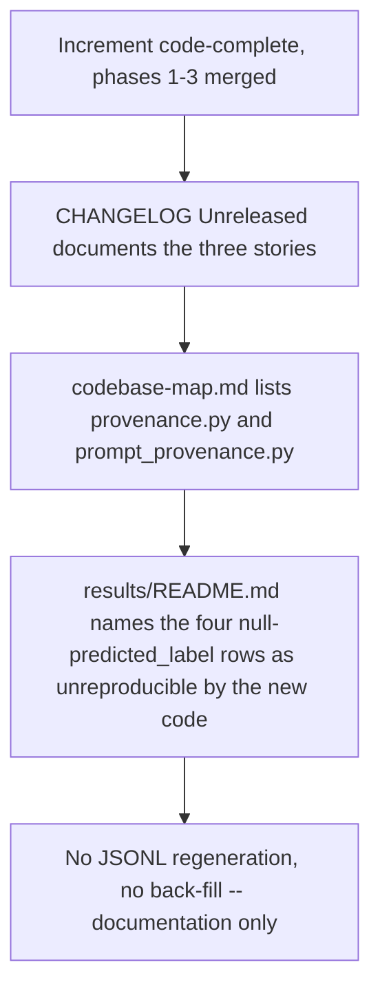
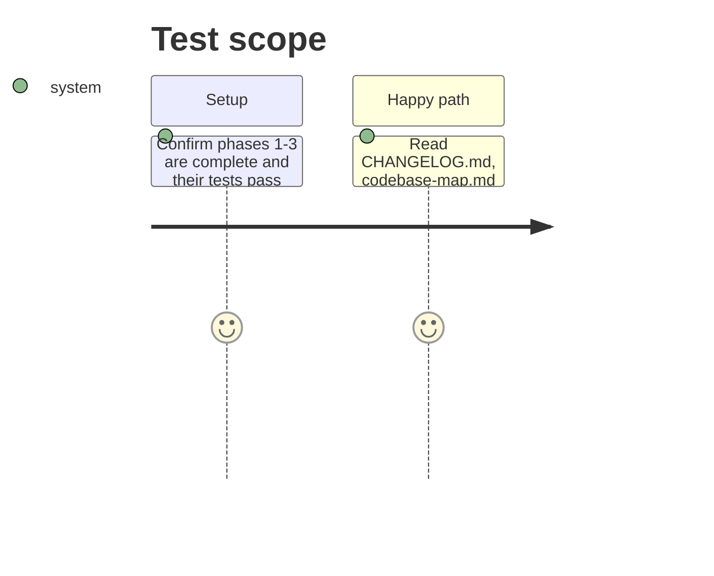

# Instruction: Changelog, codebase map and reference evidence note

## Architecture projection

```txt
.
├── CHANGELOG.md                          ✏️ Unreleased section gains the three stories' entries
├── aidd_docs/memory/codebase-map.md      ✏️ note the two new modules (provenance.py, prompt_provenance.py)
└── aidd_docs/results/README.md           ✏️ note the four predicted_label:null rows as unreproducible-by-new-code, no back-fill
```

## User Journey



## Test Scope



## Tasks to do

### `1)` `CHANGELOG.md` — Unreleased

> Follow the existing `### Added` / `### Changed` style already in the `## [Unreleased]` section; do not invent a new heading pattern.

1. Under `### Added`, append entries for: (a) every runtime and quality row now carries `release_version`, `commit_sha` and `tree_dirty`, captured once per run and degrading to explicit nulls when git is unavailable; (b) every row now carries the endpoint, prompt-template id, prompt-template content hash and capture-or-reconstruction label that produced its prompt, with the writer gate refusing a row whose endpoint applies a template but whose template id is `none`; (c) a failed quality generation (empty, truncated at the suite's cap, truncated at the model's context limit, or unparseable) now scores 0, stays in the denominator and names its `failure_reason`, and every quality row carries the suite's aggregated `failure_counts`.
2. Under `### Changed` (or a new bullet in `### Added` if more accurate — judge per entry), note that `mistral_client.complete_prompt` now returns a structured result (`content`, `endpoint`, `finish_reason`, `generated_tokens`) instead of a bare string, since this is a public-surface change a reader of the changelog would want to know about.
3. Do not touch the `## [0.1.0]` section.

### `2)` `aidd_docs/memory/codebase-map.md`

1. In the "Areas" bullet for `src/wave_local_ai_v2/`, add `provenance.py` and `prompt_provenance.py` to the list of modules shared by both entry points, alongside the existing mention of `row_contract.py` and `suite_gate.py` — state in one clause what each resolves (code/tree identity; call-path identity), matching the file's existing terse style.
2. No other section needs a change — the entry points and top-level layout are unaffected.

### `3)` `aidd_docs/results/README.md`

1. In the existing "What is deliberately absent from these rows" section (or a new sibling section if that one no longer fits the topic), add a note naming the four `quality-reference.jsonl` rows carrying `"predicted_label": null, "correct": false` with no failure reason (the ones at `technical-01`, `technical-02`, `billing-03`, `technical-03` for the local model's first run, and their run-2 duplicates) as **unreproducible by the new code path**: the current harness always writes a `failure_reason` naming why a generation failed, so a row with a bare null and no reason could not be produced by the code as it stands today.
2. State explicitly that these four rows are **not back-filled** — same discipline the file already applies to the missing `run_id`/`captured_at` keys: a hand-edited row is no longer the row the harness wrote, so the honest signal is left in place rather than reconstructed.
3. Do not touch the `runtime-reference.jsonl` section — story 5 only concerns quality rows.

## Test acceptance criteria

| Task | Acceptance criteria |
| ---- | -------------------- |
| 1... | `CHANGELOG.md`'s `## [Unreleased]` section names all three stories' row-schema additions and the `complete_prompt` return-shape change, in the file's existing bullet style. |
| 2... | `codebase-map.md` names `provenance.py` and `prompt_provenance.py` among the modules shared by both entry points. |
| 3... | `results/README.md` names the four specific `predicted_label: null`-with-no-reason rows and states plainly they are not back-filled. |
