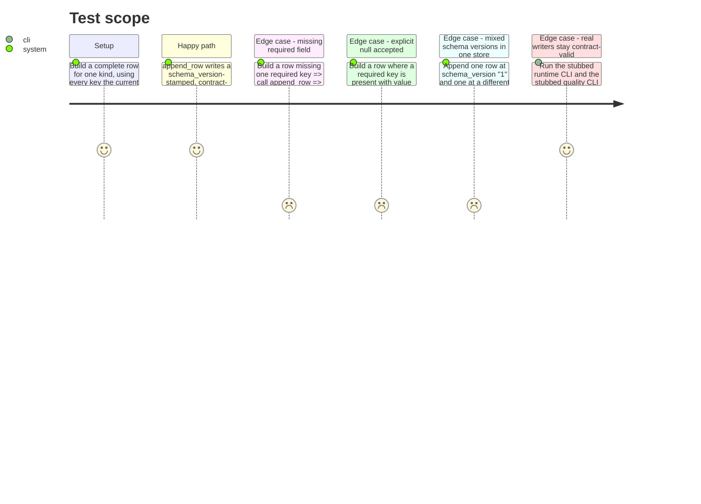

<!-- Fill or omit these sections; never add, rename, or reorder one. -->

# Instruction: Row contract + writer gate + schema_version

## Architecture projection

> Tree of the final files. ✅ create · ✏️ modify · ❌ delete

```txt
.
├── src/
│   └── wave_local_ai_v2/
│       ├── row_contract.py      ✅ create — SCHEMA_VERSION, RowKind, REQUIRED_FIELDS per kind, validate_row()
│       ├── results.py           ✏️ modify — append_row() gates on validate_row(); read_rows() selects by schema_version
│       ├── __init__.py          ✏️ modify — runtime row stamps schema_version, append_row() call passes kind="runtime"
│       └── quality_cli.py       ✏️ modify — quality row stamps schema_version, append_row() call passes kind="quality"
└── tests/
    ├── test_row_contract.py     ✅ create
    ├── test_results.py          ✏️ modify
    ├── test_cli.py              ✏️ modify
    └── test_quality_cli.py      ✏️ modify
```

## User Journey

```mermaid
flowchart TD
  A[Writer builds a row dict] --> B{validate_row(kind, row)}
  B -- all required keys present --> C[append_row writes the JSON line]
  B -- one or more keys missing --> D[RowContractError naming the missing fields]
  D --> E[Nothing appended: file unchanged]
  F[Reader calls read_rows path, schema_version] --> G[Only rows whose schema_version matches are returned]
```

## Test Scope



## Tasks to do

### `1)` Declare the row contract

> One module, one place, the list every later story extends.

1. Create `src/wave_local_ai_v2/row_contract.py`: `SCHEMA_VERSION` (a plain string, e.g. `"1"`), `RowKind = Literal["runtime", "quality"]`, `REQUIRED_FIELDS: dict[RowKind, frozenset[str]]`.
2. Set `REQUIRED_FIELDS["runtime"]` to exactly the keys `__init__.py`'s row assembly already always populates today: `schema_version`, `run_id`, `captured_at`, the six `hardware.HardwareFiche` keys (`cpu`, `ram_gb`, `gpu_name`, `gpu_driver_version`, `os`, `cuda_ceiling`), `llama_cpp_build`, `model_file`, `quant`, `flags`, `prompt`, `max_tokens`, `wall_clock_s`, the three `timings.Timings` keys (`ttft_ms`, `prompt_tok_per_s`, `gen_tok_per_s`), the two `gpu.GpuStats` keys (`vram_used_mib`, `gpu_draw_w`), `process_rss_bytes`, the two `energy.EnergyResult` keys (`energy_kwh`, `energy_method`). Every one of these already degrades to an explicit `None` on failure rather than an absent key (confirmed in `hardware.py`, `timings.py`, `gpu.py`, `energy.py`), so this set is satisfiable by the code as it stands.
3. Set `REQUIRED_FIELDS["quality"]` to exactly what `quality_cli.py`'s row assembly already always populates: `schema_version`, `run_id`, `captured_at`, `model_id`, `provider`, `task_suite`, `item_id`, `prompt`, `expected_label`, `predicted_label`, `correct`, `suite_accuracy`, `sampling`.
4. Add `class RowContractError(ValueError)` and `def validate_row(kind: RowKind, row: dict[str, Any]) -> None` that computes `REQUIRED_FIELDS[kind] - row.keys()` and raises `RowContractError` naming every missing field (sorted, for a deterministic message) when non-empty; a key present with value `None` is not missing. Returns `None` (no exception) when the row is complete.

### `2)` Gate the writer, extend the reader

> `append_row` cannot write an incomplete row; `read_rows` can select by version.

1. In `results.py`, change `append_row(path: Path, row: dict[str, Any])` to `append_row(path: Path, kind: RowKind, row: dict[str, Any])`: call `row_contract.validate_row(kind, row)` first; only open/write the file if validation does not raise. On failure, propagate `RowContractError` and touch nothing (no partial line, no empty file created if the path didn't exist).
2. Change `read_rows(path: Path, schema_version: str | None = None)`: unchanged behavior when `schema_version` is `None` (all rows); when given, return only rows whose `row.get("schema_version") == schema_version`.

### `3)` Stamp both writers

> Every row a CLI writes carries schema_version and is validated before it lands.

1. In `__init__.py`'s row assembly, add `"schema_version": row_contract.SCHEMA_VERSION` to the row dict; change the `append_row(settings.results_path, row)` call to `append_row(settings.results_path, "runtime", row)`.
2. In `quality_cli.py`'s per-item row assembly, add `"schema_version": row_contract.SCHEMA_VERSION` to the row dict; change the `append_row(settings.quality_results_path, row)` call to `append_row(settings.quality_results_path, "quality", row)`.

### `4)` Tests

1. `tests/test_row_contract.py` (new): a complete constructed row (one per kind) passes `validate_row` without raising; a row missing one required field raises `RowContractError` whose message names that field; a row where a required field is explicitly `None` passes.
2. `tests/test_results.py`: update `append_row` calls to the new `(path, kind, row)` signature with contract-complete fixture rows; add a test that `append_row` with an incomplete row raises `RowContractError` and leaves the file untouched (absent, or unchanged if it pre-existed); add a test that two rows written at different `schema_version` values to the same path are separable via `read_rows(path, schema_version=...)`.
3. `tests/test_cli.py`, `tests/test_quality_cli.py`: assert the written row carries `schema_version == row_contract.SCHEMA_VERSION` (extend the existing stubbed-run fixtures/assertions rather than adding new ones).

## Test acceptance criteria

<!-- Each criterion is an observable behavior, not a command. -->

| Task | Acceptance criteria |
| ---- | -------------------- |
| 1... | `row_contract.validate_row` exists, is importable, and `REQUIRED_FIELDS` covers exactly the fields the two current writers already produce plus `schema_version`. |
| 2... | `append_row` with a complete row writes the line and `read_rows` returns it; `append_row` with an incomplete row raises `RowContractError` naming the missing field(s) and appends nothing; `read_rows(path, schema_version="X")` returns only rows whose `schema_version` equals `"X"`. |
| 3... | A runtime row and a quality row written by the two CLIs both carry `schema_version` and independently satisfy `validate_row` for their kind. |
| 4... | `uv run pytest tests/test_row_contract.py tests/test_results.py tests/test_cli.py tests/test_quality_cli.py` passes with no regressions elsewhere (`uv run pytest`). |
